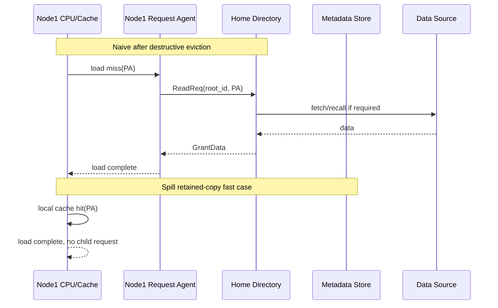
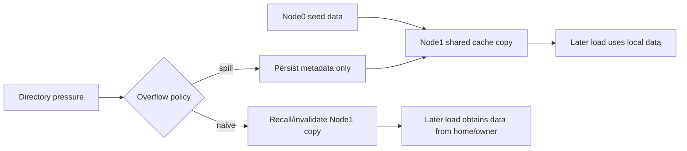
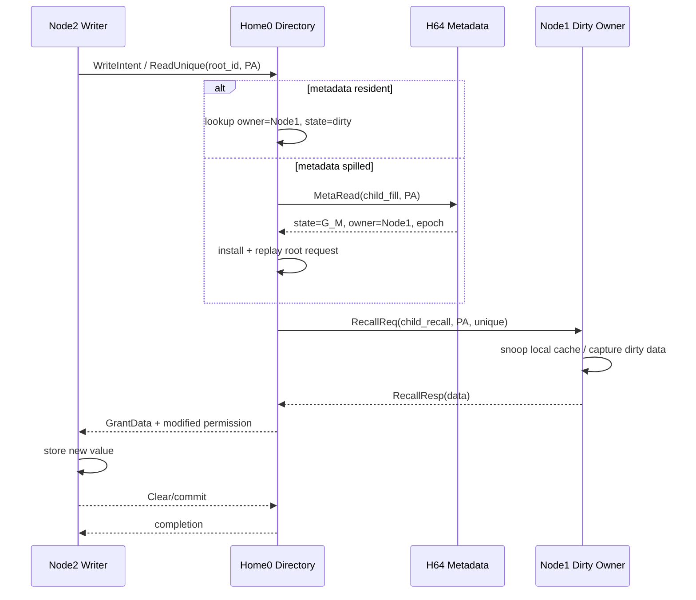
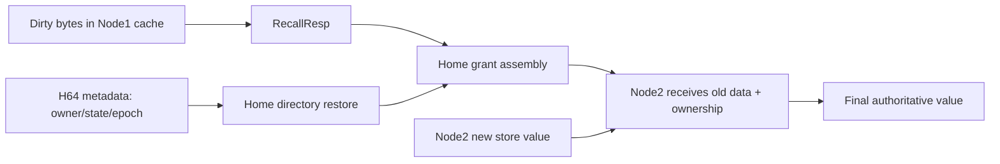
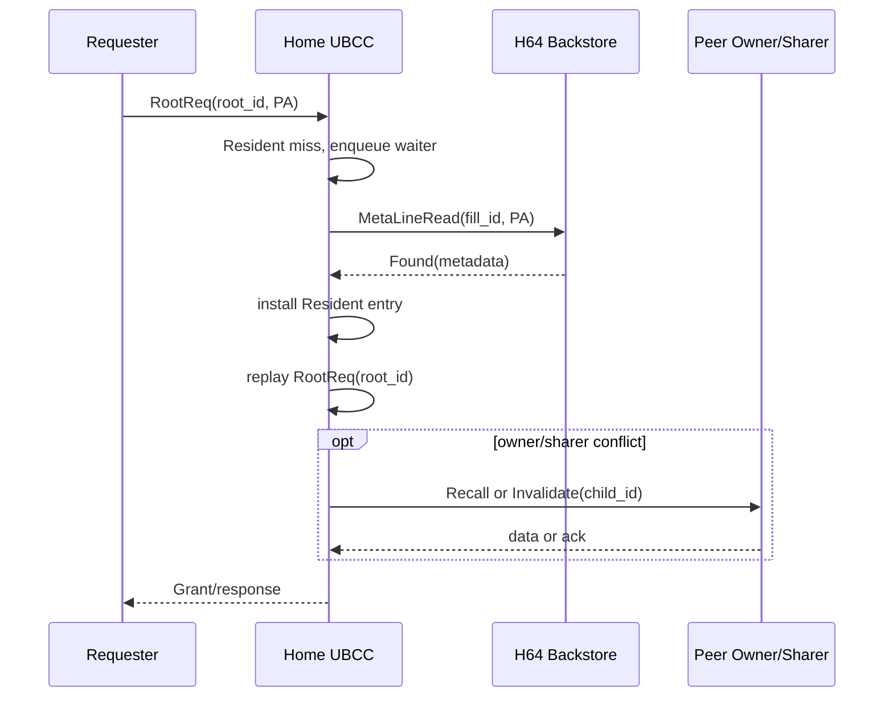
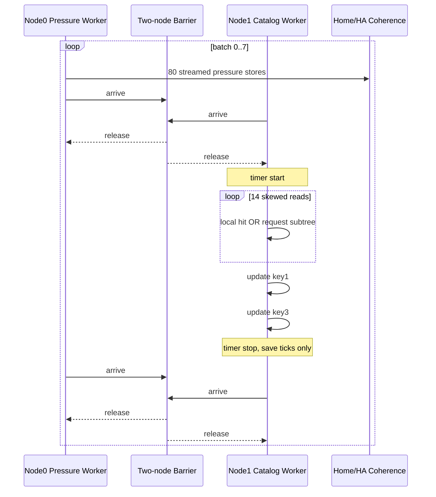
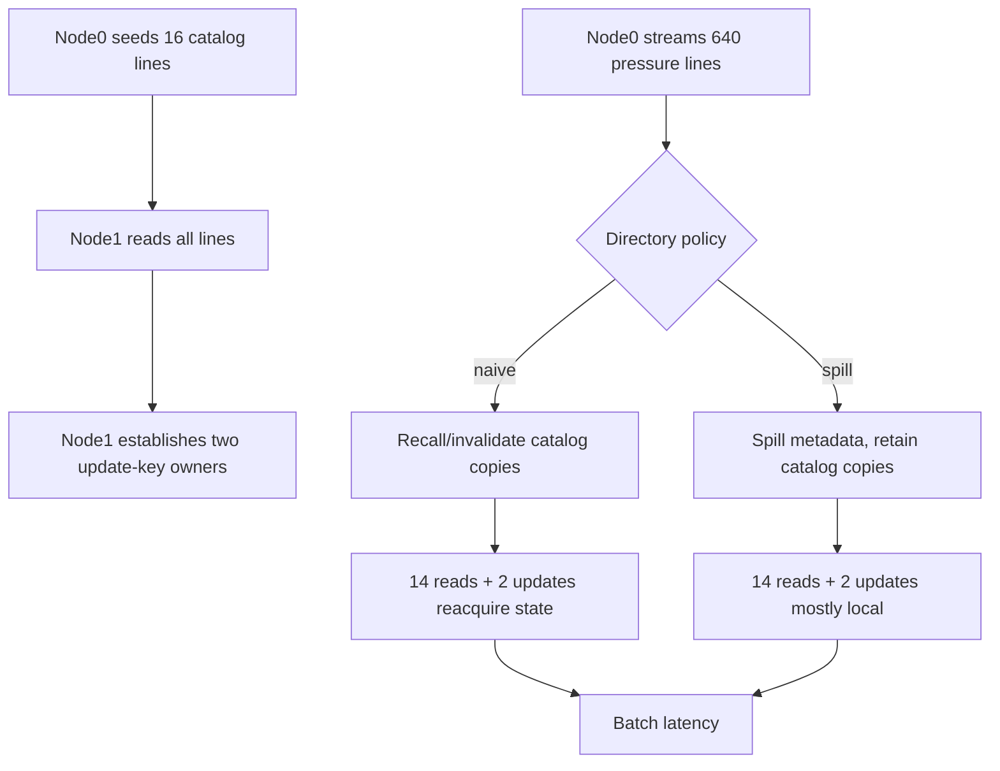

# HA 对比代表场景请求链、时序与 Dataflow

> 日期：2026-07-31
> 目的：在不了解 HA 内部实现的前提下，以相同 root operation 比较请求树结构、
> 数据来源、串行依赖和 guest/target-visible 完成时间。

## 1. 场景选择

| 对比主题 | 主要 TC | HA portable 对应场景 | 选择原因 |
|---|---:|---|---|
| pressure 后原 sharer 重访 | TC135 | HA05 / TC215 | 最直接体现 retained-copy 与 destructive eviction 差异 |
| dirty owner 转交给新 writer | TC138 | HA03/HA04/HA06 | 覆盖 recall、dirty data、ownership handoff |
| metadata offload/onload | TC125/TC137 | HA06 / TC216 | 覆盖 Resident miss、H64 fill、request replay |
| 实际混合 catalog batch | TC217 | HA10 / TC217 | 14 reads + 2 updates，可直接交付 HA target |

TC135/138/125 是机制放大器；TC217 是实际 workload。汇报时先用机制 TC 解释原因，
再用 HA10 展示最终业务效果。

## 2. 统一观察边界

### 2.1 Root latency

跨 CC/HA 正式比较只使用：

```text
T_root = target counter at root_complete - target counter at root_issue
```

root operation 是 workload 中的一次 `dsm_load`、完成语义的 `dsm_store`，或 HA10
固定 16-op batch。CC 的 Outer transaction 只用于拆分 `T_root`，不能替代它。

### 2.2 子请求时间

每个实现可以有不同组件名，但统一映射为以下角色：

| 统一角色 | CC 映射 | 未知 HA 可能映射 |
|---|---|---|
| requester | CPU/L2/HN-F/EP-SNF | requester core/cache/agent |
| home | UBCC home + directory | HA home agent/directory |
| owner | remote cache + EP-RNF | HA owner cache/agent |
| sharer | remote cache + EP-RNF | HA sharer cache/agent |
| metadata_store | MetaRNF H64 backstore | HA overflow metadata store，可不存在 |
| fabric | UBAdapter/networksim | HA NoC/CCIX/CXL/private fabric |

比较项：

```text
requester_to_home
directory_lookup
metadata_fill
home_to_owner_or_sharers
owner_or_sharer_service
data_return
commit_or_clear
root_total
```

## 3. 场景 A：TC135 Preserved Sharer Revisit

### 3.1 Workload 条件

1. Node0 写入 hot line。
2. Node1 读取，成为远程 sharer。
3. Node0 写入冲突 pressure lines，使目录溢出。
4. Node1 发出 timed first revisit load。

### 3.2 请求树

#### Naive

```text
Root: Node1 load hot PA
├── local L1/L2 miss                # pressure 时 copy 已被 recall/invalidate
├── ReadReq to Home0
│   ├── directory lookup
│   ├── locate authoritative data
│   └── GrantData / ReadResp to Node1
├── install local shared copy
└── root_complete
```

#### Spill

```text
Root: Node1 load hot PA
└── local L1/L2 hit                 # metadata 已 spill，但 cache copy 被保留
    └── root_complete
```

如果 retained copy 已因其他原因离开 cache，spill 路径会退化为：

```text
ReadReq
└── Resident miss
    ├── Bloom/group check
    ├── H64 metadata read
    ├── Resident install
    └── replay original ReadReq
        └── normal grant/data path
```

### 3.3 时序图



### 3.4 Dataflow



### 3.5 已有结果

- naive mean：2,543.13 ns。
- spill mean：238.42 ns。
- latency reduction：90.63%。

## 4. 场景 B：TC138 Dirty Owner Handoff

### 4.1 Workload 条件

1. Node1 对 Home0 line 写入，成为 dirty owner。
2. Node0 制造目录压力。
3. Node2 对同一 line 发出 timed store，要求获得唯一 dirty ownership。
4. Node0 最终读取并验证 Node2 的新值。

### 4.2 请求树

```text
Root: Node2 completed store(PA, new_value)
├── acquire unique/modified permission
│   └── ReadUnique or write-intent request to Home0
├── Home0 directory resolution
│   ├── Resident hit
│   └── or H64 fill + original request replay
├── RecallReq to dirty owner Node1
│   ├── Node1 EP/HA agent issues local unique/readback transaction
│   ├── local cache supplies dirty data
│   └── RecallResp(data, ownership release)
├── Home0 commits new owner=Node2
├── GrantData/permission to Node2
├── Node2 performs store(new_value)
├── Clear/commit acknowledgement if protocol uses two-phase grant
└── root_complete
```

Naive 在 pressure 时可能已经提前 recall Node1 dirty data并销毁其 copy，因此 timed
handoff 开始前 home 已持有数据。Spill 保留 Node1 owner copy，但 timed handoff 需要
执行 metadata fill/owner recall，可能更慢。这解释 TC138 的局部退化。

### 4.3 时序图



### 4.4 Dataflow



### 4.5 已有结果

- naive mean：2,622.60 ns。
- spill mean：2,940.50 ns。
- spill regression：12.12%。

该负结果应作为 HA 对比重点：如果 HA 在 dirty handoff 上更快，需要看它是否省掉
metadata fill、是否 direct-forward owner data、或使用不同 ownership commit 规则。

## 5. 场景 C：Metadata Offload/Onload

TC125/TC137 用于单独观察 H64 fill；HA06 提供实际 dirty-capacity 生命周期。

### 5.1 请求树

```text
Root: request to PA whose metadata is no longer Resident
├── ResidentDir miss
├── Bloom/group coverage decision
├── pin bounded fill transaction
├── MetaRNFLineReadReq to H64 backstore
│   └── MetaRNFLineReadResp(status, state, sharers, owner, epoch)
├── install ResidentDir entry
├── dequeue and replay original root request
├── normal coherence subtree
│   ├── no recall if data is local/clean home data
│   ├── RecallReq/Resp if a dirty owner exists
│   └── InvalidateReq/Ack if write intent conflicts with sharers
└── Grant/commit/root_complete
```

H64 backstore只存 directory metadata，不是 dirty data store。dirty bytes 仍必须来自
owner recall 或已持久化的数据路径，不能由 metadata fill 伪造。

### 5.2 时序图



### 5.3 需要对 HA 询问的问题

- HA 是否有 metadata overflow tier？
- miss 时是同步 refill、victim directory、broadcast 还是 hash-home lookup？
- metadata refill 是否在 demand critical path？
- dirty data 与 metadata 是否分离存储？
- 一个 root request 最多会生成多少 refill/recall/invalidate 子请求？

## 6. 场景 D：TC217 / HA10 Catalog Batch

### 6.1 Batch Forest

每个 timed batch 有 16 个 root operations，不是单个复合协议请求：

```text
Batch root interval (16 useful ops)
├── Read root x14
│   ├── local hit                            # retained-copy ideal case
│   └── or ReadReq subtree                   # naive invalidated/reacquire
├── Update root key1
│   ├── local owner store                    # retained owner ideal case
│   └── or permission/data reacquire subtree
└── Update root key3
    ├── local owner store
    └── or permission/data reacquire subtree
```

batch 前 Node0 写 80 条新 pressure lines，pressure 不在 service timer 内，但在完整
workload 的 end-to-end/生命周期中。HA target 必须保持相同 barrier，因此不能把
pressure 与 catalog batch 重叠执行来获取不公平结果。

### 6.2 时序图



### 6.3 Dataflow



### 6.4 已有结果

| profile | mean batch | P99 | mean ns/op | useful ops/s |
|---|---:|---:|---:|---:|
| naive | 7,987.02 ns | 13,391.18 ns | 500.74 | 1.997M |
| optimized | 4,212.06 ns | 4,490.22 ns | 264.19 | 3.785M |

## 7. Normalized Trace Schema

未知 HA 不需要暴露私有模块名，但至少输出以下 JSONL。所有事件在 timed region 内
只能写入固定内存 buffer，结束后统一导出。

```json
{"kind":"request_event","scenario":"HA04","run_id":"ha_001","root_id":42,"event_id":4203,"parent_event_id":4201,"request_id":"impl-77","parent_request_id":"impl-71","pa":"0x6400","actor_role":"home","event":"child_issue","message_class":"invalidate","timestamp_ticks":123456,"timer_frequency_hz":100000000,"data_source":"none","bytes":0,"state_before":"shared","state_after":"pending_unique"}
```

必需字段：

| 字段 | 说明 |
|---|---|
| `root_id` | workload root operation；整个请求树不变 |
| `event_id` / `parent_event_id` | 形成真正的 event tree |
| `request_id` / `parent_request_id` | 实现内部事务关联，可脱敏 |
| `actor_role` | requester/home/owner/sharer/metadata_store/fabric |
| `event` | root_issue、lookup、child_issue、child_complete、data_return、root_complete |
| `message_class` | read、write_intent、recall、invalidate、metadata_fill、grant、commit |
| `timestamp_ticks` | 同一 target 单调时钟域 |
| `data_source` | local_cache、owner_cache、home_memory、metadata_only、none |
| `state_before/after` | 可映射的抽象状态；不要求披露私有编码 |

现有 CC `[TRACE-PERF]` 以 `reqId:PA` 重建单事务链，但不同 child 可能使用新 reqId，
没有统一 `parent_req_id`。因此本文件的 CC request tree 是按协议状态机和消息语义
重建；若要自动生成跨 reqId 树，应在 CC 和 HA 两端增加上述 parent 字段。

## 8. CC Trace 采集方法

对机制 TC 进行 full trace：

```bash
docker run --rm --network none \
  -v "$PWD:/workspace" -w /workspace ubcc-dev:ubuntu20.04 \
  env E2E_RUN_ID=trace_tc138_spill_001 \
      LOG_BASE=logs/trace_tc138_spill_001 \
      EP_TRACE_PERF=full \
      EP_PERF_PROFILE=spill-noopt \
      UBCC_POLICY=spill \
  bash tests/e2e/run_multi.sh --1s 138
```

生成可视化：

```bash
python3 scripts/trace_visualizer.py \
  --filter-pa 0x10400000 \
  logs/trace_tc138_spill_001 \
  > tc138_spill_request_chain.html
```

现有 visualizer 会将 ReadReq 与后续 Clear 生命周期分离，响应到 requester 即为
read response 边界。比较 HA 时应额外导出 CSV/JSON，而不是只交 HTML 截图。

## 9. 对比表模板

| Scenario/root | Implementation | root total | metadata fill | recall | invalidate fanout | data source | child count |
|---|---|---:|---:|---:|---:|---|---:|
| HA02 remote read | CC |  |  |  |  |  |  |
| HA02 remote read | HA |  |  |  |  |  |  |
| HA04 shared writer | CC |  |  |  |  |  |  |
| HA04 shared writer | HA |  |  |  |  |  |  |
| HA06 dirty capacity | CC |  |  |  |  |  |  |
| HA06 dirty capacity | HA |  |  |  |  |  |  |
| HA10 catalog read/update | CC |  |  |  |  |  |  |
| HA10 catalog read/update | HA |  |  |  |  |  |  |

每个 scenario 至少采集 3 个独立 run；每个 root type 报 samples、mean、P50、P95、
P99、max，以及 request tree child-count 分布。
