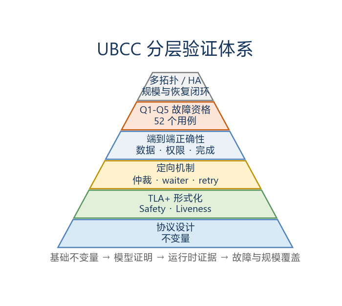
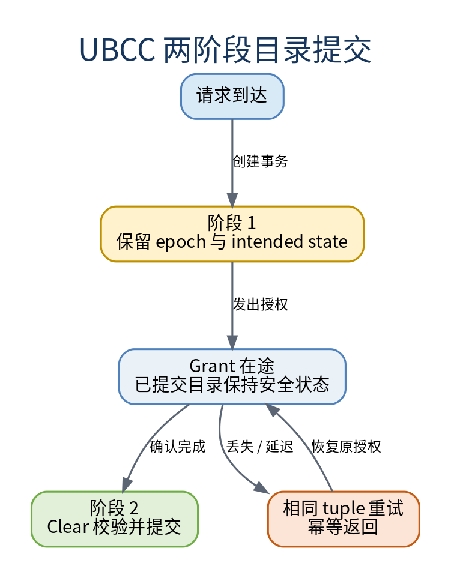

# UBCC 形式化验证与可靠性资格报告

<!-- PAGEBREAK -->

---

## 目录

1. 验证目标与结论
2. 验证方法
3. 形式化验证结果
4. 可靠性机制
5. Q1-Q5 故障资格结果
6. HA 理论与参考比较
7. 处理器乱序与拓扑验证
8. 交付内容
9. 总结
附录 A 形式化模型清单
附录 B 模型与实现对应关系
附录 C 故障资格矩阵索引
附录 D 术语表

<!-- PAGEBREAK -->

---

## 1. 验证目标与结论

### 1.1 验证目标

本报告验证 UBCC 方案在正常执行、并发竞争和可恢复消息传输故障下的协议正确性，重点覆盖：

- 全局目录状态安全；
- 单一 owner 与 sharer 集合一致性；
- epoch 和 reqId 单调性；
- Recall、Invalidate、Upgrade 和 Clear 收敛；
- 两阶段提交与幂等处理；
- EP-RNF snoop 仲裁；
- 多 PA、多 Socket 和多节点隔离；
- 消息丢失、重复、延迟和乱序恢复。

### 1.2 验证体系

UBCC 方案采用分层验证方法：形式化模型验证状态与动作规则，定向机制验证连接模型与实现，
端到端验证确认数据与权限结果，故障资格矩阵验证恢复机制在实际消息路径中的表现。

图 1-1　UBCC 分层验证体系

### 1.3 总体结论

| 验证域 | 方法 | 结果 |
|---|---|---:|
| 目录核心状态与提交顺序 | TLA+ | 通过 |
| Recall、Invalidate、Upgrade 和 Clear 活性 | TLA+ + 定向验证 | 通过 |
| EP-RNF snoop 仲裁 | focused TLA+ + 端到端验证 | 通过 |
| 多 PA 与多 Socket 隔离 | TLA+ + 多拓扑验证 | 通过 |
| 处理器 O3 下的同步语义 | 可执行验证 | 通过 |
| Q1-Q5 故障资格 | 52 项仿真测试 | 52/52 通过 |
| 拓扑覆盖 | 3N1S、3N2S、8N2S、16N1S Level-A | 协议节点规模与端点能力通过 |

表中 Liveness 结论成立于对应 temporal property、FairSpec/forward-progress 公平性和可恢复
故障最终解除的模型条件；focused 仲裁与 waiter 模型提供 Safety 检查结果。

形式化模型与可执行验证从不同抽象层共同覆盖 UBCC 的安全性、活性和可恢复传输故障能力。

### 1.4 结论与范围

| 项目 | 结论 | 适用范围 |
|---|---|---|
| 实现验证 | 端到端、O3、多拓扑与 Q1-Q5 资格结果通过 | 当前实现及既定可执行场景 |
| 形式化验证 | 核心模型覆盖声明的 Safety/Liveness；focused 模型覆盖声明的 Safety | 有界状态、抽象环境与模型公平性假设 |
| HA 比较 | 既定 HA-VI 参考范围内聚合结果支持 UBCC 优势 | 2N1S、O3、单向完成语义和固定 256 KiB L3 配置 |

---

## 2. 验证方法

### 2.1 模型分层

验证模型按职责划分为四层：

1. 目录核心层：请求、授权、Clear、Recall、Invalidate 和目录提交；
2. 并发机制层：同址 outstanding、waiter、partial Ack 和 snoop 仲裁；
3. 拓扑隔离层：多 PA、多节点和多 Socket 状态隔离；
4. 故障传输层：消息丢失、重复、延迟和乱序。

每个模型只承担明确的协议论证职责，最终由端到端测试补充真实数据路径、缓存容量和运行拓扑。

### 2.2 形式化验证证据层级

| 证据层级 | 当前证据 | 支持的结论 |
|---|---|---|
| 当前实现 + 端到端执行 | 协议实现、定向机制测试、O3、多拓扑、性能正确性门禁和 Q1-Q5 | 已执行场景中的数据、权限、收敛与故障恢复结果 |
| 有界 / focused 形式化模型 | 目录核心、传输故障、多 PA/Socket、snoop 仲裁与 waiter 退役模型 | 核心与传输模型的 Safety/Liveness，以及 focused 模型声明的 Safety |
| 理论分析 | 协议路径、目录组织、HA-VI 结构差异与复杂度解释 | 机制差异、实验结果来源与适用条件 |

### 2.3 Safety 属性

形式化验证中的主要 Safety 属性包括：

- 同一缓存行至多存在一个有效写 owner；
- owner 与 sharer 集合满足状态约束；
- committed epoch 不回退；
- 过期消息不能覆盖新目录状态；
- 重复 Ack 不重复推进事务；
- Clear 只提交匹配的 epoch、reqId 和 requester；
- 不同 PA 和不同 Socket 的事务互不污染；
- 已完成 waiter 不被重复重放。

### 2.4 Liveness 属性

主要 Liveness 属性包括：

- 在消息最终可达的条件下，请求最终获得授权或明确重试；
- Recall 最终返回数据或完成 owner 降级；
- Invalidate 在目标 Ack 收敛后完成；
- Clear 完成后 outstanding 被退役；
- waiter 在阻塞条件解除后得到重放；
- EP-RNF 同址 snoop 不形成循环等待。

### 2.5 模型与实现对应

模型动作与实现机制采用稳定语义对应，而不依赖源码行号：

| 模型动作 | 实现机制 |
|---|---|
| `RequestGrant` | UBCC 请求仲裁与 intended state 建立 |
| `RecallOwner` | RecallReq / RecallResp 数据回收 |
| `InvalidateSharers` | 目标集合确定并保持、InvalidateReq 和 Ack 位图 |
| `ClearCommit` | Clear 身份校验与目录提交 |
| `RetireWaiter` | 已完成 Read waiter 精确退役 |
| `ReplayWaiter` | 阻塞条件解除后的请求重放 |
| `SnoopArbitrate` | EP-RNF 对同址 snoop 的 immediate/stale 仲裁 |

---

## 3. 形式化验证结果

### 3.1 UBCC 目录核心

目录核心模型覆盖请求、授权、Clear、Recall 和 Invalidate 的状态迁移，验证目录提交前后
owner、sharer、epoch 和 outstanding 关系保持一致。

验证结果表明：

- 授权在途期间 committed state 保持安全；
- Clear 只提交匹配事务；
- Recall 与 Invalidate 不产生双 owner；
- 重复和延迟消息不会改变已完成事务结果。

### 3.2 传输故障模型

传输故障模型枚举丢失、重复和乱序消息，验证 epoch、reqId、Ack 位图和幂等确认能够阻止
重复提交与过期状态覆盖。

### 3.3 多 PA 与多 Socket 隔离

多 PA 和多 Socket 模型验证不同地址、不同 Home Socket 和不同 requester 的状态独立性。
任一事务的 outstanding、waiter、Ack 集合和提交结果不会污染其他事务。

### 3.4 EP-RNF snoop 仲裁

EP-RNF focused 模型覆盖 active Recall、ReadShared、ReadUnique、CleanUnique 与多类 snoop
组合。模型验证 immediate 和 stale 响应规则能够打破同址循环等待，同时保持数据权限约束。

该模型完成 328 个状态的全空间检查，Safety 属性全部通过。

### 3.5 committed waiter 精确退役

成功提交 Clear 后，UBCC 按 `(PA, node, socket, reqId)` 精确退役已经完成的 Read waiter，
保留其他 requester、事务身份和操作类型，再安全重放剩余请求。

该 focused 模型完成 274,593 个状态的检查，验证以下性质：

- 已完成 waiter 不会再次创建同类 outstanding；
- 非匹配 waiter 不被误删；
- Writeback、Upgrade 和 Evict waiter 保持独立；
- replay 不改变已提交目录状态。

### 3.6 结果汇总

| 模型组 | 核心论证 | Safety | Liveness |
|---|---|:---:|:---:|
| UBCC 目录核心 | 目录状态、授权与提交 | 通过 | 通过 |
| 传输故障 | 丢失、重复、乱序 | 通过 | 通过 |
| 多 PA / 多 Socket | 状态隔离 | 通过 | 通过 |
| EP-RNF 仲裁 | 同址 snoop 仲裁安全性 | 通过 | 由 TC98 验证 |
| waiter 退役 | 精确退役与重放安全性 | 通过 | 由 TC224、TC126 验证 |

---

## 4. 可靠性机制

### 4.1 两阶段目录提交

Home UBCC 控制器使用保留和提交两个阶段管理跨节点授权：

1. 请求通过仲裁后，Home UBCC 控制器建立 outstanding 并记录 intended state；
2. Grant 发送期间，原 committed state 保持有效；
3. requester 本地操作完成后发送 Clear；
4. Home UBCC 控制器校验 epoch、reqId 和 requester；
5. 匹配事务提交 intended state，并退役 outstanding。

图 4-1　UBCC 两阶段目录提交

两阶段提交将“权限已承诺”和“目录已提交”清晰分离，使 Grant 丢失、Clear 重试和重复请求
都可以按相同事务身份恢复。

### 4.2 epoch 与 reqId

epoch 区分同址事务的新旧顺序，reqId 区分同一 epoch 内的具体请求。接收方在处理响应、
Ack 和 Clear 前执行 tuple 校验，过期消息不会覆盖新状态。

### 4.3 Ack 位图

Invalidate 使用目标位图和 Ack 位图记录每个节点的完成状态。重复 Ack 只命中已置位目标，
不会重复推进事务；发生 partial Ack 时，仅对尚未确认的目标重发请求。

### 4.4 tombstone 与幂等确认

已完成 Clear 在短期内保留 tombstone。相同 tuple 的重复 Clear 可以直接获得已接受结果，
而不重新提交目录状态。

### 4.5 waiter 去重与重放

进入等待队列的请求按地址、请求者、Socket、reqId 和操作类型去重。阻塞条件解除后，UBCC
重新检查 committed directory，再决定服务、继续等待或重试。

### 4.6 数据可见性

Recall 和 dirty writeback 使用当前 owner、目录 epoch 和事务身份共同确定权威数据。目录
提交只在数据和权限路径满足完成条件后发生，保证新 owner 获得最新数据。

### 4.7 可靠性故障模型

可靠性验证采用节点与 Home 持续存活、可恢复传输故障最终解除的模型条件。

| 故障类别 | 模型 | 预期恢复机制 | 验证证据 |
|---|---|---|---|
| 消息丢失 | 单次或连续丢失可恢复消息 | stable tuple 重试、幂等接收 | Q1-Q3 |
| 消息重复 | 同一事务消息重复送达 | Ack 位图、tombstone、重复提交抑制 | Q1、Q4 |
| 消息延迟 | 消息晚于后续事务阶段到达 | epoch/reqId 校验、deferred 收敛 | Q1、Q3、Q5 |
| 消息乱序 | 合法消息以不同顺序到达 | 状态阶段检查与过期消息拒绝 | Q1、Q4 |
| 并发压力 | 多 PA、多来源 Ack、接近 outstanding 边界 | 同址串行化、waiter 和 partial Ack | Q4 |

---

## 5. Q1-Q5 故障资格结果

### 5.1 矩阵设计

Q1-Q5 矩阵面向可恢复消息传输故障，覆盖基础故障、连续丢失、组合故障、并发压力和多拓扑。
每项运行同时检查：

- 预期故障规则准确触发；
- 延迟和乱序消息实际送达；
- 数据读回与权限结果正确；
- 重复消息不产生重复提交；
- pending、held 和 deferred 状态最终收敛；
- 所有参与模块正常结束。

### 5.2 分组结果

| 资格组 | 数量 | 核心覆盖 | 结果 |
|---|---:|---|---:|
| Q1 | 20 | 基础消息故障集合 | 20/20 通过 |
| Q2 | 8 | Clear、Upgrade、InvalidateAck、RecallResp 连续丢失 | 8/8 通过 |
| Q3 | 4 | 请求与响应的双故障组合 | 4/4 通过 |
| Q4 | 8 | 32 PA、burst、partial Ack、multi-source、near-outstanding | 8/8 通过 |
| Q5 | 12 | 3N1S、3N2S、8N2S、16N1S Level-A | 12/12 通过 |
| 合计 | 52 | Q1-Q5 | 52/52 通过 |

五组共 52 项仿真测试，最终结果为 52/52 通过。

### 5.3 消息覆盖

| 协议路径 | 覆盖消息 |
|---|---|
| Clear | ClearReq、ClearResp |
| Upgrade | UpgradeReq、UpgradeResp、UpgradeAckNotify |
| Invalidate | InvalidateReq、InvalidateAck |
| Recall | RecallReq、RecallResp |

### 5.4 故障动作覆盖

| 故障动作 | 覆盖 case 数 | 验证职责 |
|---|---:|---|
| 丢失 | 37 | 重试、stable tuple 和最终收敛 |
| 延迟 | 13 | deferred delivery 与过期消息处理 |
| 重复 | 6 | Ack、Clear 和事务提交幂等 |
| 乱序 | 6 | 接收顺序变化下的 epoch/reqId 安全 |

同一测试可同时包含多个故障动作，因此动作覆盖数不等于仿真测试总数。

### 5.5 连续丢失与组合故障

Q2 验证首 2 次和首 3 次消息丢失后的恢复，覆盖 ClearReq、UpgradeReq、InvalidateAck 和
RecallResp。Q3 验证以下有依赖关系的组合：

- UpgradeResp 丢失 + UpgradeAckNotify 丢失；
- InvalidateReq 丢失 + InvalidateAck 丢失；
- RecallReq 丢失 + RecallResp 丢失；
- ClearReq 丢失 + ClearResp 延迟。

四类组合均完成数据和权限收敛。

### 5.6 并发与拓扑覆盖

Q4 覆盖 32 PA、partial Ack、多源 Ack 和接近 outstanding 容量的代表流量。Q5 在以下
拓扑完成请求和 Ack 故障验证：

| 拓扑 | 代表性覆盖 | 结果 |
|---|---|---:|
| 3N1S | 基础跨节点失效与确认 | 3/3 通过 |
| 3N2S | 多 Socket 路由与事务身份 | 3/3 通过 |
| 8N2S | 多 sharer 与 partial Ack | 3/3 通过 |
| 16N1S Level-A | node15、16 节点共享转写者 | 3/3 通过 |

---

## 6. HA 理论与参考比较

### 6.1 比较目的与固定范围

HA-VI 证据用于回答：在相同 workload、完成边界和统一参数下，UBCC 的目录定位与权限路径
相对窄化 VI 参考模型有何结构差异。比较范围固定为 2N1S、O3、单向完成语义、256 KiB
L3 和 100% L3 压力；该结果定位为理论分析与可执行参考模型比较。

### 6.2 参考条件与公平性定义

| 维度 | 统一参考条件 | 参考模型抽象 |
|---|---|---|
| 系统与处理器 | 2N1S、O3；UBCC 与 HA-VI 使用相同节点和处理器条件 | 处理器、缓存与 Home 采用共同可执行环境配置 |
| workload 与输入 | 相同 testcase、输入、操作配比和 100% L3 压力 | 结果对应表列 workload、输入配比与 L3 配置 |
| 完成与计量 | 相同根操作完成边界；单向完成语义 | 计量采用根操作单向完成事件 |
| 对照模型 | 既定 HA-VI 可执行参考模型及其目录、状态和时延参数 | HA-VI 按表列目录、状态与时延参数执行 |
| 通信结构 | 两方案使用相同可执行比较环境 | 通信采用共同可执行传输环境 |
| 结果解释 | 按正式主值形成核心场景组和代表场景组的等权聚合 | 结论适用于核心与代表场景组聚合 |

这些条件保证配对比较在既定参考范围内使用共同输入和共同完成边界。结论反映核心场景组
与代表场景组的平均主值比较结果。

### 6.3 理论结构比较

| 维度 | UBCC | HA-VI 既定参考模型 | 理论含义 |
|---|---|---|---|
| 全局状态表达 | 精确 owner、sharer 与事务身份 | VI 有效/无效关系的窄化表达 | UBCC 可直接形成精确 Recall/Invalidate 目标 |
| 目录资源 | 独立 ResidentDir + H64 Backstore | 既定参考目录组织 | UBCC 方案将全局元数据与节点内 Home 资源解耦 |
| 提交语义 | Grant 与 Clear 两阶段提交 | 参考模型完成链 | UBCC 显式区分承诺与提交，并支持幂等恢复 |
| 数据源选择 | 按 owner 定位权威数据 | 按参考模型状态路径处理 | 对 ownership handoff 和 shared-to-writer 路径影响最直接 |

理论结构比较用于解释机制差异，性能结论由相同输入下的正式配对运行给出。

### 6.4 HA-VI 参考结果

| 固定 L3 配置 | 场景组 | UBCC ticks/op | HA-VI ticks/op | UBCC 降幅 |
|---|---|---:|---:|---:|
| 256 KiB / 100% 压力 | 核心场景组 | 31.440 | 39.344 | 20.090% |
| 256 KiB / 100% 压力 | 代表场景组 | 76.178 | 79.060 | 3.645% |

在该固定 L3 配置下，核心场景组和代表场景组均满足 UBCC 平均时延低于 HA-VI。
该结果与理论分析相互印证，适用于上述 HA-VI 参考模型及固定实验配置。

---

## 7. 处理器乱序与拓扑验证

### 7.1 O3 可执行验证

处理器乱序验证覆盖以下同步场景：

- release/acquire 远程发布；
- 脏数据所有权迁移；
- 多独立缓存行并行访问；
- Invalidate 与 acquire read 竞争。

相关测试在 O3 模型下全部通过，确认节点内乱序执行与 UBCC 全局权限顺序能够正确协同。

### 7.2 16 节点协议能力验证

16N1S Level-A 验证覆盖 16 个协议节点、跨节点共享者集合和正式性能工作负载。Q5 进一步覆盖
该配置下的请求丢失、Ack 丢失和 Ack 延迟。结果确认了 16 节点规模下的协议端点与事务收敛能力。

---

## 8. 交付内容

本次交付覆盖：

- UBCC 目录状态与关键活性机制；
- EP-RNF、EP-SNF 和 UBAdapter 协同；
- 可恢复消息传输故障；
- 3N1S、3N2S、8N2S 和 16N1S Level-A 代表拓扑；
- O3 处理器模型下的同步语义；
- 性能矩阵执行前的正确性门禁。

---

## 9. 总结

UBCC 已建立从形式化模型到端到端执行的分层验证体系。目录提交、同址事务、消息幂等、
失效收敛和 snoop 仲裁均获得明确验证；Q1-Q5 故障资格矩阵 52/52 通过，多拓扑和 O3
验证进一步确认了实现的工程适用性。

---

## 附录 A 形式化模型清单

| 模型组 | 覆盖内容 |
|---|---|
| UBCC protocol core | request、grant、clear、recall、invalidate |
| transport faults | 丢失、重复、乱序 |
| intra-node EP | EP-RNF single-flight 与 snoop 仲裁 |
| multi-PA / multi-socket | 地址与 Socket 隔离 |
| waiter retirement | committed waiter 精确退役 |
| capacity refill | 数据完整性、升级屏障与 refill |

---

## 附录 B 模型与实现对应关系

| 验证概念 | 实现组件 |
|---|---|
| 全局目录状态 | UBCCController、ResidentDir |
| 两阶段提交 | UBCC outstanding 与 Clear 处理 |
| Recall | UBCCController、EPBackend、EP-RNF |
| Invalidate | UBCCController、UBAdapter、EP-RNF |
| waiter | ResidentDir waiter queue |
| Backstore 换入 | BackstoreHost、BackstoreSchema |
| snoop 仲裁 | EP-RNF |

---

## 附录 C 故障资格矩阵索引

| 资格组 | 工作负载类型 | 主要消息 | 主要拓扑 |
|---|---|---|---|
| Q1 | 单故障基础集 | Clear、Upgrade、Invalidate、Recall | 3N1S |
| Q2 | 连续丢失 | ClearReq、UpgradeReq、InvalidateAck、RecallResp | 3N1S |
| Q3 | 双故障组合 | 请求 + 响应 | 3N1S |
| Q4 | burst / concurrency | Clear、InvalidateAck、RecallResp | 3N1S |
| Q5 | topology | InvalidateReq、InvalidateAck | 3N1S、3N2S、8N2S、16N1S Level-A |

---

## 附录 D 术语表

| 术语 | 说明 |
|---|---|
| UBCC 方案 | 采用独立 Outer 一致性层和分层目录的跨节点一致性体系结构 |
| UBCC 控制器 | 维护全局目录并执行同址事务仲裁的控制器组件 |
| Home UBCC 控制器 | 由地址映射选定、负责目标地址目录和提交的控制器实例 |
| EP-RNF | 代表 Outer 域参与节点内 snoop 的端点 |
| ResidentDir | SRAM 驻留目录 |
| H64 Backstore | 位于 metadata DRAM、保存冷目录元数据的 64 B bucket 哈希表 |
| TLA+ | 用于描述并检查协议状态与动作的形式化语言 |
| O3 | Out-of-Order，乱序执行并按架构顺序提交的处理器模型；用于验证乱序条件下的同步与一致性语义 |
| Safety | 所有可达状态均满足的不变量 |
| epoch | 区分同址新旧事务的单调序号 |
| reqId | 标识具体请求的事务编号 |
| stable tuple | 重试期间保持不变的事务身份 |
| tombstone | 已完成事务的幂等确认记录 |
| partial Ack | 目标集合中部分节点已经完成确认 |
| Q1-Q5 | 从基础单故障到多拓扑故障的五级资格分组 |
| ubsim |  |
| ub |  |
| Liveness | 在公平调度和消息最终可达条件下，事务能够持续推进并最终完成的性质 |
