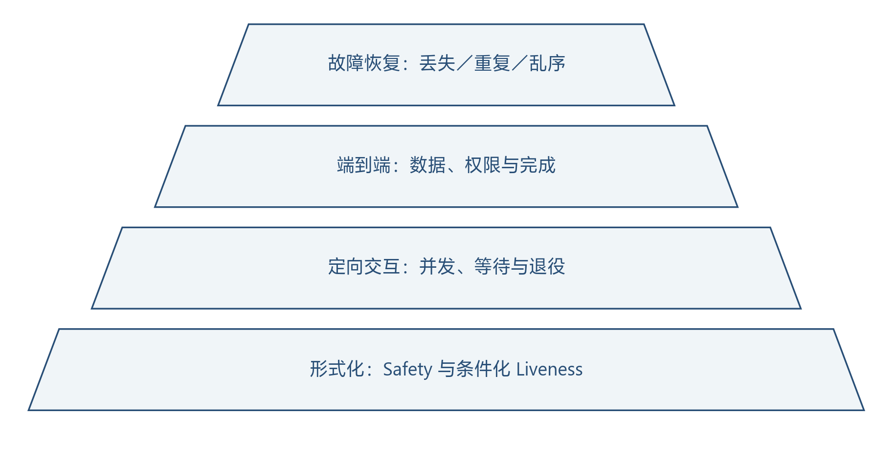
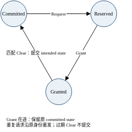

# UBCC 形式化验证与可靠性资格报告

<!-- PAGEBREAK -->

---

## 目录

1. 验证目标与结论
2. 验证方法
3. 形式化验证结果
4. 可靠性机制
5. 丢包、重复、乱序故障结果
6. HA 理论与仿真参考比较
7. 处理器乱序与拓扑验证
8. 交付内容
9. 总结
附录 A 形式化模型清单
附录 B 模型与实现对应关系
附录 C 故障资格矩阵索引
附录 D 术语表

<!-- PAGEBREAK -->

---

## 1. 验证目标与结论

### 1.1 验证目标

本报告验证 UBCC 方案在正常执行、并发竞争和可恢复消息传输故障下的协议正确性与可靠性，重点覆盖以下不变量或场景：

- 全局目录状态安全；
- 单一 owner 与 sharer 集合一致性；
- epoch 和 reqId 单调性；
- Recall、Invalidate、Upgrade 和 Clear 收敛；
- 两阶段提交与幂等处理；
- EP-RNF snoop 仲裁；
- 多 PA、多 Socket 和多节点隔离；
- 消息丢失、重复、延迟和乱序恢复。

### 1.2 验证体系

UBCC 方案采用分层验证方法：形式化模型验证状态与动作规则，定向机制验证连接模型与实现，
端到端验证确认数据与权限结果，故障资格矩阵验证恢复机制在实际消息路径中的表现。

图 1-1　UBCC 分层验证体系

### 1.3 总体结论

| 验证内容 | 方法 | 结果 |
|---|---|---:|
| 目录核心状态与提交顺序 | TLA+ | 通过 |
| Recall、Invalidate、Upgrade 和 Clear 活性 | TLA+ + 定向验证 | 通过 |
| EP-RNF snoop 仲裁 | focused TLA+ + 端到端验证 | 通过 |
| 多 PA 与多 Socket 隔离 | TLA+ + 多拓扑验证 | 通过 |
| 处理器 O3 下的同步语义 | 可执行验证 | 通过 |
| 丢包、重复、乱序故障 | 52 项仿真测试 | 52/52 通过 |
| 拓扑覆盖 | 3N1S、3N2S、8N2S、16N1S | 协议节点规模与端点能力通过 |

形式化模型与可执行仿真验证从不同抽象层共同覆盖 UBCC 的安全性、活性和可恢复传输故障能力。

## 2. 验证方法

### 2.1 模型分层

验证模型按职责划分为四层：

1. 目录核心层：定义缓存行在目录的授权与提交规则，包含请求、授权、Clear、Recall、Invalidate 和目录提交；
2. 并发机制层：处理同一地址上的并发竞争，包含同址 outstanding、waiter、partial Ack 和 snoop 仲裁；
3. 拓扑隔离层：保证不同地址、节点和 Socket 互不影响，包含多 PA、多节点和多 Socket 状态隔离；
4. 故障传输层：验证消息不可靠时的恢复，包含消息丢失、重复、延迟和乱序。

各模型分别承担明确的协议论证职责，端到端测试补充数据路径、缓存容量和运行拓扑验证。

### 2.2 形式化验证证据层级

| 证据层级 | 当前证据 | 支持的结论 |
|---|---|---|
| 当前实现 + 端到端执行 | 协议实现、定向机制测试、O3、多拓扑、性能正确性测试和 Q1-Q5 | 已执行场景中的数据、权限、收敛与故障恢复结果 |
| 有界 / focused 形式化模型 | 目录核心、传输故障、多 PA/Socket、snoop 仲裁与 waiter 退役模型 | 核心与传输模型的 Safety/Liveness，以及 focused 模型声明的 Safety |
| 理论分析 | 协议路径、目录组织、HA-VI 结构差异与复杂度解释 | 机制差异、实验结果来源与适用条件 |

### 2.3 Safety 属性

形式化验证中的主要 Safety 属性包括：

- 同一缓存行至多存在一个有效写 owner；
- owner 与 sharer 集合满足目录状态约束：G_E/G_M 至多一个 owner 且其在 sharer 位图中，G_S 至少一个 sharer，G_I 无 sharer；
- committed epoch 不回退；
- 过期消息不能覆盖新目录状态；
- 重复 Ack 不重复推进事务；
- Clear 只提交匹配的 epoch、reqId 和 requester；
- 不同 PA 和不同 Socket 的事务互不污染；
- 已完成 waiter 不被重复重放。

### 2.4 Liveness 属性

主要 Liveness 属性包括：

- 在消息最终可达的条件下，请求最终获得授权或明确重试；
- Recall 最终返回数据或完成 owner 降级；
- Invalidate 在目标 Ack 收敛后完成；
- Clear 完成后 outstanding 被退役；
- waiter 在阻塞条件解除后得到重放；
- EP-RNF 同址 snoop 不形成循环等待。

### 2.5 TLA+模型与实现对应

我们用 TLA+ 对 UBCC 目录的核心动作进行建模，其中 TLA+ 模型内的抽象动作与 UBCC 中具体实现的对应关系如下表所示：

| 模型动作 | 实现机制 |
|---|---|
| `RequestGrant` | UBCC 请求仲裁与 intended state 建立 |
| `RecallOwner` | RecallReq / RecallResp 数据回收 |
| `InvalidateSharers` | 目标集合确定并保持、InvalidateReq 和 Ack 位图 |
| `ClearCommit` | Clear 身份校验与目录提交 |
| `RetireWaiter` | 已完成 Read waiter 精确退役 |
| `ReplayWaiter` | 阻塞条件解除后的请求重放 |
| `SnoopArbitrate` | EP-RNF 对同址 snoop 的 immediate/stale 仲裁 |

---

## 3. 形式化验证结果

### 3.1 UBCC 目录核心

目录核心模型覆盖请求、授权、Clear、Recall 和 Invalidate 的状态迁移，验证目录提交前后
owner、sharer、epoch 和 outstanding 关系保持一致。

我们对 UBCC 目录核心动作建模，并用 TLA+ 做了形式化验证；所有声明的不变量均在建模的状态空间内成立。验证结果表明：

- 授权在途期间 committed state 保持安全；
- Clear 只提交匹配事务；
- Recall 与 Invalidate 不产生双 owner；
- 重复和延迟消息不会改变已完成事务结果。

### 3.2 传输故障模型

传输故障模型枚举丢失、重复和乱序消息，逐项检查：重复消息不产生重复提交；过期消息不覆盖新的目录状态；epoch、reqId 与 Ack 位图的匹配规则正确；幂等确认在重放后仍收敛。据此验证 epoch、reqId、Ack 位图和幂等确认能够阻止重复提交与过期状态覆盖。

### 3.3 多 PA 与多 Socket 隔离

多 PA 和多 Socket 模型验证不同地址、不同 Home Socket 和不同 requester 的状态独立性。
任一事务的 outstanding、waiter、Ack 集合和提交结果不会污染其他事务。

### 3.4 EP-RNF snoop 仲裁

EP-RNF focused 模型覆盖 active Recall、ReadShared、ReadUnique、CleanUnique 与多类 snoop
组合。模型验证 immediate 和 stale 响应规则能够打破同址循环等待，同时保持数据权限约束。

该模型完成 328 个状态的全空间检查，Safety 属性全部通过。

### 3.5 committed waiter 精确退役

成功提交 Clear 后，UBCC 按 `(PA, node, socket, reqId)` 精确退役已经完成的 Read waiter，
保留其他 requester、事务身份和操作类型，再安全重放剩余请求。

该 focused 模型完成 274,593 个状态的检查，验证了以下性质：

- 已完成 waiter 不会再次创建同类 outstanding；
- 非匹配 waiter 不被误删；
- Writeback、Upgrade 和 Evict waiter 保持独立；
- replay 不改变已提交目录状态。

#### 3.5.1 EP 交接身份与完成不变量

Recall 与写回交接使用节点级 64 项协调表，分别保留首次 owner／epoch 快照、Recall 与写回事务身份及 Socket。有效令牌同时匹配槽位和 generation；在同一地址重新分配的条目不能被旧回调完成。数据发布、写回完成与 Recall 原生清理分别推进，只有已登记路径全部满足完成条件，且不存在尚未到达的合并 Recall，才能退役。

| 交互条件 | 必须保持的约束 | 验证关注点 |
|---|---|---|
| Recall 先到、写回后到 | 首次 owner／epoch 快照不变 | 合并身份与数据责任一致 |
| 写回先发布、Recall 后到 | 保留已合并 Recall 标识 | 不能提前释放交接描述符 |
| 延迟回调遇到槽位复用 | generation 必须匹配 | 不能完成新条目 |
| 两 Socket 同址交接 | 两侧 Socket 分别匹配 | 不能消费另一返回路径 |
| 普通写回达到分配上限 | 控制预留不被普通新分配占用 | 回收路径保留准入机会 |
| Home 容量等待后重放 | 原操作与携带数据保持 | 写回不能退化成只更新目录的读请求 |

### 3.6 结果汇总

| 模型组 | 核心论证 | Safety | Liveness |
|---|---|:---:|:---:|
| UBCC 目录核心 | 目录状态、授权与提交 | 通过 | 通过 |
| 传输故障 | 丢失、重复、乱序 | 通过 | 通过 |
| 多 PA / 多 Socket | 状态隔离 | 通过 | 通过 |
| EP-RNF 仲裁 | 同址 snoop 仲裁安全性 | 通过 | 由 TC98 验证 |
| waiter 退役 | 精确退役与重放安全性 | 通过 | 由 TC224、TC126 验证 |

---

## 4. 可靠性机制

### 4.1 两阶段目录提交

Home UBCC 控制器使用保留和提交两个阶段管理跨节点授权：

1. 请求通过仲裁后，Home UBCC 控制器建立 outstanding 并记录 intended state；
2. Grant 发送期间，原 committed state 保持有效；
3. requester 本地操作完成后发送 Clear；
4. Home UBCC 控制器校验 epoch、reqId 和 requester；
5. 匹配事务提交 intended state，并退役 outstanding。

图 4-1　UBCC 两阶段目录提交

两阶段提交将“权限已承诺”和“目录已提交”清晰分离，使 Grant 丢失、Clear 重试和重复请求
都可以按相同事务身份恢复。

### 4.2 epoch 与 reqId

epoch 区分同址事务的新旧顺序，reqId 区分同一 epoch 内的具体请求。接收方在处理响应、
Ack 和 Clear 前执行 tuple 校验，过期消息不会覆盖新状态。

### 4.3 Ack 位图

Invalidate 使用目标位图和 Ack 位图记录每个节点的完成状态。重复 Ack 只命中已置位目标，
不会重复推进事务；发生 partial Ack 时，仅对尚未确认的目标重发请求。

### 4.4 tombstone 与幂等确认

已完成 Clear 在短期内保留 tombstone。相同 tuple 的重复 Clear 可以直接获得已接受结果，
而不重新提交目录状态。

### 4.5 waiter 去重与重放

进入等待队列的请求按地址、请求者、Socket、reqId 和操作类型去重。阻塞条件解除后，UBCC
重新检查 committed directory，再决定服务、继续等待或重试。

### 4.6 数据可见性

Recall 和 dirty writeback 使用当前 owner、目录 epoch 和事务身份共同确定权威数据。目录
提交只在数据和权限路径满足完成条件后发生，保证新 owner 获得最新数据。

### 4.7 可靠性故障仿真模型

可靠性验证采用节点与 Home 持续存活、可恢复传输故障最终解除的模型条件。

| 故障类别 | 模型 | 预期恢复机制 | 验证证据 |
|---|---|---|---|
| 消息丢失 | 单次或连续丢失可恢复消息 | stable tuple 重试、幂等接收 | Q1-Q3 |
| 消息重复 | 同一事务消息重复送达 | Ack 位图、tombstone、重复提交抑制 | Q1、Q4 |
| 消息延迟 | 消息晚于后续事务阶段到达 | epoch/reqId 校验、deferred 收敛 | Q1、Q3、Q5 |
| 消息乱序 | 合法消息以不同顺序到达 | 状态阶段检查与过期消息拒绝 | Q1、Q4 |
| 并发压力 | 多 PA、多来源 Ack、Near-outstanding 边界 | 同址串行化、waiter 和 partial Ack | Q4 |

---

## 5. 丢包、重复、乱序故障结果

### 5.1 矩阵设计

丢包、重复、乱序故障矩阵面向可恢复消息传输故障，覆盖基础故障、连续丢失、组合故障、并发压力和多拓扑。
每项运行同时检查：

- 预期故障规则准确触发；
- 延迟和乱序消息实际送达；
- 数据读回与权限结果正确；
- 重复消息不产生重复提交；
- pending、held 和 deferred 状态最终收敛；
- 所有参与模块正常结束。

### 5.2 分组结果

| 资格组 | 数量 | 核心覆盖 | 结果 |
|---|---:|---|---:|
| Q1 | 20 | 基础消息故障集合 | 20/20 通过 |
| Q2 | 8 | Clear、Upgrade、InvalidateAck、RecallResp 连续丢失 | 8/8 通过 |
| Q3 | 4 | 请求与响应的双故障组合 | 4/4 通过 |
| Q4 | 8 | 32 PA、burst、partial Ack、multi-source、Near-outstanding | 8/8 通过 |
| Q5 | 12 | 3N1S、3N2S、8N2S、16N1S | 12/12 通过 |
| 合计 | 52 | Q1-Q5 | 52/52 通过 |

五组共 52 项仿真测试，最终结果为 52/52 通过。

### 5.3 消息覆盖

| 协议路径 | 覆盖消息 |
|---|---|
| Clear | Clear、ClearAck |
| Upgrade | UpgradeReq、UpgradeResp、UpgradeAckNotify |
| Invalidate | InvalidateReq、InvalidateAck |
| Recall | RecallReq、RecallResp |

### 5.4 故障动作覆盖

| 故障动作 | 覆盖 case 数 | 验证职责 |
|---|---:|---|
| 丢失 | 37 | 重试、stable tuple 和最终收敛 |
| 延迟 | 13 | deferred delivery 与过期消息处理 |
| 重复 | 6 | Ack、Clear 和事务提交幂等 |
| 乱序 | 6 | 接收顺序变化下的 epoch/reqId 安全 |

故障动作按类别计数，同一测试可计入多个类别；仿真测试总数为 52。

### 5.5 连续丢失与组合故障

Q2 验证首 2 次和首 3 次消息丢失后的恢复，覆盖 Clear、UpgradeReq、InvalidateAck 和
RecallResp。Q3 验证以下有依赖关系的组合：

- UpgradeResp 丢失 + UpgradeAckNotify 丢失；
- InvalidateReq 丢失 + InvalidateAck 丢失；
- RecallReq 丢失 + RecallResp 丢失；
- Clear 丢失 + ClearAck 延迟。

四类组合均完成数据和权限收敛。

### 5.6 并发与拓扑覆盖

Q4 覆盖 32 PA、partial Ack、多源 Ack 和 Near-outstanding（请求数接近控制器并发 outstanding 上限）的代表流量。Q5 在以下
拓扑完成请求和 Ack 故障验证：

| 拓扑 | 代表性覆盖 | 结果 |
|---|---|---:|
| 3N1S | 基础跨节点失效与确认 | 3/3 通过 |
| 3N2S | 多 Socket 路由与事务身份 | 3/3 通过 |
| 8N2S | 多 sharer 与 partial Ack | 3/3 通过 |
| 16N1S | node15、16 节点共享转写者 | 3/3 通过 |

---

## 6. HA 理论与仿真参考比较

### 6.1 比较目的与范围

本章节用于回答：在相同 workload、完成边界和统一参数下，UBCC 的目录定位与权限路径相对 HA 方案参考模型有何结构差异。该结果涵盖理论分析与对 HA 方案进行适当建模的仿真比较。

### 6.2 参考条件与公平性定义

本节对照的 HA 参考模型（HA-VI）按照以下条件建模：

- 节点级状态为 VI，每行只有有效/无效两态；
- 每缓存行 N-bit 节点级目录，一位为 VI 状态、N−1 位标记该行远端副本的持有副本的节点；
- 采用 write-back 策略，store 时需要失效其他节点的副本；
- 元数据位于 IODie；全局缓存地址空间不超过 128 MiB；元数据占用不超过 512 KB；
- 网络保证可靠性，不考虑丢包等问题。

配对比较采用统一条件：

| 维度 | 统一参考条件 |
|---|---|
| 系统与处理器 | 两方案使用相同节点、缓存与处理器（Arm O3）条件 |
| workload 与输入 | 相同 testcase、输入与对应 L3 Cache 压力 |
| 完成与计量 | 相同完成边界（根完成语义）：以单次操作发起为起点，终点为数据与权限可被观察 |
| 可靠性 | 单向完成语义：响应不需要额外 Ack 握手，可靠性由网络保证 |

### 6.3 理论结构比较

HA-VI 的节点级目录精确记录了该行副本的持有节点，因此失效目标集合与 UBCC 的 sharer 位图同样精确；两者的结构差异在权限表达与数据责任。按三条代表性场景（对应 TC228–TC230）比较：

**远程读（TC228）**
- UBCC：Home 依目录中的 owner 与 sharer 状态直接确定权威数据源，返回数据后建立共享关系。
- HA-VI：没有脏数据标记。若该行只有一个 holder，它可能是干净副本，也可能是最近一次 unique write 留下的最新数据，位图无法区分；因此对其他 requester 的读需要联系该 holder 取最新数据。
- 差异：多 holder、Home 数据最新时两者路径一致；单 holder 场景 HA-VI 要多一次 holder 联系。

**所有权迁移（TC229）**
- UBCC：目录直接定位最新数据的 owner，组织旧 owner 释放数据与权限，再向新 owner 授权。
- HA-VI：能精确失效其他 holder，但缺少 owner/脏数据信息，需先经节点内状态或 probe 确认最新数据在哪个 holder，再完成失效与数据回取。
- 差异：写前"定位最新数据"这一步是主要区别——UBCC 由目录直接给出，HA-VI 需要额外定位。

**共享转写者（TC230）**
- UBCC：按精确的 sharer 位图确定需失效的节点集合并行失效，确认收敛后授予单写者。
- HA-VI：同样按精确位图确定失效目标，失效与确认过程相同。
- 差异：写权限的复用。UBCC 获得 E/M 后可对同一行重复本地写、不再产生全局事务；HA-VI 每次写都要向 Home 申请 unique ownership 并执行一次失效事务，即使 requester 已是唯一 holder，仍有一次 requester–Home 往返。

另外，HA-VI 方案使用整个片上空间存储位图形式的元数据，其地址空间严重受限，且随着节点数增长进一步缩小（128 MB @ 2 Nodes，64 MB @ 4 Nodes）；而 UBCC 方案存储地址 Tag，从而允许缓存行稀疏地分布在较大的地址空间中。

### 6.4 HA-VI 参考结果

120 对结果在全部 15 个拓扑／压力坐标中，核心组三个 TC 的均值与代表组五个 TC 的均值均满足 UBCC 低于 HA-VI；核心组降幅约 21%–27%、代表组约 9%–25%。具体结果详见交付件 3 第 5 章。

---

## 7. 处理器乱序与拓扑验证

### 7.1 O3 可执行验证

处理器乱序验证覆盖以下同步场景：

- release/acquire 远程发布；
- 脏数据所有权迁移；
- 多独立缓存行并行访问；
- Invalidate 与 acquire read 竞争。

相关测试在 O3 模型下全部通过，确认节点内乱序执行与 UBCC 全局权限顺序能够正确协同。

### 7.2 16 节点协议能力验证

16N1S 多拓扑测试验证覆盖 16 个协议节点、跨节点共享者集合和正式性能工作负载。Q5 进一步覆盖
该配置下的请求丢失、Ack 丢失和 Ack 延迟。结果确认了 16 节点规模下的协议端点与事务收敛能力。

---

## 8. 交付内容

本次交付覆盖：

- UBCC 目录状态与关键活性机制；
- EP-RNF、EP-SNF 和 UBAdapter 协同；
- 可恢复消息传输故障；
- 3N1S、3N2S、8N2S 和 16N1S 代表拓扑；
- O3 处理器模型下的同步语义；
- 性能矩阵执行前的正确性测试。

---

## 9. 总结

UBCC 已建立从形式化模型到端到端执行的分层验证体系。目录提交、同址事务、消息幂等、
失效收敛和 snoop 仲裁均获得明确验证；Q1-Q5 故障资格矩阵 52/52 通过，多拓扑和 O3
验证进一步确认了实现的工程适用性。

---

## 附录 A 形式化模型清单

| 模型组 | 覆盖内容 |
|---|---|
| UBCC protocol core | request、grant、clear、recall、invalidate |
| transport faults | 丢失、重复、乱序 |
| intra-node EP | EP-RNF single-flight 与 snoop 仲裁 |
| multi-PA / multi-socket | 地址与 Socket 隔离 |
| waiter retirement | committed waiter 精确退役 |
| capacity refill | 数据完整性、升级屏障与 refill |

---

## 附录 B 模型与实现对应关系

| 验证概念 | 实现组件 |
|---|---|
| 全局目录状态 | UBCCController、ResidentDir |
| 两阶段提交 | UBCC outstanding 与 Clear 处理 |
| Recall | UBCCController、EPBackend、EP-RNF |
| Invalidate | UBCCController、UBAdapter、EP-RNF |
| waiter | ResidentDir waiter queue |
| Backstore 换入 | BackstoreHost、BackstoreSchema |
| snoop 仲裁 | EP-RNF |

---

## 附录 C 故障资格矩阵索引

| 资格组 | 工作负载类型 | 主要消息 | 主要拓扑 |
|---|---|---|---|
| Q1 | 单故障基础集 | Clear、Upgrade、Invalidate、Recall | 3N1S |
| Q2 | 连续丢失 | Clear、UpgradeReq、InvalidateAck、RecallResp | 3N1S |
| Q3 | 双故障组合 | 请求 + 响应 | 3N1S |
| Q4 | burst / concurrency | Clear、InvalidateAck、RecallResp | 3N1S |
| Q5 | topology | InvalidateReq、InvalidateAck | 3N1S、3N2S、8N2S、16N1S |

---

## 附录 D 术语表

| 术语 | 说明 |
|---|---|
| UBCC 方案 | 采用独立 Outer 一致性层和分层目录的跨节点一致性体系结构 |
| UBCC 控制器 | 维护全局目录并执行同址事务仲裁的控制器组件 |
| Home UBCC 控制器 | 由地址映射选定、负责目标地址目录和提交的控制器实例 |
| EP-RNF | 代表 Outer 域参与节点内 snoop 的端点 |
| ResidentDir | SRAM 驻留目录 |
| H64 Backstore | 位于 metadata DRAM、保存冷目录元数据的 64 B bucket 哈希表 |
| TLA+ | 用于描述并检查协议状态与动作的形式化语言 |
| O3 | Out-of-Order，乱序执行并按架构顺序提交的处理器模型；用于验证乱序条件下的同步与一致性语义 |
| Safety | 所有可达状态均满足的不变量 |
| epoch | 区分同址新旧事务的单调序号 |
| reqId | 标识具体请求的事务编号 |
| stable tuple | 重试期间保持不变的事务身份 |
| tombstone | 已完成事务的幂等确认记录 |
| partial Ack | 目标集合中部分节点已经完成确认 |
| Q1-Q5 | 从基础单故障到多拓扑故障的五级测试分组 |
| ubsim | 组织仿真模块装载、运行与集成的框架 |
| Liveness | 在公平调度和消息最终可达条件下，事务能够持续推进并最终完成的性质 |
