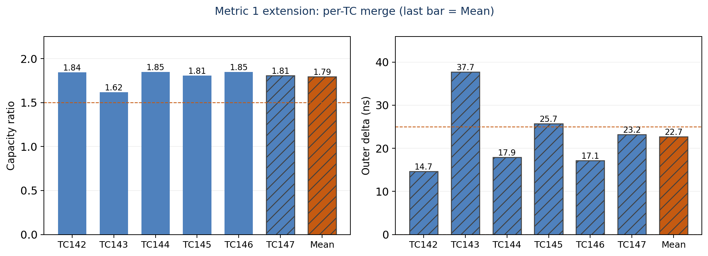
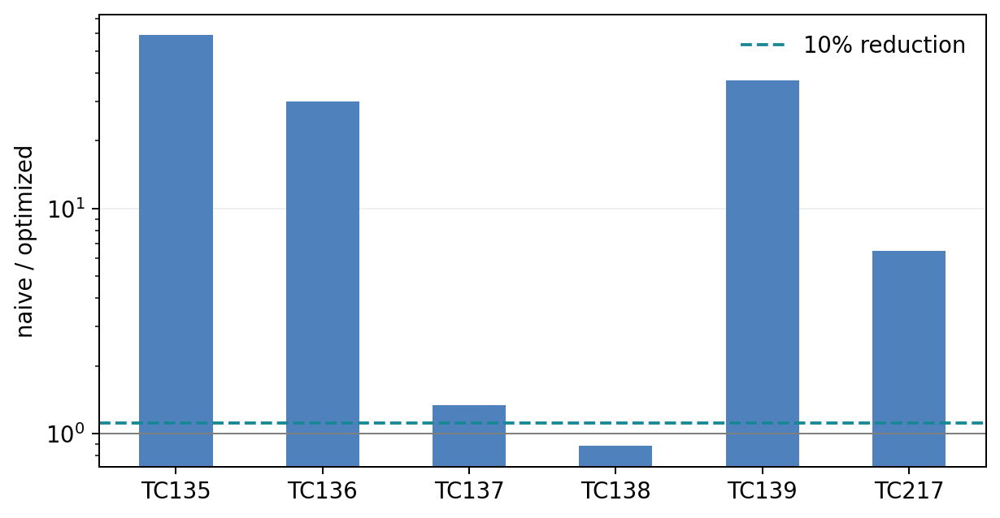
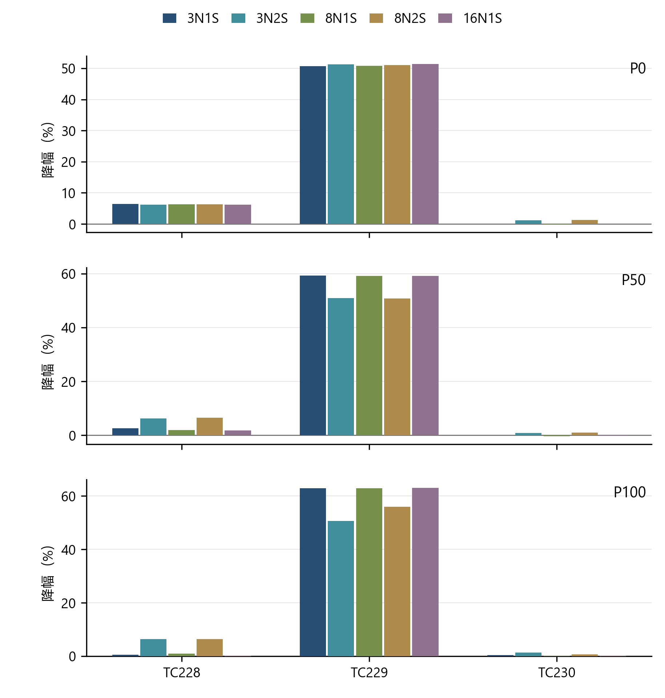
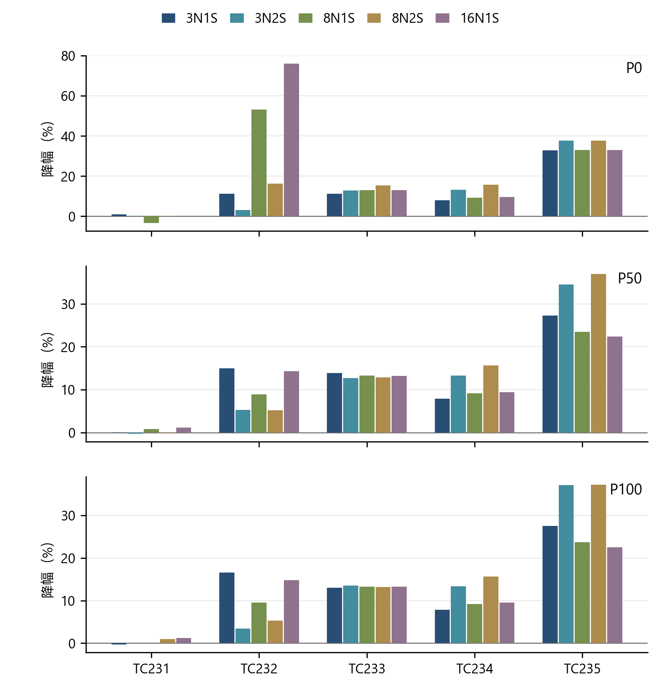

# UBCC 性能验收与集成接口说明

## 目录

1. 执行摘要

2. 验收方法

3. 指标 1：TC131 与 TC142–147 的容量及附加时延

4. 指标 2：TC135–140、TC217 与 TC142–147 服务阶段

5. 指标 3：TC228–235 的 UBCC/HA-VI 配对比较

6. 正确性与回归结果

7. 测试脚本使用指南

8. 总结

附录 A 指标口径

附录 B TC120-TC140、TC142-TC147 与 TC217 场景明细

附录 C TC228-TC235 场景明细

附录 D 四拓扑扩展性数据

附录 E 接口速查表

附录 F 术语表

## 1. 执行摘要

### 1.1 三项指标结论

UBCC 的性能评价包括容量效率、适用场景端到端时延和 HA-VI 方案的配对比较。三项指标的核验集合分别为：指标 1 采用 TC131 + TC142–147 × 五种拓扑（3N1S、3N2S、8N1S、8N2S、16N1S）× P175/P200；指标 2 采用 TC135–140、TC217 + TC142–147（服务阶段 service）；指标 3 采用 TC228–235 五拓扑、三压力完整配对矩阵。

| 指标 | 验收门槛 | 已核验结果 | 结果范围 |
| --- | --- | --- | --- |
| 指标 1：等效追踪容量 | ≥ 1.500× | TC131 1.515×； TC142–147  1.618–1.849x | TC131 与 TC142–147 |
| 指标 1：附加时延 | < 25.000 ns | TC131 10.535 ns；TC142–147 均值为 22.731 ns | TC131 与 TC142–147 |
| 指标 2：适用场景等权平均降幅 | ≥ 10.000% | TC135-140/TC217 64.759%； TC142–147 服务阶段为 37.5%–50.5% | TC135–140、TC217 与 TC142–147 |
| 指标 3：UBCC 相对 HA-VI | 两场景组均满足 UBCC 平均时延更低 | 15 个拓扑/压力测试对全部满足 | TC228–235 五拓扑、三压力矩阵 |

### 1.2 结论与范围

| 项目 | 结论 | 适用范围 |
| --- | --- | --- |
| 指标 1 | 容量 1.515×（扩展 1.618–1.849）；附加时延 10.535 ns（扩展均值 22.731 ns） | TC131 与 TC142–147 |
| 指标 2 | 适用场景等权平均降幅 64.759%；扩展服务阶段 37.5%–50.5% | TC135–140、TC217 与 TC142–147 |
| 指标 3 | 固定 L3 配置下两个场景组均满足 UBCC 聚合均值更低 | TC228–235；既定 HA-VI 可执行参考模型 |

指标 1 的 TC142–147 覆盖五种拓扑 × P175/P200，容量 Mean 为 1.793×，附加时延 Mean 为 22.731 ns；TC143、TC145 的时延合并值超过 25 ns，不作逐 TC 全部达标声明。指标 2 的 TC142–147 仅使用 service，不以完整 episode 替代。两组指标 2 数据分别汇总，不虚构跨组统一总分。

### 1.3 正确性门禁

性能结论以正确性验证为前提：

| 验证矩阵 | 规模 | 结果 |
| --- | --- | --- |
| 指标 1/2 profile 矩阵 | 78 项 | 78/78 通过 |
| 指标 3 配对矩阵 | 240 次仿真运行 | 240/240 通过 |
| 正确性测试(TC1~119) | 84 项 | 84/84 通过 |
| G1–G5 故障测试 | 52 项 | 52/52 通过 |

## 2. 验收方法

### 2.1 Profile 定义与差异

指标 1/2 使用以下三个基础 profile。三者采用相同处理器、缓存层级、工作负载和完成边界， 差异集中在目录容量组织和协议时延优化。

| 配置维度 | naive | spill-noopt（noopt） | optimized（opt） |
| --- | --- | --- | --- |
| 片上目录预算 | 512 KiB | 512 KiB | 512 KiB |
| ResidentDir 物理容量 | 65,536 条 | 57,344 条 | 57,344 条 |
| Bloom 与 GroupIndex | 不启用 Bloom；4 KiB GroupIndex | 60 KiB 分组 Bloom；4 KiB GroupIndex | 与 spill-noopt 相同 |
| 容量溢出策略 | 在 ResidentDir 内选择替换条目 | 冷目录元数据迁移至 H64 Backstore | 与 spill-noopt 相同 |
| H64 Backstore | 不用于容量扩展 | 启用 lookup、upsert、erase 和按需换入 | 与 spill-noopt 相同 |
| 本地 silent upgrade | 关闭 | 关闭 | 开启 |
| batch read-shared | 关闭 | 关闭 | 开启 |
| direct forwarding | 关闭 | 关闭 | 关闭 |
| 指标 1 职责 | 容量分母 | 容量分子和 spill-512K 时延角色 | 支撑结果 |
| 指标 2 职责 | 时延基线 | 容量机制观察 | 与 naive 形成应用时延比较 |

spill-IdealDir 是指标 1 附加时延使用的实验角色。它保持 spill-noopt 的协议优化设置，采用 2 MiB 实验性片上目录预算和 131,072 条 ResidentDir 容量，为 TC131 提供无目录溢出的参考路径。

### 2.2 仿真拓扑与共同配置

本文使用 NnSs 描述逻辑仿真拓扑，其中 N 表示参与跨节点一致性的协议节点数，S 表示每个节点包含的 Socket 数。例如，8N1S 表示 8 个协议节点、每节点 1 个 Socket；8N2S 表示 8 个协议节点、每节点 2 个 Socket。

每个协议节点包含处理器与缓存层级、节点内 HN-F，以及连接 Inner CHI 域和 Outer 一致性层的 EP。地址映射为每条缓存行选择 Home 节点和 Home Socket；Home UBCC 控制器负责全局目录查询、owner/sharer 仲裁和目录提交。requester、Home 与数据 owner 可以位于不同节点，跨节点请求、数据、失效和确认均按 node/socket 身份路由。

各对照实验使用相同的处理器模型、缓存配置、workload 输入、逻辑拓扑和根操作完成边界。 拓扑规模变化时，各 testcase 保持其参与者角色、地址映射和发布事件定义。

| 结果范围 | Testcase | 拓扑 | 主要作用 |
| --- | --- | --- | --- |
| 指标 1 基础项 | TC131 | 8N1S | Home 目录服务、catalog 扫描与写权限升级 |
| 指标 2 核心计分 | TC135-TC140 | 3N1S | owner、sharer、新 requester 与验证者分工 |
| 指标 2 catalog | TC217 | 2N1S | catalog 提供者与 read-mostly 执行者 |
| 机制与容量支撑 | TC120-TC132、TC135-TC140 | 主要为 3N1S | 共享、所有权迁移、换入换出与恢复 |
| 多节点支撑 | TC133 | 8N1S | 多 reader 共享与压力后复用 |
| 多 Socket 支撑 | TC134 | 8N2S | 16 个执行 plane 和跨 Socket 窗口复用 |
| 指标 1 扩展项 | TC142–147 | 五种拓扑 × P175/P200 | 容量及附加时延 |
| 指标 2 服务项 | TC142–147 | 3N1S、8N1S、16N1S × P175/P200 | service；不计完整 episode |
| 指标 3 | TC228-TC235 | 3N1S、3N2S、8N1S、8N2S、16N1S | UBCC 与 HA-VI 配对比较 |

指标 3 的配对配置采用 O3、256 KiB L3、P0/P50/P100 和单向完成语义。16N1S 表示协议节点规模和端点能力覆盖。

### 2.3 指标 1 口径：TC131 + TC142–147 × 五拓扑

指标 1 的完整测试集合为 TC131，以及 TC142–147 在 3N1S、3N2S、8N1S、8N2S、16N1S × P175/P200 下的扩展矩阵。两部分均属于指标 1，分别列示，不能将 TC131 单项结果称为完整集合的结果。

### 2.3.1 等效追踪容量

TC131 对 naive 和 spill-noopt 各执行三次重复。相同片上预算下，naive 提供容量分母，spill-noopt 通过 ResidentDir 与 H64 Backstore 扩展有效覆盖。按缓存行地址去重，避免重复计数：

```text
C_effective = count(union(ResidentDir_live, Backstore_persisted_live))
capacity_ratio = C_effective_spill / C_effective_naive
```

TC131 的容量为 99,293 / 65,536 = 1.515×。扩展矩阵使用已有计数口径 `max(spill ResidentDir capacity, Home0/socket0 H64 exact live) / naive capacity`，不直接相加。每个 TC 对五拓扑 × 两压力的容量比求几何平均，六个 TC 再求几何平均；Mean 为 1.793×。容量门槛为 1.500×。

### 2.3.2 目录溢出附加时延

两侧均保持 spill-noopt 协议策略：spill-512K 为有溢出角色，spill-IdealDir 为无溢出参考角色。TC131 的参考使用 2 MiB 实验预算、131,072 条 ResidentDir。只统计已经发布完成事件的 Outer 根操作，不使用未完成请求或内部子阶段代替。

```text
delta_outer(r) = mean_outer(spill-512K, r)
                 - mean_outer(spill-IdealDir, r)
delta_TC131 = mean(delta_outer(1), delta_outer(2), delta_outer(3))
```

TC131 三对、共六次运行的等权结果为 10.535 ns。扩展矩阵每个配置先合并各进程 completed Outer 事件，再计算两角色均值差；每个 TC 对十个坐标求算术平均，六个 TC 再求算术平均，Mean 为 22.731 ns。门槛为低于 25 ns；均值达标不代表每个 TC 或每个坐标均达标。

### 2.3.3 分组报告与资格边界

| 结果组 | 容量 | 附加时延 | 说明 |
| --- | --- | --- | --- |
| TC131 | 1.515× | 10.535 ns | 三次重复配对 |
| TC142–147 × 五拓扑 × 两压力 | GM 1.793× | AM 22.731 ns | 六个 TC 的合并 Mean |

扩展容量各 TC 的 GM 为 1.618–1.849×；TC143、TC145 的附加时延 AM 分别为 37.724、25.743 ns。详细数值、聚合和参考资格见 §3.6；不把两组结果重新混合为未经定义的总分。

### 2.4 指标 2 口径：TC135–140、TC217 + TC142–147（service）

指标 2 固定包含两个结果组。第一组为 TC135–140、TC217，比较 optimized 与 naive，naive 均值不低于 500 ns 的场景进入等权平均。TC140 仍属于测试集合，但因 119.209 ns 低于门槛，作为中性控制项，不进入该组聚合。TC138 的负降幅完整保留。

第二组为 TC142–147 的服务阶段 service，使用 DOCX 保留的 naive/spill-noopt 配对角色，在 3N1S、8N1S、16N1S 和 P175/P200 内计算业务操作平均时延。先在每个坐标计算百分比降幅，再对该组拓扑和两档压力等权汇总。500 ns 筛选仅用于第一组，不将其套用于服务阶段组而删除后者。

```text
reduction_percent = 100 * (1 - compared_ns_per_op / naive_ns_per_op)
group_reduction = mean(per_case_reduction_percent)
```

第一组 compared 为 optimized；第二组为 spill-noopt，不将两种角色混写。第一组等权降幅 64.759%；第二组六个 TC 的两压力等权降幅依次为 44.331%、48.757%、37.465%、42.292%、46.933%、50.521%。两组均属于指标 2，分别与 10% 参考门槛比较，不将完整 episode、准备、逐批压力写入和屏障计入 service，也不构造未约定权重的跨组总分。

### 2.5 指标 3 口径

指标 3 的测试集合固定为 TC228–235 × 五种拓扑（3N1S、3N2S、8N1S、8N2S、16N1S）× P0/P50/P100。采用固定 256 KiB L3，在每个拓扑与压力坐标内进行 UBCC/HA-VI 配对，共 120 对、240 次运行：

- 核心场景组：TC228、TC229、TC230 各占 1/3；

- 代表场景组：TC231-TC235 各占 1/5。

代表场景组每个 testcase 只贡献一个主值：

- TC231：clean shared read；

- TC232：2/3 × hot-key read + 1/3 × hot-key write；

- TC233：producer-consumer service；

- TC234：queued-token end-to-end；

- TC235：catalog-KV end-to-end。

判据为严格的 UBCC 平均时延 < HA-VI 平均时延。

确定性重复仿真提供可复现性证据，而非总体分布的统计推断。

### 2.6 完成边界

所有比较遵循发布事件原则：只统计满足正式完成条件并已经发布完成事件的根操作。开始点为 workload 发起目标操作，结束点为数据和权限满足该 workload 的可观察完成条件。未完成事件和诊断子阶段不进入聚合。指标 2 的 TC142–147 明确以已完成的业务 service 为计时边界，不能与包含压力写入和屏障的完整 episode 混用。

### 2.7 计分集与支撑集

合同计分集的 testcase、权重和门槛在评审前确定。支撑集按各自明确职责报告，不将未设定正式权重的场景混合成额外总分：

- TC120-TC124 比较多类访问模式下的完整场景行为；

- TC125-TC129 验证 Backstore 机制路径的完成性；

- TC130-TC134 展示固定容量压力下的真实数据复用场景；

TC142–147 不再仅作为支撑集：其五拓扑容量/Outer 结果属于指标 1，service 结果属于指标 2。TC131 的容量和附加时延属于指标 1，其 guest 业务阶段值仅作路径说明。

## 3. 指标 1：TC131 与 TC142–147 的容量及附加时延

本章完整覆盖 TC131 + TC142–147 × 五种拓扑 × P175/P200；§3.1–3.4 解释 TC131，§3.6 报告扩展组，两者共同形成指标 1。

### 3.1 TC131 配对结果

指标 1 的三个实验角色采用以下目录容量：

| 角色 | 片上目录预算 | ResidentDir 物理容量 | Backstore | 指标用途 |
| --- | --- | --- | --- | --- |
| naive | 512 KiB | 65,536 条 | 基线策略 | 容量分母 |
| spill-512K | 512 KiB | 57,344 条 | H64 | 容量分子和附加时延被测侧 |
| spill-IdealDir | 2 MiB 实验角色 | 131,072 条 | 无溢出参考 | 附加时延参考侧 |

spill-512K 的 ResidentDir 物理容量为 57,344 条；TC131 结束时，ResidentDir 与 H64 Backstore 按地址去重后的有效覆盖达到 99,293 条，因此容量比为 99,293 / 65,536 = 1.515×。

| 子项 | 比较角色 | 配对结果 | 门槛 |
| --- | --- | --- | --- |
| 等效追踪容量 | spill / naive | 99,293 / 65,536 = 1.515× | ≥ 1.500× |
| Outer 附加时延 | spill-512K mean - spill-IdealDir mean | 10.535 ns | < 25.000 ns |

容量按 spill/naive 计算，其中 spill 为 512K 容量约束角色；时延按已完成 Outer 事件的 spill-512K 均值减去 spill-IdealDir 均值计算。表中数值均由未舍入结果独立计算后显示至最多 3 位小数。

容量与附加时延均见上表，分别使用容量比与 ns 表示。

### 3.2 TC131 完成事件与容量解释

spill 的等效追踪容量达到 naive 的 1.515 倍，超过 1.5 倍门槛；该角色采用 512K 容量约束。容量扩展由 ResidentDir 与 Backstore 的分层管理实现，热点元数据保留在 SRAM 路径，冷元数据进入后备存储。

附加时延采用同为 spill-noopt 策略的两个角色隔离容量溢出成本：spill-512K 使用 512K 容量约束，spill-IdealDir 使用实验性超大 ResidentDir 作为无溢出的反事实基线。三次重复中， 每次均对全部已完成 Outer 事件求均值后作差；跨轮等权均值为 10.535 ns。

TC131 两个时延角色的全部可用发布事件统计如下；每个角色均有三次相同配置重复，表中为每轮已完成 Outer 事件的统计值：

| 统计量 | spill-512K | spill-IdealDir |
| --- | --- | --- |
| 完成事件数／轮 | 111,182 | 111,184 |
| 均值（ns） | 169.769 | 159.235 |
| P50（ns） | 11.000 | 11.000 |
| P95（ns） | 1,720.000 | 1,720.000 |
| P99（ns） | 1,732.500 | 1,722.500 |
| 最大值（ns） | 2,617.000 | 2,601.500 |
| ResidentDir 条目数 | 57,344 | 131,072 |

spill-512K 每轮观察到 186 次 Backstore found fill；该附加时延矩阵中的最大精确 live 覆盖为 99,291。容量计分矩阵使用的正式容量分子为 99,293，两组观测分别服务于容量和附加时延子项。 spill-IdealDir 不发生 Backstore fill。两角色的均值差为 10.535 ns。

### 3.3 完整集合的结论

TC131 的容量提升 51.509%，容量 1.515×、附加时延 10.535 ns 均满足门槛。TC142–147 × 五拓扑 × P175/P200 的容量 Mean 为 1.793×，附加时延 Mean 为 22.731 ns，也满足合并均值门槛。但 TC143/TC145 的附加时延分别为 37.724/25.743 ns，超过 25 ns，不能宣称扩展集合逐项全部通过。扩展参考数据含估计标记，资格说明见 §3.6；此处不以均值掩盖异常项。

### 3.4 重复与汇总

容量子项对 naive 和 spill-noopt 分别执行三次重复，每轮形成容量观测值，并按既定规则汇总容量分母和分子。附加时延子项执行三对 spill-512K 与 spill-IdealDir；每对先计算两个角色的已完成 Outer 事件均值之差，再对三轮差值等权平均。optimized profile 作为应用性能支撑， 不参与指标 1 的容量或附加时延计算。

### 3.5 容量机制支撑结果

指标 1 由 TC131 与 TC142–147 扩展矩阵共同报告；以下 TC120–129 不增加指标 1 权重，仅对容量机制和 Backstore 生命周期提供支撑：

| Testcase | 场景 | 结果职责 |
| --- | --- | --- |
| TC120 | baseline performance mix | 验证 mixed read/write 下三 profile 正确执行 |
| TC121 | cold streaming overflow | 验证低复用连续压力下的目录行为 |
| TC122 | hot reuse after pressure | 验证目录压力后热点共享信息保持 |
| TC123 | shared hotset periodic upgrade | 验证共享热点与周期性写升级 |
| TC124 | owner/home/requester split | 验证三方分离的数据与权限收敛 |
| TC125 | read offload/onload | 验证冷元数据换出和读换入 |
| TC126 | resident upgrade replay | 验证 waiter 与升级重放 |
| TC127 | writeback offload/onload | 验证脏写回持久化和重新装入 |
| TC128 | clean evict offload/onload | 验证干净逐出和元数据恢复 |
| TC129 | long mixed integration | 验证多轮 spill/fill 与所有权迁移 |

TC120-TC124 的三 profile 运行均通过；TC125-TC129 的适用 spill 路径均通过。该组结果说明正式容量收益建立在完整的元数据生命周期之上。

该组用例将容量扩展分解为共享建立、目录换出、按需换入、升级重放与写回恢复五类行为。TC120 的 spill-noopt 与 optimized 完整场景降幅分别为 5.37% 和 5.34%；其余完整场景与路径绝对计时统一列于附录 B.4、B.5。完整场景报告 ns/场景，路径报告 ns/op，两者不混用分母。

### 3.6 TC142–147 × 五拓扑 × P175/P200 结果

TC142-TC147 的三角色观测覆盖 175% 和 200% 两档目录目标压力，以及五种拓扑，共 60 个坐标、180 次运行。五种拓扑为 3N1S、3N2S、8N1S、8N2S、16N1S。P175/P200 是目录目标压力，不是 L3 压力；180 次为三角色矩阵规模，不与 §1.3 的 78 项 profile 门禁重复相加。

容量与附加时延均**按 TC 合并**：每个 TC 内对五种拓扑 × 两档压力求合并值，容量用几何平均（GM），附加时延用算术平均（AM）。图 3-3 绘制六个 TC 的合并柱，并在末尾追加一根 **Mean** 柱（容量为六个 TC 的 GM，附加时延为六个 TC 的 AM）。两档压力不再分面。

容量柱为 max(spill ResidentDir capacity, Home0/socket0 H64 exact live) / naive capacity， 不把 resident 与 H64 重复相加。Delta 为每个实验配置合并所有进程 completed Outer 事件后的均值差，单位为 ns；负 Delta 原样显示。参考线分别为 1.5× 以及 0、25 ns。

| TC | 坐标数 / 运行数 | 容量 GM | 附加时延 AM（ns） |
| --- | --- | --- | --- |
| 142 | 10 / 30 | 1.843× | 14.665 |
| 143 | 10 / 30 | 1.618× | 37.724 |
| 144 | 10 / 30 | 1.848× | 17.882 |
| 145 | 10 / 30 | 1.807× | 25.743 |
| 146 | 10 / 30 | 1.849× | 17.142 |
| 147 | 10 / 30 | 1.807× | 23.233 |
| Mean | 60 / 180 | 1.793× | 22.731 |

参考资格：扩展合并数值来自 `d3_142_147_merged.json`。其中 TC147 容量以及六个 TC 的附加时延合并值均带有估计来源标记（含估计坐标），因此作为扩展参考报告，不等同于所有坐标均经新增实测。图中斜线柱保留该区别；未在本次文档重建中重新仿真。



图 3-3　指标 1 按 TC 合并的容量与附加时延；末柱为六个 TC 的 Mean（容量 GM、时延 AM），参考线 1.5× 与 25 ns。

## 4. 指标 2：TC135–140、TC217 与 TC142–147 服务阶段

本章测试集合固定为 TC135–140、TC217 + TC142–147（service）。前组保留 optimized/naive 及中性控制项，后组保留 service 的 spill-noopt/naive 观测；两组分别汇总。

### 4.1 TC135–140、TC217 场景结果

本节及图 4-1 比较 optimized 与 naive，覆盖指标 2 的 TC135–140、TC217 结果组；TC142–147 服务阶段结果在 §4.6 单列。

| 场景 | naive ns/op | spill-noopt ns/op | optimized ns/op | optimized 降幅 |
| --- | --- | --- | --- | --- |
| TC135 preserved sharer revisit | 2,344.449 | 39.736 | 39.736 | 98.305% |
| TC136 preserved owner store | 2,384.186 | 79.473 | 79.473 | 96.667% |
| TC137 new requester load | 2,384.186 | 1,788.139 | 1,788.139 | 25.000% |
| TC138 dirty owner handoff | 2,384.186 | 2,702.077 | 2,702.077 | −13.333% |
| TC139 mixed batch | 23,563.703 | 635.783 | 635.783 | 97.302% |
| TC217 catalog batch | 4,132.589 | 635.783 | 635.783 | 84.615% |

TC140 的 naive、spill-noopt 和 optimized 均值均为 119.209 ns，低于 500 ns 适用门槛， 因此作为低时延中性控制项，不进入指标 2 聚合。

六个适用场景按 case 等权聚合，TC140 保留为中性控制项。



图 4-1　适用场景 naive / optimized 时延比（对数轴）；虚线表示 10% reduction。聚合采用各 TC 百分比降幅的算术平均。

### 4.2 TC135–140、TC217 聚合结果

六个适用场景的等权算术平均降幅为 **64.759%**，未舍入值保留在数值源。

TC138 展示了 dirty owner handoff 场景下数据回收与权限迁移的机制权衡，其结果完整纳入等权平均。聚合结果仍显著超过 10% 门槛，说明 optimized profile 在适用场景集合中形成稳定的总体收益。

### 4.3 优势来源

指标 2 的主要收益来自：

- 已有目录关系的直接复用；

- 热点 owner 和 sharer 状态的保留；

- 批量场景下跨节点控制消息的摊薄；

- 分层目录减少容量替换与后续重建；

- 权限路径与数据路径按实际状态选择，避免不必要的全流程重建。

### 4.4 结论

指标 2 包含 TC135–140、TC217 与 TC142–147（service）。前组适用场景等权平均降幅为 64.759%，TC140 保留为控制项；后组六个 TC 的两压力等权降幅为 37.465%–50.521%，分别见 §4.6。两组所报聚合均超过 10% 参考门槛，但不能把不同 profile、service 与完整 episode 合并为一个未定义总分。

### 4.5 真实容量压力支撑结果

TC130-TC134 使用更大工作集和多节点拓扑，展示目录压力后状态复用的场景价值：

| 场景与计量操作 | naive（ns/op） | spill-noopt（ns/op） | optimized（ns/op） |
| --- | --- | --- | --- |
| TC130 · 热点复用（96 次） | 4,396.439 | 1,860.460 | 1,860.460 |
| TC131 · catalog 复用（8,192 次） | 259.876 | 254.313 | 255.108 |
| TC131 · 独占升级（256 次） | 371,885.300 | 374,691.089 | 374,711.752 |
| TC132 · 检查点恢复（8,192 次） | 1,936.356 | 2,700.885 | 2,701.283 |
| TC133 · 图前沿复用（4,096 次） | 281.731 | 262.260 | 261.466 |
| TC134 · 窗口复用（4,096 次） | 1,655.817 | 388.622 | 390.609 |

该表报告业务路径的归一化时延；包含准备、压力写入及同步的完整场景总耗时见附录 B.4。TC130、TC134 的完整场景降幅分别为 16.28%、20.37%，不能以热点路径的更大降幅替代它们。

TC130、TC133 和 TC134 表明 UBCC 在目录压力后仍能保留有价值的热点元数据，收益在滑动窗口和高复用场景中最为突出。TC132 负责验证脏数据恢复路径。

TC132 的恢复路径成本增加，TC131 的独占升级也略有增加，说明保留共享元数据的收益不能直接外推到所有脏数据和权限迁移路径。

### 4.6 TC142–147：服务阶段 service 结果

TC142–TC147 分别模拟 OLTP 缓冲池、索引页访问、WAL、租户热调用、图 frontier 和 feature store。每批访问配比分别为 28R/4W、60R/4W、32W、56R/8W、60R/4W、56R/8W；每 plane 的 seed 行数分别为 32、137、192、136、192、136。索引场景使用确定性索引页序列，而非真实指针追踪。

计时以**服务阶段**为区间：从业务操作序列开始到该阶段最后一次操作完成，分母为该阶段的操作数（每 plane 1024 或 2048）。因此该量表示应用业务路径上每个操作的平均时延（ns/op），不含实验的逐批压力写入与屏障；容量压力对整体的影响另由完整 episode 观测（附录 D.2）说明。

对每个实验配置，先计算各 plane 的 counter_ticks × 10⁹ / counter_frequency_hz / operations，再对 plane 等权平均得到 ns/op。对每个 TC、拓扑、压力坐标计算 100 × (1 − spill-noopt ns/op / naive ns/op)，然后按拓扑等权算术平均。计数器频率为 25,165,824 Hz，每 tick 约 39.736 ns；2 GHz 处理器周期为 0.5 ns，gem5 仿真 tick 采用其独立时基。

全局目录目标 T = 65,536 × 压力百分比，压力写入量 Q = T − plane 数 × seed，压力行由各 plane 分摊，业务地址均指向 Home0/socket0。8N2S 的两个 worker 共享节点内资源，16N1S 为每节点一个 worker；16N1S 的 naive/spill ResidentDir 容量为 55,296/49,152，其余已测拓扑为 65,536/57,344。因此跨拓扑结果同时反映并行组织和资源预算，配对降幅在相同拓扑内计算。

| Testcase | P175 降幅 | P200 降幅 | 两压力等权降幅 |
| --- | --- | --- | --- |
| TC142 | 42.970% | 45.690% | 44.331% |
| TC143 | 50.490% | 47.030% | 48.757% |
| TC144 | 36.140% | 38.790% | 37.465% |
| TC145 | 42.680% | 41.900% | 42.292% |
| TC146 | 48.200% | 45.660% | 46.933% |
| TC147 | 44.620% | 56.430% | 50.521% |

本节按 3N1S、8N1S、16N1S 三种单 Socket 配置报告服务阶段观测，不把指标 1 的五拓扑容量矩阵误作指标 2 的服务数据覆盖。表中两压力等权值使用指定的未舍入汇总结果，P175/P200 分列保留原 DOCX 的展示精度，不能由两列已舍入数值反推更高精度。原服务阶段图的 TC147 标签与本次指定汇总值不一致，故以本表取代该图，不修改 figures 文件。

服务阶段的计时边界、参与者、配比和分母均保留；完整 episode 仅在附录 D.2 说明，不进入本组指标 2。

## 5. 指标 3：TC228–235 的 UBCC/HA-VI 配对比较

本章采用 3N1S、3N2S、8N1S、8N2S、16N1S 五种拓扑，覆盖 TC228–TC235、P0/P50/P100 三种 L3 压力及 UBCC/HA-VI 两种配置，共 240 次运行、120 对结果。三种压力是三个不同实验条件，不是三轮重复。每个坐标的核心组三个 TC 等权、代表组五个 TC 等权，分别检验 UBCC 组均值是否严格低于 HA-VI。

### 5.1 场景定义与关键路径

指标 3 以共同 workload 和共同根操作完成边界比较 UBCC 与 HA-VI。UBCC 通过 Home UBCC 控制器上的精确 owner/sharer 目录确定数据源、权限目标和提交顺序；HA-VI 按既定的 VI 有效性状态与参考完成链执行相同根操作。

每个 testcase 在两个对照角色中使用相同的参与者角色、操作序列、输入配比和计量事件。核心场景组直接覆盖三条一致性关键路径，代表场景组将相同机制置于应用化组合 workload 中。

### 5.1.1 核心场景组

| TC | 主操作与完成边界 | UBCC 关键路径 | HA-VI 参考路径 | 比较重点 |
| --- | --- | --- | --- | --- |
| 228 | requester 获得数据与共享授权 | Home UBCC 控制器按 owner 状态选择权威数据源，并在数据返回后建立共享关系 | 按 VI 有效性关系完成数据定位和有效副本建立 | 数据源定位与共享授权 |
| 229 | 新 owner 获得最新数据与独占权限 | Home UBCC 控制器定位旧 owner，组织释放、数据返回和新 owner 授权 | 按既定 VI 状态转移和完成链迁移写权限 | 最新数据与写权限迁移 |
| 230 | Ack 收敛并建立单写者 | Home UBCC 控制器确定并保持精确 sharer 目标集合，并行失效，Ack 收敛后授权 | 执行既定的共享副本失效与写者建立路径 | 目标选择、失效扇出和 Ack 收敛 |

三个 testcase 各贡献一个主值，并按 1/3 等权形成核心场景组均值。

### 5.1.2 代表场景组

| TC | 应用场景与操作序列 | 主值及完成边界 | UBCC 关键路径 | HA-VI 参考路径 | 展示内容 |
| --- | --- | --- | --- | --- | --- |
| 231 | 压力后复用干净共享行 | 共享读服务 | 复用已提交共享关系 | 有效副本共享读 | 干净共享控制成本 |
| 232 | hot key 上的多参与者读写服务 | 固定 2/3 读 + 1/3 写 | 共享读取与精确写权限迁移 | 分别执行读写参考路径 | 固定配比的综合成本 |
| 233 | 生产者发布，消费者读取 | 发布—消费服务 | 数据发布与服务完成 | 有效性发布与读取 | 发布—消费服务链 |
| 234 | token 在参与者间排队交接 | 交接端到端 | 写入、权限交接和有序观察 | VI 权限交接 | 连续所有权交接 |
| 235 | catalog 查询与稀疏更新 | 批处理端到端 | 查询、更新和批次同步 | 相同序列及同步边界 | 读为主的完整批处理 |

五个 testcase 各贡献一个主值，并按 1/5 等权形成代表场景组均值。

### 5.1.3 主值与辅助事件

| Testcase | 进入聚合的主值 | 辅助事件 |
| --- | --- | --- |
| TC231 | clean shared read service | — |
| TC232 | 2/3 read + 1/3 write | hot-key read、hot-key write |
| TC233 | producer-consumer service | consumer load |
| TC234 | queued-token end-to-end | token store |
| TC235 | catalog-KV end-to-end | catalog-KV service |

辅助事件用于解释主值构成和关键路径，每个 testcase 在代表场景组中保持一次权重。

### 5.2 假设与公平性边界

| 维度 | 统一参考条件 | 建模范围与结论适用范围 |
| --- | --- | --- |
| 系统与处理器 | 五拓扑、O3；配对两侧使用相同处理器与缓存条件 | 协议级仿真，非目标芯片物理测量 |
| workload | 相同 testcase、输入及对应的 P0/P50/P100 压力 | 结论适用于表列流量、系统规模和 L3 配置 |
| 完成与计量 | 相同根操作完成边界和单向完成语义 | 计量对象为根操作主值；内部阶段与物理链路握手未纳入主值 |
| HA 对照 | 既定的 HA-VI 可执行参考参数与行为 | 采用既定参考行为；额外 HA 优化、缓冲、队列、预测及扩展状态未建模 |
| 通信 | 相同可执行比较环境 | 采用可执行传输抽象；端口级 Switch 排队、仲裁、拥塞和链路误码未建模 |
| 聚合 | 核心、代表场景组按正式主值等权聚合 | 结论适用于组均值；各 testcase 与子操作的收益分别报告 |

该比较在共同输入、共同完成边界和统一参考假设下保持公平。

### 5.3 聚合结果

| 拓扑 | L3 压力 | 核心 UBCC / HA-VI（ns/op） | 核心降幅 | 代表 UBCC / HA-VI（ns/op） | 代表降幅 |
| --- | --- | --- | --- | --- | --- |
| 3N1S | 0% | 1278.188 / 1648.234 | 22.451% | 3357.105 / 3676.168 | 8.679% |
| 3N1S | 50% | 1588.353 / 2092.785 | 24.103% | 3398.175 / 3731.263 | 8.927% |
| 3N1S | 100% | 1601.047 / 2197.093 | 27.129% | 3404.864 / 3740.707 | 8.978% |
| 3N2S | 0% | 1420.163 / 1803.316 | 21.247% | 3847.436 / 4356.486 | 11.685% |
| 3N2S | 50% | 1417.266 / 1789.795 | 20.814% | 3574.500 / 4088.425 | 12.570% |
| 3N2S | 100% | 1420.991 / 1796.694 | 20.911% | 3889.101 / 4407.862 | 11.769% |
| 8N1S | 0% | 1274.463 / 1643.267 | 22.443% | 3610.607 / 4237.749 | 14.799% |
| 8N1S | 50% | 1603.841 / 2105.720 | 23.834% | 3906.993 / 4317.252 | 9.503% |
| 8N1S | 100% | 1605.186 / 2201.957 | 27.102% | 3912.372 / 4328.663 | 9.617% |
| 8N2S | 0% | 1419.956 / 1802.213 | 21.210% | 4491.990 / 5355.071 | 16.117% |
| 8N2S | 50% | 1418.611 / 1792.227 | 20.846% | 3788.442 / 4423.263 | 14.352% |
| 8N2S | 100% | 1425.337 / 1882.513 | 24.285% | 3784.061 / 4420.988 | 14.407% |
| 16N1S | 0% | 1270.841 / 1644.509 | 22.722% | 3713.657 / 4952.297 | 25.011% |
| 16N1S | 50% | 1601.150 / 2104.013 | 23.900% | 4513.340 / 5064.395 | 10.881% |
| 16N1S | 100% | 1607.877 / 2204.699 | 27.070% | 4514.435 / 5076.485 | 11.072% |

服务主值合并各参与者计时与操作数后归一化；TC232 固定采用 2/3 读与 1/3 写，独立于运行中的参与者数量。端到端主值使用各参与者归一化时延的最大值，TC234 的一次操作为一次 token 交接，TC235 为业务访问。计数器频率为 25,165,824 Hz，统一换算为 ns/op，不将 guest counter tick 当作 2 GHz CPU 周期或 gem5 tick。

核心组在全部 15 个坐标的降幅为 20.814%–27.129%，代表组为 8.679%–25.011%。组判据针对时延算术均值，不是各 TC speedup 的几何平均，也不是逐 TC 均须改善。

若进一步对五拓扑、三压力的绝对组均值等权汇总，再计算两方案均值之比，核心组降幅为 23.532%，代表组为 12.799%。这是辅助总览，不替代逐坐标判据。120 对逐 TC 结果中有 7 对出现负降幅，范围为 −0.107% 至 −3.370%，主要位于共享控制与共享转写者路径；这些结果均保留在图中和数值源中。

### 5.4 理论路径解释

使用统一表达：

```text
T = K_crossnode * tau + P
```

其中 K_crossnode 表示跨节点串行消息段，τ 表示单段传输时延，P 表示目录查询、 节点内一致性和完成处理。

### 5.4.1 TC228 Remote Read

数据和权限路径为 requester → Home → 数据源 → Home → requester。UBCC 依据 owner 状态选择权威数据源，并在数据返回后更新共享关系。该场景中 UBCC 与 HA-VI 均保持紧凑路径， UBCC 的优势较小但稳定。

### 5.4.2 TC229 Ownership Handoff

UBCC 首先定位 latest-data owner，再组织旧 owner 释放数据和权限，最后向新 owner 授权。 该场景是核心场景组的主要优势来源，说明独立全局目录能够联合判断数据位置与写权限归属， 缩短两个问题的决策路径。

### 5.4.3 TC230 Shared-to-Writer

UBCC 确定并保持当前 sharer 目标集合，发出 Invalidate，等待 Ack 收敛后向 requester 授予单写者权限。核心收益来自精确目标选择和统一 completion/grant 链。

### 5.4.4 TC232 Hot-Key 组合

TC232 主值采用固定 2/3 read + 1/3 write。多参与者运行的实际采样数随拓扑分工变化，但不据此改变场景权重。read 和 write 先分别计量，再合成为一个 testcase 主值，避免同一 workload 重复计权。

### 5.5 每 testcase 主值

图 5-1、5-2 展示所有配对坐标的逐 TC 降幅，正值表示 UBCC 时延更低；负值保留。绝对时延与每个参与者计时源随本册数值数据一并保留。



图 5-1　核心场景逐坐标降幅；颜色对应拓扑，三个分面分别为 P0、P50、P100。



图 5-2　代表场景逐坐标降幅；保持 TC232 固定权重与 TC235 完整端到端边界。

### 5.6 复合项与辅助发布事件

TC232 的读写辅助事件用于解释组合成本；TC233 的 consumer load、TC234 的 token store、TC235 的服务阶段只用于路径解释，不额外参与组均值。尤其是批次同步或排队位于服务计时之外时，不以服务阶段值替代完整端到端值。

### 5.7 结论

在 TC228–235 × 五拓扑 × P0/P50/P100 的完整测试集合内，共 120 对、240 次运行。固定 L3 和既定 HA-VI 参考条件下，全部 15 个坐标的核心组（TC228–230）及代表组（TC231–235）均满足 UBCC 平均时延更低，指标 3 按组判据通过。7 对逐 TC 负降幅仍保留，不以组通过表述为逐 TC 全部改善。

## 6. 正确性与回归结果

### 6.1 基础正确性：TC1–TC119

基础正确性由 TC1–TC119（TC1~119）范围内的测试集合验证，已执行集合为 84 项，84/84 通过。这里的 TC1–TC119 是编号范围，并非声称连续 119 个编号均执行；矩阵选择见 §7 的 BASIC、ADVANCED 和 FAULT_INJECTION。基础正确性不能由性能测试通过替代。

### 6.2 性能运行门禁与重型回归

| 验证矩阵 | 规模 | 结果 |
| --- | --- | --- |
| 指标 1/2 profile 矩阵 | 78 项 | 78/78 通过 |
| 指标 3 配对矩阵 | 240 次仿真运行 | 240/240 通过 |
| 正确性测试(TC1~119) | 84 项 | 84/84 通过 |
| G1–G5 故障测试 | 52 项 | 52/52 通过 |

指标 1/2 的 78 项沿用原门禁口径，包含原报告的 72 项 profile 运行及 6 次指标 1 时延角色运行，不再次累加。性能运行检查数据读回、目标阶段、受管模块退出及 profile 身份。第 3、4 章的扩展容量和 service 结果按各自集合、角色及参考资格报告，不能与门禁规模混算。

重型回归覆盖热点竞争、大拓扑、目录容量和长路径事务，共 6 项，全部通过；不将其作为 TC1–TC119 基础正确性集合的替代。

### 6.3 故障资格的引用范围

G1–G5 共 52 项、52/52 通过，覆盖消息丢失、重复、延迟、乱序、组合故障与多拓扑。其结果和适用实现版本由正确性分册统一报告，不计为指标 3 配对矩阵新增运行。

## 7. 测试脚本使用指南

### 7.1 脚本参数

UBSIM 仓库根目录下的 `parallel_test_v2.py` 用于在单台宿主机的计算资源上并行运行相互隔离的测试。实际编译与仿真须在项目 Docker 环境内执行；以下命令是容器内、UBSIM 仓库根目录下的调用示例。

| 参数 | 含义 |
| --- | --- |
| `--test=<expr>` | 测试集合；接受 Python 表达式，可预处理测试矩阵 |
| `--affinity` | 启用测试亲和性，将线程绑定固定核心；同一测试的仿真器线程不跨 NUMA |
| `--nprocs=<count>` | 最多使用 count 个线程 |

测试矩阵类型 `TestcaseMatrix` 支持 `+`、`*`、`filter`、`map` 等运算，并预定义测试矩阵及其生成函数。

启动 BASIC 矩阵，最多使用 252 个核心，并启用 CPU 核心亲和性：

```sh
python3 parallel_test_v2.py --test="BASIC" --affinity --nprocs=252
```

执行一遍 BASIC、两遍 ADVANCED，且只测试 TC 编号不大于 90 的测试（原示例条件为 `<= 90`）：

```sh
python3 parallel_test_v2.py \
  --test="(BASIC+ADVANCED*2).filter(lambda t: t.tc_id <= 90)"
```

### 7.2 测试集合

| 矩阵名称 | 测试编号 | 概述 |
| --- | --- | --- |
| BASIC | TC1~64 | 基本正确性测试 |
| ADVANCED | TC80~116 | 更多正确性测试 |
| FAULT_INJECTION | TC47~49,117~119 | 故障注入矩阵 |
| FAULT_Q | TC151~159 | 故障注入矩阵（增强） |
| PERF_A | TC120~129 | 性能测试1 |
| PERF_B | TC130~134 | 性能测试2 |
| PERF_G | TC135~140 | 性能测试3 |
| PERF_R | TC142~147 | 仿应用访存模式的testcase |
| PERF_M1 | TC131,142~147 | 指标1测试 |
| PERF_M2 | TC135~140,217, 142~147 | 指标2测试 |
| HA_EXT | TC228~235 | 指标3仿真测试 |

## 8. 总结

在固定 256 KiB L3、五拓扑与三种压力的条件下，UBCC 的核心场景组和代表场景组在全部 15 个坐标均满足组均值低于 HA-VI。指标 1 包含 TC131 与 TC142–147 × 五拓扑 × P175/P200，合并容量及时延达到参考门槛，但 TC143/TC145 时延超限且扩展参考含估计来源，不作逐项全通过声明。指标 2 包含 TC135–140、TC217 与 TC142–147（service），两组分别报告。指标 3 包含 TC228–235。三项指标的完整范围及限定分别见第 3、4、5 章。

## 附录 A 指标口径

所有展示时延统一为 ns 或 ns/op。guest CNTVCT 计数按 counter_ticks × 10⁹ / 25,165,824 换算为 ns；业务路径再除以其操作数。2 GHz 处理器周期对应 0.5 ns；以 ps 记录的 gem5/Outer 时间除以 1,000 换算为 ns。

| 指标 | 计算方式 |
| --- | --- |
| 指标 1 容量比 | spill 等效追踪容量 / naive 等效追踪容量（spill 为 512K 容量约束角色） |
| 指标 1 时延差 | 已完成 Outer 事件的 spill-512K 均值 - spill-IdealDir 均值 |
| 指标 2 case 降幅 | (naive - compared) / naive × 100%；TC135–140/TC217 的 compared 为 optimized，TC142–147 service 为 spill-noopt |
| 指标 2 聚合 | 适用 case 降幅的等权平均 |
| 指标 3 delta | HA-VI 平均时延 - UBCC 平均时延 |
| 指标 3 通过 | 核心场景组和代表场景组的 delta 均严格大于 0 |

## 附录 B TC120-TC140、TC142-TC147 与 TC217 场景明细

### B.1 TC120-TC129

参与者、工作集与操作序列

| TC | 参与者与工作集 | 操作序列 |
| --- | --- | --- |
| TC120 | 3N1S；node0 初始化，node1 读热点，node2 更新；12 lines，6 hot | 12-line populate → 24 shared reads → owner migration → reread |
| TC121 | 3N1S；node0 写流，node1 抽样读；64 条低复用线 | 64-line cold stream → 每 4 条抽样 → 完成 |
| TC122 | 3N1S；node0 施压，node1 首读，node2 重用；24 hot + 128 cold | 24 hot share → 128 cold pressure → 24 hot reread |
| TC123 | 3N1S；node1/node2 共享，node1 升级，node2 验证；16 hot + 96 cold | init → share → 96-line pressure → periodic upgrades → verify |
| TC124 | 3N1S；owner=node2、Home=node1、requester=node0；32 lines，三方分离 | owner 写 32 lines → requester 读 32 lines |
| TC125 | 3N1S；node0 seed，node1/node2 share，node1 onload；目标行 + 2 conflict lines | V0 → share → spill → read onload → V1 write → final read |
| TC126 | 3N1S；node1 在 fill 后升级，node2 终读；目标行 + 2 conflict lines | share → spill → waiter/fill → Upgrade replay → verify |
| TC127 | 3N1S；node0 dirty owner，node1/node2 读取；dirty target + conflict lines | dirty seed → pressure → flush/writeback → onload → reads |
| TC128 | 3N1S；三节点共享，node1 clean evict 后重访；shared target + conflict lines | share → drain → pressure → clean evict → onload/revisit |
| TC129 | 3N1S；node1 更新，node2 二次 onload，node0 终读；同一行两轮生命周期 | V0 → spill/fill 1 → V1 ownership → spill/fill 2 → read |

完成边界与验证能力（按 TC 对应）

| TC | 完成边界 | 验证能力 |
| --- | --- | --- |
| TC120 | 24-op shared-hot timer及场景完成 | mixed read/write、共享读和所有权迁移 |
| TC121 | workload_total | 冷流溢出下三 profile 完成 |
| TC122 | hot reuse 完成及 workload_total | 压力后共享热点保持 |
| TC123 | verify_upgrade 后发布 | shared-to-writer 升级收敛 |
| TC124 | 32 次读取完成 | 数据源、Home、请求者分离时收敛 |
| TC125 | fill 完成且 node0 读回 V1 | shared metadata offload/onload |
| TC126 | Upgrade 单次提交且终值匹配 | waiter 保持 Upgrade 语义 |
| TC127 | WB 持久化、fill、两次读完成 | dirty writeback 与元数据恢复 |
| TC128 | fill 后 node1 重读正确 | clean/shared 元数据恢复 |
| TC129 | 两轮 fill 且 node2/node0 读回 V1 | 重复 spill/fill 与所有权迁移 |

TC120 仅保留完整场景相对值；TC125-TC129 的绝对计时对应 spill 路径，不构造缺少语义匹配对照的降幅。计时明细见 B.4、B.5。

### B.2 TC130-TC140

参与者、工作集与操作序列

| TC | 参与者与工作集 | 操作序列 |
| --- | --- | --- |
| TC130 | 3N1S；node0 seed/pressure，其他节点复用；24 hot + 192 pressure | 24 hot → 192 pressure → 4×24 reuse |
| TC131 | 8N1S；node0 Home，node1/2 scan/reuse，node1 upgrade；102,400 目标线；512K/IdealDir 角色 | 4096 hot → 98304 pressure → 8192 reuse → 256 upgrades |
| TC132 | 3N1S；node1 dirty seed，node0 pressure，node2 recover；8192 active + 65536 pressure | 8192 seed → 65536 writes → 8192 reads |
| TC133 | 8N1S；node0 seed/pressure，7 个 reader；4096 hot + 65536 pressure | 4096 share → 65536 pressure → 4096 reuse |
| TC134 | 8N2S；16 planes，socket0 pressure、socket1 reuse；16-plane sliding window | seed/share → 每 socket0 8192 writes → window reuse |
| TC135 | 3N1S；node1 preserved sharer；24 hot + 192 pressure | seed/share → pressure → 24 first loads |
| TC136 | 3N1S；node1 dirty owner，node2 验证；24 hot + 192 pressure | dirty seed → pressure → 24 owner stores → reads |
| TC137 | 3N1S；node1 先 share，node2 新 requester；24 hot + 192 pressure | seed/share → pressure → 24 new loads |
| TC138 | 3N1S；node1 dirty owner，node2 新 writer；24 hot + 192 pressure | dirty seed → pressure → 24 handoff stores → verify |
| TC139 | 3N1S；node1 mixed executor，node2 验证；16 hot + 192 pressure | seed/share/owner → pressure → 16×16 mixed ops |
| TC140 | 3N1S；node0 两个 L2 cluster，node2 verifier；24 lines | setup → 24 cross-L2 stores → verify |

完成边界与验证能力（按 TC 对应）

| TC | 完成边界 | 验证能力 |
| --- | --- | --- |
| TC130 | 96-op hot reuse；另报 scenario total | 溢出后保留热点副本 |
| TC131 | 去重容量、已完成 Outer、guest phases | 1.515× 容量及 spill 成本隔离 |
| TC132 | checkpoint-recover 8192 ops；scenario total | dirty metadata/data 恢复 |
| TC133 | frontier-reuse 4096 ops；scenario total | 8 节点共享 frontier 复用 |
| TC134 | window-reuse 4096 ops；scenario total | 8N2S 容量与跨 socket 复用 |
| TC135 | 24 first-revisit samples | preserved sharer 快速重访 |
| TC136 | 24 store-complete samples | preserved owner 重复写入 |
| TC137 | 24 first-load samples | spilled shared metadata 服务新请求者 |
| TC138 | 24 handoff store samples | dirty owner handoff 及其成本 |
| TC139 | 16 个 16-op batch samples | shared/owner 状态批量复用 |
| TC140 | 24 store samples | 低时延 cross-L2 控制场景 |

### B.3 TC142-TC147 与 TC217

以下保留原 DOCX 的 16N1S 应用场景定义和完整完成边界；指标 1 的五拓扑、两压力实例按 §2.3/§3.6 展开，指标 2 则取 §2.4/§4.6 定义的 service 阶段，不将表中 end-to-end 直接作为 service。

参与者、工作集与操作序列

| TC | 参与者与工作集 | 操作序列 |
| --- | --- | --- |
| TC142 | 16N1S；每节点 OLTP plane，Home0；每 plane 32 hot；总目标 98,304 lines | seed → pressure → 32×(28 reads+4 updates) |
| TC143 | 16N1S；每节点 B-tree shard；每 plane 137 hot；总目标 98,304 lines | root/internal/leaf/record traversal + sparse update |
| TC144 | 16N1S；每节点 WAL/data plane；每 plane 192 hot；总目标 98,304 lines | WAL store → data store → checkpoint verify |
| TC145 | 16N1S；每节点 FaaS plane；每 plane 136 hot；总目标 98,304 lines | warm runtime/tenant → package pressure → invocations |
| TC146 | 16N1S；每节点 graph plane；每 plane 192 hot；总目标 98,304 lines | frontier/adjacency/property expansion + sparse writes |
| TC147 | 16N1S；每节点 feature-store plane；每 plane 136 hot；总目标 98,304 lines | embedding lookup → pressure → accumulator updates |
| TC217 | 2N1S；node0 catalog，node1 batch executor；16 keys + 640 pressure | seed → 每批 80 pressure + 14 reads + 2 updates，共 8 批 |

完成边界与验证能力（按 TC 对应）

| TC | 完成边界 | 验证能力 |
| --- | --- | --- |
| TC142 | 每 plane 1,024-op end-to-end | OLTP buffer-pool 读写混合扩展 |
| TC143 | 每 plane 2,048-op end-to-end | 层次共享读取与写升级 |
| TC144 | 每 plane 1,024 stores，WAL/data 成对完成 | 有序脏写与 checkpoint 语义 |
| TC145 | 每 plane 2,048-op end-to-end | warm-container 热状态复用 |
| TC146 | 每 plane 2,048-op end-to-end | 图共享前沿与属性更新 |
| TC147 | 每 plane 2,048-op end-to-end | 高偏斜 lookup 与稀疏更新 |
| TC217 | 16-op catalog batch | read-mostly catalog 容量收益 |

### B.4 完整场景总耗时

以下为完整场景的平均总耗时，单位为 ns/场景。

| 场景 | naive（ns/场景） | spill-noopt（ns/场景） | optimized（ns/场景） |
| --- | --- | --- | --- |
| TC121 | 1,158,210.834 | 1,148,290.237 | 1,148,329.973 |
| TC122 | 1,003,954.013 | 1,004,152.695 | 1,004,007.260 |
| TC123 | 1,157,296.896 | 1,157,323.519 | 1,157,389.879 |
| TC124 | 597,304.900 | 597,569.545 | 597,331.127 |
| TC130 | 1,534,488.599 | 1,284,745.137 | 1,284,665.664 |
| TC131 | 95,411,181.450 | 96,129,920.880 | 96,135,099.729 |
| TC132 | 55,368,489.822 | 56,854,658.524 | 56,854,724.884 |
| TC133 | 28,827,483.654 | 29,251,605.272 | 29,247,760.773 |
| TC134 | 37,054,702.838 | 29,517,439.604 | 29,507,932.663 |

### B.5 容量机制路径绝对计时

以下路径计时不与完整场景总耗时混合。未标明 profile 配对的保留路径值仅用于说明绝对服务成本。

| 场景 | 路径 | 时延（ns/op） |
| --- | --- | --- |
| TC120 | 共享热点读 | 1,389.119 |
| TC121 | 冷流读取 | 13,853.113 |
| TC122 | 热点重用 | 2,905.726 |
| TC122 | 热点共享 | 2,963.675 |
| TC123 | 节点 1 共享读 | 3,012.518 |
| TC123 | 节点 2 共享读 | 3,064.672 |
| TC123 | 两节点等权均值 | 3,038.595 |
| TC124 | 请求者读取 | 3,781.170 |
| TC125 | 读换入 | 317.891 |
| TC126 | 升级写入 | 2,026.558 |
| TC127 | 写回刷新（按 16K 行折算） | 150.360 |
| TC128 | 验证读取 | 2,543.132 |
| TC129 | V0 换入读 | 2,423.922 |
| TC129 | V1 换入读 | 3,139.178 |

TC127 的写回刷新按行折算为 **150.360 ns/op**。该 flush 覆盖 16K = 16,384 行，按 `2,463,499.705 / 16,384 = 150.359601... ns/op` 换算；此处一次 op 指刷新一行，而非一次完整 flush。

## 附录 C TC228-TC235 场景明细

参与者、工作集与操作序列

| TC | 参与者与工作集 | 操作序列 |
| --- | --- | --- |
| TC228 | 五拓扑；请求者、Home、数据源；256 KiB；三压力 | 请求 → 数据源回收 → 返回 → 授权 |
| TC229 | 五拓扑；旧 owner 与新 owner；256 KiB；三压力 | 回收 → 最新数据 → 新权限 |
| TC230 | 五拓扑；共享者与新写者；256 KiB；三压力 | 失效 → Ack 收敛 → 授权 |
| TC231 | 五拓扑；干净共享者；256 KiB；三压力 | 建立共享 → 压力 → 重读 |
| TC232 | 五拓扑；热点读写参与者；256 KiB；三压力 | 读写分别计时，固定 2:1 合成 |
| TC233 | 五拓扑；生产者与消费者；256 KiB；三压力 | 发布 → 读取 → 服务完成 |
| TC234 | 五拓扑；token 参与者；256 KiB；三压力 | 排队 → 写入 → 有序观察 |
| TC235 | 五拓扑；catalog／KV 参与者；256 KiB；三压力 | 查询更新 → 批次同步 → 完成 |

完成边界与验证能力（按 TC 对应）

| TC | 完成边界 | 验证能力 |
| --- | --- | --- |
| TC228 | 数据与共享授权可见 | 共享读 |
| TC229 | 数据与独占权限可见 | 所有权迁移 |
| TC230 | 全部目标确认且建立单写者 | 共享转写者 |
| TC231 | 共享读服务 | 共享控制路径 |
| TC232 | 复合主值计一次权重 | 热点读写 |
| TC233 | 服务主值；load 辅助 | 发布—消费 |
| TC234 | 端到端／交接次数 | 有序交接 |
| TC235 | 最大归一化端到端时延 | 批处理 |

## 附录 D 四拓扑扩展性数据

TC142-TC147 的独立 spill-noopt 扩展矩阵覆盖 3N1S、3N2S、8N1S、8N2S，24/24 场景完成。服务阶段与完整端到端时延分别列示，均为 ns/op。

### D.1 服务阶段

| TC | 3N1S | 3N2S | 8N1S | 8N2S |
| --- | --- | --- | --- | --- |
| TC142 | 269.27 | 271.75 | 271.70 | 271.61 |
| TC143 | 185.98 | 188.43 | 188.45 | 188.42 |
| TC144 | 248.07 | 249.31 | 249.58 | 248.88 |
| TC145 | 259.93 | 262.31 | 262.35 | 262.29 |
| TC146 | 198.25 | 200.73 | 200.30 | 200.50 |
| TC147 | 243.70 | 246.14 | 246.18 | 246.13 |

### D.2 完整端到端

| TC | 3N1S | 3N2S | 8N1S | 8N2S |
| --- | --- | --- | --- | --- |
| TC142 | 13,476.17 | 13,240.20 | 13,164.08 | 13,112.36 |
| TC143 | 6,795.73 | 6,675.43 | 6,635.93 | 6,609.07 |
| TC144 | 13,471.54 | 13,224.06 | 13,144.61 | 13,091.06 |
| TC145 | 6,869.90 | 6,749.21 | 6,709.87 | 6,682.98 |
| TC146 | 6,809.79 | 6,688.11 | 6,647.99 | 6,621.61 |
| TC147 | 6,853.80 | 6,733.15 | 6,693.94 | 6,666.93 |

从 3 个 active planes 扩展到 16 个 active planes 时，各 testcase 的 mean plane service 时延保持在相近范围；该表报告绝对扩展性，不与 16N1S profile 对照表混合计算百分比。

完整 episode 降幅（naive 与 spill-noopt，3N1S/8N1S/16N1S 等权、两档压力等权）为：TC142 6.336%、TC143 12.206%、TC144 8.063%、TC145 7.565%、TC146 12.092%、TC147 8.032%。该量包含逐批压力写入与屏障，反映容量压力与业务共同推进的整体成本；正文指标 2 采用服务阶段时延。

## 附录 E 接口速查表

| 模块 | 主要入口 | 主要输出 |
| --- | --- | --- |
| UBCCController | read、upgrade、clear、writeback、evict | grant、target set、commit result |
| ResidentDir | lookup、insert、erase、waiter | directory entry、capacity status |
| H64 Backstore | lookup、upsert、erase | persisted directory metadata |
| EP-RNF | read shared/unique、clean unique、snoop | data、snoop response、completion |
| EP-SNF | request service | CHI data/response |
| UBAdapter | send、receive、retry、callback | Outer message、local completion |

## 附录 F 术语表

| 术语 | 说明 | 术语 | 说明 |
| --- | --- | --- | --- |
| UBCC 方案 | 由 Outer 一致性层、Home UBCC 控制器、分层目录和 EP 边界组成的跨节点一致性体系结构 | spill-noopt | 使用 H64 Backstore 且关闭时延优化 |
| UBCC 控制器 | 维护全局目录、串行化同址事务并执行权限仲裁的控制器组件 | optimized | 使用 Backstore 并启用时延优化的 profile |
| Home UBCC 控制器 | 由地址映射选定、负责该地址全局目录和事务提交的 UBCC 控制器实例 | 核心场景组 | TC228-TC230 等权聚合 |
| HA-VI | 指标 3 使用的 VI 协议可执行参考模型 | 代表场景组 | TC231-TC235 按正式主值等权聚合 |
| 可执行参考模型 | 使用相同 workload、完成边界和统一参数运行的协议对照模型 | 单向完成语义 | 根操作不以同步 ClearResp 作为完成条件的语义 |
| Profile | 一组固定的目录策略与协议优化配置 | 配对运行 | UBCC 与 HA-VI 使用相同输入和统一条件的成对运行 |
| ResidentDir | SRAM 驻留目录 | 完成边界 | 根操作开始和结束时刻的共同定义 |
| H64 Backstore | 位于 metadata DRAM、保存冷目录元数据的 64 B bucket 哈希表 | ubsim | 组织仿真模块装载、运行与集成的框架 |
| 等效追踪容量 | ResidentDir 与持久化 Backstore 元数据的去重覆盖量 | naive | 不使用 Backstore 容量扩展和时延优化的基线 profile |
