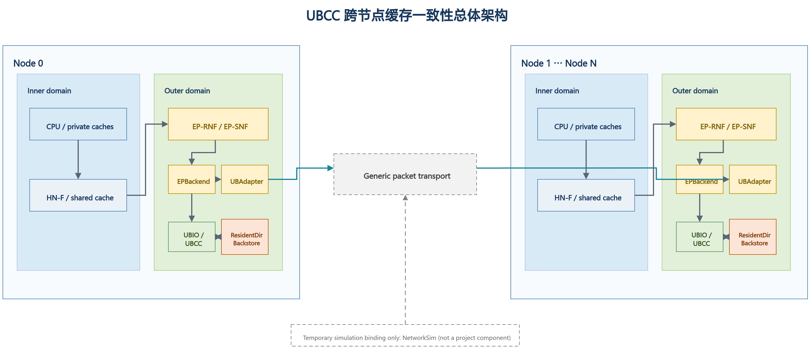
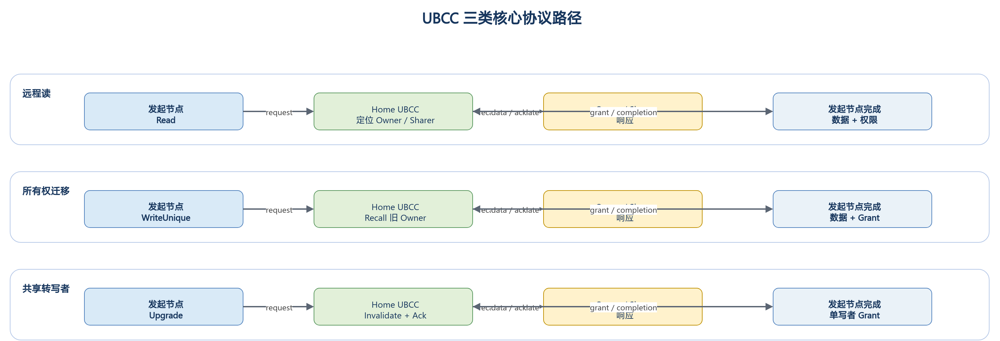

# UBCC 跨节点缓存一致性协议体系结构

**文档版本：V1.0**

**交付阶段：正式文档第一版**

**项目名称：<XXX>**

**甲方单位：<XXX>**

<!-- PAGEBREAK -->

---

## 目录

1. 方案概述
2. 总体体系结构
3. 核心组件设计
4. 全局一致性语义
5. 关键协议路径
6. 并发仲裁与活性机制
7. 方案价值与架构比较
8. 交付代码结构
9. 总结
附录 A 消息与状态速查表
附录 B EP-RNF 仲裁规则
附录 C 术语表

<!-- PAGEBREAK -->

---

## 1. 方案概述

### 1.1 方案定位

UBCC 是面向多节点系统的跨节点缓存一致性方案。该方案在节点内标准 CHI 一致性域之上，
构建独立的跨节点目录与仲裁层，并通过 EP 接入现有处理器缓存层级。

UBCC 的核心价值是将全局目录、跨节点权限仲裁和元数据容量管理从节点内 HN-F 资源域中
分离出来，使节点内一致性与跨节点一致性保持清晰边界：

1. 节点内缓存层级继续使用标准 CHI 机制；
2. 跨节点 sharer、owner 和权限迁移由 UBCC 统一管理；
3. ResidentDir 与 Backstore 组成分层元数据体系；
4. EP-RNF、EP-SNF 与 UBAdapter 负责两个一致性域之间的协议衔接。

### 1.2 设计目标

UBCC 围绕以下目标进行设计：

- **协议解耦**：全局目录与节点内 CHI 状态机职责分离；
- **容量扩展**：在固定 SRAM 预算下提升等效追踪容量；
- **精确仲裁**：依据全局目录状态选择 owner、sharer 和失效目标；
- **事务收敛**：通过 epoch、reqId、两阶段提交和幂等处理保证同址事务有序完成；
- **多拓扑适配**：支持多节点、多 Socket 和跨节点路由组织；
- **工程集成**：以模块化接口接入 `<XXX>Sim` 多仿真器环境。

### 1.3 交付结论

UBCC 已形成完整的跨节点一致性数据通路和控制通路，覆盖远程读、所有权迁移、共享转写者、
写回、逐出以及目录换入换出等关键路径。方案通过分层验证确认协议状态安全、消息幂等和
事务收敛，并在正式性能验收中达到三项冻结指标。

---

## 2. 总体体系结构

### 2.1 Inner 域与 Outer 域

UBCC 将系统划分为两个协同的一致性域：

- **Inner 域**：节点内标准 CHI 一致性域，包括 CPU Cache、HN-F 及节点内 snoop 路径；
- **Outer 域**：由 UBCC 管理的跨节点一致性域，负责全局目录、权限仲裁、Recall 和
  Invalidate 收敛。



**图 2-1** 展示了节点内 CHI、EP、UBCC、ResidentDir、Backstore 和 NetworkSim 之间的
关系。节点内请求经 EP 接入 UBCC；UBCC 根据全局目录状态完成权限判断，并在需要时通过
NetworkSim 与其他节点交换一致性消息。

### 2.2 控制路径与数据路径

UBCC 对控制信息与数据传输采用统一事务身份进行关联：

- **控制路径**：请求类型、权限状态、epoch、reqId、sharer/owner 信息和完成确认；
- **数据路径**：远程读数据、脏数据回收、写回数据和授权返回；
- **完成路径**：请求授权、失效确认、Clear 提交和最终权限可用。

数据来源由全局目录状态决定。若最新数据位于远程 owner，UBCC 发起 Recall；若 Home 已有
权威数据，则直接组织授权返回。该设计避免由节点内任意缓存副本替代全局 owner 语义。

### 2.3 组件关系

| 组件 | 所属域 | 主要职责 |
|---|---|---|
| CPU Cache / HN-F | Inner 域 | 执行节点内缓存一致性和本地内存访问 |
| EP-RNF | 边界层 | 代表 Outer 域响应 HN-F snoop，并发起跨节点权限操作 |
| EP-SNF | 边界层 | 将节点内服务请求接入 UBCC 数据路径 |
| UBAdapter | 边界层 | 完成 CHI 端点与 UBIO 之间的消息适配和事务关联 |
| UBCC 控制器 | Outer 域 | 维护全局目录，执行权限仲裁和事务收敛 |
| ResidentDir | Outer 域 | 保存活跃跨节点目录元数据 |
| Backstore | Outer 域 | 保存冷目录元数据并支持换入换出 |
| NetworkSim | 传输层 | 组织跨节点消息路由和链路时延 |

---

## 3. 核心组件设计

### 3.1 UBCC 控制器

UBCC 控制器是全局一致性仲裁中心。其主要功能包括：

1. 根据物理地址确定 Home 节点和 Home Socket；
2. 查询和更新全局 sharer/owner 状态；
3. 为远程读选择权威数据源；
4. 为写权限请求生成精确失效目标集合；
5. 协调 Recall、Invalidate、Ack、Grant 和 Clear；
6. 管理同址 outstanding、waiter 和重试事务；
7. 在 ResidentDir 与 Backstore 之间迁移目录元数据。

### 3.2 ResidentDir 与 Backstore

ResidentDir 保存当前活跃的跨节点目录条目，提供低时延的 SRAM 查询路径。Backstore 保存
从 ResidentDir 换出的冷元数据，并在后续访问时按需换入。

分层目录带来两项直接收益：

- 固定 SRAM 预算优先服务热点目录条目；
- 等效追踪容量不再受 ResidentDir 物理条目数单独限制。

目录容量以 ResidentDir 和已持久化 Backstore 元数据的去重覆盖量计算，避免重复计数。

### 3.3 EP-RNF

EP-RNF 在节点内 CHI 域中代表跨节点一致性域。HN-F 对共享或独占缓存行发起 snoop 时，
EP-RNF 根据当前 Outer 事务状态选择即时响应、返回 stale 结果或发起跨节点权限操作。

EP-RNF 的关键职责包括：

- 处理 `SnpCleanInvalid`、`SnpUnique`、`SnpOnce` 等 snoop；
- 将本地写升级转换为 UBCC 权限请求；
- 为 Recall 发起节点内 `ReadShared` 或 `ReadUnique`；
- 在同址 CHI 事务与 snoop 并发时执行确定性仲裁。

### 3.4 EP-SNF

EP-SNF 将节点内无 snoop 服务请求连接到 UBCC。它接收节点内请求，完成地址和事务信息
封装，并在 UBCC 返回数据与授权后生成节点内响应。

### 3.5 UBAdapter

UBAdapter 提供稳定的消息适配边界，负责：

- 协议消息序列化与反序列化；
- 本地事务与跨节点事务身份关联；
- 请求发送、响应分发和回调完成；
- 对可恢复消息执行稳定 tuple 重试。

### 3.6 NetworkSim

NetworkSim 根据拓扑配置连接各节点通信平面，为 UBCC 消息提供跨节点路由和链路时延。
UBCC 协议语义不依赖特定网络拓扑，节点数和 Socket 数由配置决定。

---

## 4. 全局一致性语义

### 4.1 目录状态

UBCC 目录记录每条缓存行的全局权限关系，核心信息包括：

- 当前 owner；
- sharer 集合；
- 数据有效性与脏状态；
- committed epoch；
- 正在执行的权限事务。

全局状态采用单调 epoch 区分新旧事务。reqId 标识同一 epoch 内的具体请求，使重试、重复
消息和延迟消息可以被准确识别。

### 4.2 请求与授权

一次跨节点操作由请求、仲裁、授权和提交组成：

1. requester 发送读或写权限请求；
2. UBCC 查询已提交目录状态；
3. 必要时 Recall owner 或 Invalidate sharer；
4. UBCC 返回数据和临时授权；
5. requester 完成本地操作后发送 Clear；
6. UBCC 校验事务身份并提交新目录状态。

### 4.3 两阶段提交

UBCC 将授权发送与目录提交分为两个阶段：

- **阶段 1：保留**。创建 outstanding，记录目标状态和事务身份，保持原已提交目录状态；
- **阶段 2：提交**。收到匹配的 Clear 后，提交目标状态并退役对应事务。

该语义保证 Grant 在途期间目录仍保持安全状态，并使重复请求能够返回同一授权结果。

### 4.4 幂等与过期消息处理

UBCC 使用以下机制处理消息重复、延迟和重试：

- Ack 位图保证每个目标只贡献一次确认；
- epoch 和 reqId 拒绝过期事务；
- Clear tombstone 支持已完成事务的幂等确认；
- stable tuple 保证重试不改变事务身份；
- waiter 去重避免相同请求重复进入等待队列。

---

## 5. 关键协议路径



### 5.1 远程读

远程读的目标是定位权威数据并将共享权限返回 requester：

1. requester 的节点内 miss 经 EP-SNF 发送到 Home UBCC；
2. UBCC 查询 owner 和 sharer 状态；
3. 若远程 owner 持有最新数据，UBCC 发起 Recall；
4. owner 节点经 EP-RNF 读取节点内权威副本并返回数据；
5. UBCC 更新共享关系并向 requester 返回数据和授权。

### 5.2 所有权迁移

所有权迁移用于将写权限和最新数据从旧 owner 转移到新 requester：

1. 新写者向 Home UBCC 请求独占或修改权限；
2. UBCC 定位旧 owner；
3. 旧 owner 完成本地降级或失效，并返回最新数据；
4. UBCC 完成权限重配置；
5. 新写者获得数据和单一写权限。

该路径的优势来自全局目录对最新数据位置的直接定位，以及权限释放与新授权之间的统一
事务管理。

### 5.3 共享转写者

共享转写者路径用于将多个共享副本收敛为单一写者：

1. requester 发起写权限请求；
2. UBCC 冻结本次事务的有效 sharer 目标集合；
3. UBCC 向目标节点发送 Invalidate；
4. 每个目标完成本地失效并返回 Ack；
5. UBCC 在 Ack 集合收敛后向 requester 授权；
6. Clear 到达后提交新的 owner 状态。

### 5.4 写回与逐出

节点逐出脏数据时，UBCC 根据 committed directory 和事务 epoch 校验写回来源。有效写回
可作为 Recall 的权威数据返回；重复或过期写回不会重复提交目录状态。

### 5.5 目录换入与换出

ResidentDir 达到容量边界时，冷目录条目写入 Backstore。后续访问由 Home 重新装入条目并
恢复全局 sharer/owner 信息。对同一 set 的并发请求进入 waiter 队列，在条目可用后按事务
身份重放。

---

## 6. 并发仲裁与活性机制

### 6.1 同址事务串行化

UBCC 对同一缓存行保持单一主事务。并发请求根据 committed state、outstanding stage 和
请求类型进入以下处理之一：

- 立即服务；
- 进入 waiter 队列；
- 返回 BUSY 并按稳定事务身份重试；
- 合并到正在进行的 Recall 或 Invalidate 流程。

### 6.2 动态失效目标

失效目标以发送时刻的 committed directory 为基础计算，并扣除已完成降级或已确认的目标。
该机制使 partial Ack 重试只覆盖尚未确认的节点，避免重复扩大失效范围。

### 6.3 EP-RNF snoop 仲裁

EP-RNF 对同址 CHI 事务和 snoop 采用分类仲裁：

- active Recall 优先完成数据回收；
- 可安全即时响应的 snoop 直接完成；
- 与写权限冲突的 snoop 返回 stale 结果，使发起者按全局顺序重试；
- 不符合路由约束的组合进入协议错误处理。

### 6.4 waiter 精确退役与重放

Clear 成功提交后，UBCC 按 `(PA, node, socket, reqId)` 精确退役已经完成的 Read waiter，
保留其他 requester、其他事务身份和其他操作类型的 waiter，再安全重放剩余请求。

### 6.5 可恢复消息重试

Clear、Upgrade、Invalidate 和 Recall 路径均保存原事务身份。发生可恢复消息丢失时，协议
重发相同 tuple，并由接收方按 epoch、reqId 和 Ack 状态执行幂等处理。

---

## 7. 方案价值与架构比较

### 7.1 独立目录资源域

UBCC 将全局目录与仲裁逻辑置于独立模块，避免全局元数据直接占用节点内 HN-F 的目录和
事务资源。该边界有利于容量扩展、协议演进和多仿真器集成。

### 7.2 分层元数据管理

ResidentDir 为热点目录提供低时延访问，Backstore 为冷元数据提供容量扩展。正式验收中，
UBCC 的等效追踪容量达到 naive 基线的 1.515 倍。

### 7.3 精确目标选择

UBCC 依据全局 sharer/owner 状态生成 Recall 和 Invalidate 目标，避免将所有远程节点作为
默认广播对象。随着节点规模增加，精确目标选择能够直接降低无效消息和目标端干扰。

### 7.4 通信与完成路径优化

UBCC 支持单向完成语义、直接数据路径和批量共享者处理。相关性能收益由《UBCC 性能验收
与集成接口说明》中的配对实验给出。

### 7.5 与 HA 架构的比较维度

| 比较维度 | UBCC | HN-F 内置全局目录方案 |
|---|---|---|
| 全局目录位置 | 独立 UBIO 模块 | 节点内 HN-F |
| 节点内资源隔离 | 全局目录与本地事务分离 | 全局目录与本地事务共享资源域 |
| 元数据容量组织 | ResidentDir + Backstore | 由 HN-F 目录容量决定 |
| 跨节点目标选择 | 全局 sharer/owner 精确选择 | 取决于具体 HA 目录组织 |
| 协议演进边界 | Outer 域独立演进 | 与节点内协议实现耦合 |

---

## 8. 交付代码结构

### 8.1 工程目录

远端交付工程采用 CMake 组织，代码结构如下：

```text
<XXX>sim/
├── src/
├── sims/
│   ├── gem5/
│   ├── ubiomodule/
│   │   ├── CMakeLists.txt
│   │   └── ...
│   ├── hamodule/
│   │   ├── CMakeLists.txt
│   │   └── ...
│   ├── networksim/
│   │   ├── CMakeLists.txt
│   │   └── ...
│   ├── framework/
│   │   ├── iface/
│   │   ├── <XXX>sim_shim/
│   │   │   ├── Port.cc
│   │   │   ├── Message.hh
│   │   │   └── Message.cc
│   │   └── CMakeLists.txt
│   ├── protocol/
│   └── CMakeLists.txt
├── compile.sh
├── gen_topo.py
├── parallel_test_v2.py
├── simulate.py
└── CMakeLists.txt
```

### 8.2 目录职责

| 路径 | 职责 |
|---|---|
| `sims/gem5/` | 节点内 CHI、EP 和处理器缓存仿真 |
| `sims/ubiomodule/` | UBCC 控制器、ResidentDir、Backstore 和协议事务处理 |
| `sims/hamodule/` | HA-VI 可执行参考模型 |
| `sims/networksim/` | 跨节点消息路由与链路时延 |
| `sims/framework/iface/` | 模块间公共端口、消息和日志接口 |
| `sims/framework/<XXX>sim_shim/` | 仿真器适配层 |
| `sims/protocol/` | 共享协议消息、地址映射和公共数据结构 |
| `compile.sh` | 统一编译入口 |
| `gen_topo.py` | 拓扑配置生成入口 |
| `simulate.py` | 单组仿真实验启动入口 |
| `parallel_test_v2.py` | 测试集合选择、并行调度和验证汇总入口 `[TODO-R01]` |

### 8.3 构建目标

| 构建目标 | 产物 | 主要依赖 |
|---|---|---|
| framework | `lib<XXX>sim_framework.a` | `lib<XXX>sim.a`、公共接口 |
| hamodule | 静态库 | protocol、framework |
| ubiomodule | `bin/ubiomodule` | framework、hamodule、`lib<XXX>sim.a` |
| networksim | `bin/networksim` | framework、`lib<XXX>sim.a` |
| gem5 | gem5 可执行文件 | framework、`lib<XXX>sim.a` |

---

## 9. 总结

UBCC 以独立全局目录为核心，在保持节点内 CHI 一致性边界的同时，提供跨节点数据定位、
权限仲裁、目录容量扩展和可恢复消息处理。该架构兼顾协议清晰度、容量效率、目标选择精度
和多拓扑扩展能力，并已形成可集成到 `<XXX>Sim` 的完整模块化实现。

---

## 附录 A 消息与状态速查表

### A.1 主要消息

| 消息类别 | 代表消息 | 作用 |
|---|---|---|
| 请求 | ReadReq、UpgradeReq、RecallReq、InvalidateReq | 发起数据或权限操作 |
| 响应 | ReadResp、UpgradeResp、RecallResp | 返回数据、目标集合或接受状态 |
| 确认 | ClearReq、ClearResp、InvalidateAck、UpgradeAckNotify | 确认本地完成或全局收敛 |
| 生命周期 | Writeback、Evict | 归还数据或释放目录关系 |

### A.2 关键目录概念

| 概念 | 说明 |
|---|---|
| committed state | 已对后续请求可见的全局目录状态 |
| intended state | 当前授权完成后准备提交的目标状态 |
| outstanding | 正在执行的同址主事务 |
| waiter | 等待同址事务或目录换入完成的请求 |
| tombstone | 已完成事务的短期幂等记录 |

---

## 附录 B EP-RNF 仲裁规则

| 活跃事务 | invalidating snoop | SnpOnce | 处理原则 |
|---|---|---|---|
| CleanUnique | stale | stale | 保持全局写顺序，发起者重试 |
| ReadUnique | stale | stale | 优先完成 Recall 数据回收 |
| ReadShared | stale | immediate data | 允许只读数据即时返回 |
| 无冲突事务 | immediate | immediate | 按 CHI 正常响应 |

---

## 附录 C 术语表

| 术语 | 说明 |
|---|---|
| UBCC | 跨节点缓存一致性方案及全局目录控制器 |
| CHI | 节点内缓存一致性协议 |
| HN-F | 节点内 Home Node，负责本地一致性与内存访问 |
| EP | 节点内 CHI 域与 UBCC 之间的端点扩展层 |
| EP-RNF | 代表 Outer 域参与节点内 snoop 的端点 |
| EP-SNF | 将节点内服务请求接入 UBCC 的端点 |
| UBAdapter | EP 与 UBIO 之间的消息适配组件 |
| UBIO | 承载 UBCC 控制器的运行模块 |
| ResidentDir | SRAM 驻留目录 |
| Backstore | 冷目录元数据的后备存储 |
| NetworkSim | 跨节点消息路由与链路时延模块 |
| HA-VI | VI 协议可执行参考模型 |
| Inner 域 | 节点内标准 CHI 一致性域 |
| Outer 域 | UBCC 管理的跨节点一致性域 |
| Home | 负责指定地址全局目录和仲裁的节点 |
| owner | 持有写权限或最新脏数据的节点 |
| sharer | 持有共享副本的节点 |
| epoch | 区分同址新旧事务的单调序号 |
| reqId | 标识具体请求的事务编号 |
| Recall | 从当前 owner 回收数据或权限 |
| Invalidate | 使共享副本失效 |
| Clear | requester 本地完成后的提交确认 |
