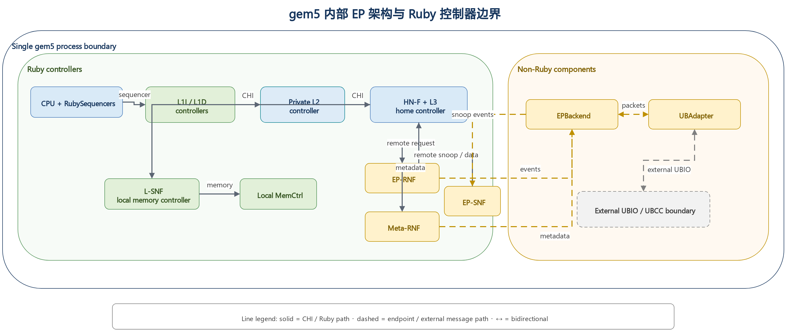

# UBCC 跨节点缓存一致性协议体系结构

<!-- PAGEBREAK -->

---

## 目录

1. 方案概述
2. 总体体系结构
3. 核心组件设计
4. 全局一致性语义
5. 关键协议路径
6. 并发仲裁与活性机制
7. 跨节点协议选择分析
   - 7.1 比较方法与概念分层
   - 7.2 稳定状态族：VI/MSI/MESI/MOESI/MESIF
   - 7.3 CHI 与 UBCC 的协议层次
   - 7.4 权威、数据位置与提交权分离
   - 7.5 三类关键 DAG 与路径成本
   - 7.6 元数据、扇出与规模公式
   - 7.7 瞬态、卸载、重试与路由成本
   - 7.8 为什么 Outer 域不直接使用 CHI
   - 7.9 综合比较与选择结论
8. 集成边界
9. 总结
附录 A 消息与状态速查表
附录 B EP-RNF 仲裁规则
附录 C 术语表

<!-- PAGEBREAK -->

---

## 1. 方案概述

### 1.1 方案定位

UBCC 是面向多节点系统的跨节点缓存一致性方案。该方案在节点内 gem5 CHI 一致性域之上，
构建独立的跨节点目录与仲裁层，并通过 EP 接入现有处理器缓存层级。

UBCC 的核心价值是将全局目录、跨节点权限仲裁和元数据容量管理从节点内 HN-F 资源域中
分离出来，使节点内一致性与跨节点一致性保持清晰边界：

1. 节点内缓存层级继续使用现有 gem5 CHI 机制；
2. 跨节点 sharer、owner 和权限迁移由 UBCC 统一管理；
3. ResidentDir 与 Backstore 组成分层元数据体系；
4. EP-RNF、EP-SNF 与 UBAdapter 负责两个一致性域之间的协议衔接。

### 1.2 设计目标

UBCC 围绕以下目标进行设计：

- 协议解耦：全局目录与节点内 CHI 状态机职责分离；
- 容量扩展：在固定 SRAM 预算下提升等效追踪容量；
- 精确仲裁：依据全局目录状态选择 owner、sharer 和失效目标；
- 事务收敛：通过 epoch、reqId、两阶段提交和幂等处理保证同址事务有序完成；
- 多拓扑适配：支持多节点、多 Socket 和跨节点路由组织；
- 工程集成：以模块化接口接入 ubsim 环境。

### 1.3 交付结论

UBCC 已形成完整的跨节点一致性数据通路和控制通路，覆盖远程读、所有权迁移、共享转写者、
写回、逐出以及目录换入换出等关键路径。方案通过分层验证确认协议状态安全、消息幂等和
事务收敛，并在正式性能验收中达到三项冻结指标。

### 1.4 结论与范围

| 项目 | 结论 | 适用范围 |
|---|---|---|
| 架构 | 独立 Outer 域、分层目录和 EP 接入路径已形成 | 当前 UBCC 实现及已验证拓扑 |
| 正确性 | 关键安全、活性与可恢复传输故障路径通过分层验证 | 形式化模型、定向验证与端到端执行所覆盖的机制 |
| 性能 | 三项冻结验收指标达到门槛 | 冻结 workload、完成边界与参考模型条件 |
| 范围外 | 不作本次交付能力主张 | 永久 Home 故障在线恢复和端口级 Switch 微体系结构 |

---

## 2. 总体体系结构

### 2.1 Inner 域与 Outer 域

UBCC 将系统划分为两个协同的一致性域：

- Inner 域：节点内 gem5 CHI 一致性域，包括 CPU Cache、HN-F 及节点内 snoop 路径；
- Outer 域：由 UBCC 管理的跨节点一致性域，负责全局目录、权限仲裁、Recall 和
  Invalidate 收敛。

节点内请求经 EP 接入 UBCC；UBCC 根据全局目录状态完成权限判断，并经跨节点通信平面交换
一致性消息。

图 2-1　UBCC 总体架构

### 2.2 控制路径与数据路径

UBCC 对控制信息与数据传输采用统一事务身份进行关联：

- 控制路径：请求类型、权限状态、epoch、reqId、sharer/owner 信息和完成确认；
- 数据路径：远程读数据、脏数据回收、写回数据和授权返回；
- 完成路径：请求授权、失效确认、Clear 提交和最终权限可用。

数据来源由全局目录状态决定。若最新数据位于远程 owner，UBCC 发起 Recall；若 Home 已有
权威数据，则直接组织授权返回。该设计避免由节点内任意缓存副本替代全局 owner 语义。

### 2.3 组件关系

| 组件 | 所属域 | 主要职责 |
|---|---|---|
| CPU Cache / HN-F | Inner 域 | 执行节点内缓存一致性和本地内存访问 |
| EP-RNF | 边界层 | 代表 Outer 域响应 HN-F snoop，并发起跨节点权限操作 |
| EP-SNF | 边界层 | 将节点内服务请求接入 UBCC 数据路径 |
| UBAdapter | 边界层 | 完成 CHI 端点与 UBIO 之间的消息适配和事务关联 |
| UBCC 控制器 | Outer 域 | 维护全局目录，执行权限仲裁和事务收敛 |
| ResidentDir | Outer 域 | 保存活跃跨节点目录元数据 |
| Backstore | Outer 域 | 保存冷目录元数据并支持换入换出 |

---

## 3. 核心组件设计

### 3.1 UBCC 控制器

UBCC 控制器是全局一致性仲裁中心。其主要功能包括：

1. 根据物理地址确定 Home 节点和 Home Socket；
2. 查询和更新全局 sharer/owner 状态；
3. 为远程读选择权威数据源；
4. 为写权限请求生成精确失效目标集合；
5. 协调 Recall、Invalidate、Ack、Grant 和 Clear；
6. 管理同址 outstanding、waiter 和重试事务；
7. 在 ResidentDir 与 Backstore 之间迁移目录元数据。

### 3.2 ResidentDir 与 Backstore

ResidentDir 保存当前活跃的跨节点目录条目，提供低时延的 SRAM 查询路径。Backstore 保存
从 ResidentDir 换出的冷元数据，并在后续访问时按需换入。

分层目录带来两项直接收益：

- 固定 SRAM 预算优先服务热点目录条目；
- 等效追踪容量不再受 ResidentDir 物理条目数单独限制。

目录容量以 ResidentDir 和已持久化 Backstore 元数据的去重覆盖量计算，避免重复计数。

### 3.3 EP-RNF

EP-RNF 在节点内 CHI 域中代表跨节点一致性域。HN-F 对共享或独占缓存行发起 snoop 时，
EP-RNF 根据当前 Outer 事务状态选择即时响应、返回 stale 结果或发起跨节点权限操作。

EP-RNF 的关键职责包括：

- 处理 `SnpCleanInvalid`、`SnpUnique`、`SnpOnce` 等 snoop；
- 将本地写升级转换为 UBCC 权限请求；
- 为 Recall 发起节点内 `ReadShared` 或 `ReadUnique`；
- 在同址 CHI 事务与 snoop 并发时执行确定性仲裁。

### 3.4 EP-SNF

EP-SNF 将节点内无 snoop 服务请求连接到 UBCC。它接收节点内请求，完成地址和事务信息
封装，并在 UBCC 返回数据与授权后生成节点内响应。

### 3.5 UBAdapter

UBAdapter 提供稳定的消息适配边界，负责：

- 协议消息序列化与反序列化；
- 本地事务与跨节点事务身份关联；
- 请求发送、响应分发和回调完成；
- 对可恢复消息执行稳定 tuple 重试。

### 3.6 gem5 EP 关系

EP-RNF、EP-SNF 和 UBAdapter 位于节点内 CHI 域与 UBCC Outer 域之间，分别承担 snoop
参与、服务请求接入和跨域事务关联。

图 3-1　gem5 EP 架构

---

## 4. 全局一致性语义

### 4.1 目录状态

UBCC 目录记录每条缓存行的全局权限关系，核心信息包括：

- 当前 owner；
- sharer 集合；
- 数据有效性与脏状态；
- committed epoch；
- 正在执行的权限事务。

全局状态采用单调 epoch 区分新旧事务。reqId 标识同一 epoch 内的具体请求，使重试、重复
消息和延迟消息可以被准确识别。

### 4.2 请求与授权

一次跨节点操作由请求、仲裁、授权和提交组成：

1. requester 发送读或写权限请求；
2. UBCC 查询已提交目录状态；
3. 必要时 Recall owner 或 Invalidate sharer；
4. UBCC 返回数据和临时授权；
5. requester 完成本地操作后发送 Clear；
6. UBCC 校验事务身份并提交新目录状态。

### 4.3 两阶段提交

UBCC 将授权发送与目录提交分为两个阶段：

- 阶段 1（保留）：创建 outstanding，记录目标状态和事务身份，保持原已提交目录状态；
- 阶段 2（提交）：收到匹配的 Clear 后，提交目标状态并退役对应事务。

该语义保证 Grant 在途期间目录仍保持安全状态，并使重复请求能够返回同一授权结果。

### 4.4 幂等与过期消息处理

UBCC 使用以下机制处理消息重复、延迟和重试：

- Ack 位图保证每个目标只贡献一次确认；
- epoch 和 reqId 拒绝过期事务；
- Clear tombstone 支持已完成事务的幂等确认；
- stable tuple 保证重试不改变事务身份；
- waiter 去重避免相同请求重复进入等待队列。

---

## 5. 关键协议路径

图 5-1　UBCC 核心协议路径

### 5.1 远程读

远程读的目标是定位权威数据并将共享权限返回 requester：

1. requester 的节点内 miss 经 EP-SNF 发送到 Home UBCC；
2. UBCC 查询 owner 和 sharer 状态；
3. 若远程 owner 持有最新数据，UBCC 发起 Recall；
4. owner 节点经 EP-RNF 读取节点内权威副本并返回数据；
5. UBCC 更新共享关系并向 requester 返回数据和授权。

### 5.2 所有权迁移

所有权迁移用于将写权限和最新数据从旧 owner 转移到新 requester：

1. 新写者向 Home UBCC 请求独占或修改权限；
2. UBCC 定位旧 owner；
3. 旧 owner 完成本地降级或失效，并返回最新数据；
4. UBCC 完成权限重配置；
5. 新写者获得数据和单一写权限。

该路径的优势来自全局目录对最新数据位置的直接定位，以及权限释放与新授权之间的统一
事务管理。

### 5.3 共享转写者

共享转写者路径用于将多个共享副本收敛为单一写者：

1. requester 发起写权限请求；
2. UBCC 冻结本次事务的有效 sharer 目标集合；
3. UBCC 向目标节点发送 Invalidate；
4. 每个目标完成本地失效并返回 Ack；
5. UBCC 在 Ack 集合收敛后向 requester 授权；
6. Clear 到达后提交新的 owner 状态。

### 5.4 写回与逐出

节点逐出脏数据时，UBCC 根据 committed directory 和事务 epoch 校验写回来源。有效写回
可作为 Recall 的权威数据返回；重复或过期写回不会重复提交目录状态。

### 5.5 目录换入与换出

ResidentDir 达到容量边界时，冷目录条目写入 Backstore。后续访问由 Home 重新装入条目并
恢复全局 sharer/owner 信息。对同一 set 的并发请求进入 waiter 队列，在条目可用后按事务
身份重放。

---

## 6. 并发仲裁与活性机制

### 6.1 同址事务串行化

UBCC 对同一缓存行保持单一主事务。并发请求根据 committed state、outstanding stage 和
请求类型进入以下处理之一：

- 立即服务；
- 进入 waiter 队列；
- 返回 BUSY 并按稳定事务身份重试；
- 合并到正在进行的 Recall 或 Invalidate 流程。

### 6.2 动态失效目标

失效目标以发送时刻的 committed directory 为基础计算，并扣除已完成降级或已确认的目标。
该机制使 partial Ack 重试只覆盖尚未确认的节点，避免重复扩大失效范围。

### 6.3 EP-RNF snoop 仲裁

EP-RNF 对同址 CHI 事务和 snoop 采用分类仲裁：

- active Recall 优先完成数据回收；
- 可安全即时响应的 snoop 直接完成；
- 与写权限冲突的 snoop 返回 stale 结果，使发起者按全局顺序重试；
- 不符合路由约束的组合进入协议错误处理。

### 6.4 waiter 精确退役与重放

Clear 成功提交后，UBCC 按 `(PA, node, socket, reqId)` 精确退役已经完成的 Read waiter，
保留其他 requester、其他事务身份和其他操作类型的 waiter，再安全重放剩余请求。

### 6.5 可恢复消息重试

Clear、Upgrade、Invalidate 和 Recall 路径均保存原事务身份。发生可恢复消息丢失时，协议
重发相同 tuple，并由接收方按 epoch、reqId 和 Ack 状态执行幂等处理。

---

## 7. 跨节点协议选择分析

### 7.1 比较方法与概念分层

跨节点方案不能只按“状态数多少”或“是否使用 CHI”二选一。严谨比较至少分为三层：

1. **稳定状态族**回答一条线在事务间隙可处于什么权限状态，例如 VI、MSI、MESI、
   MOESI、MESIF；
2. **事务与承载协议**回答请求、snoop、响应和数据如何分通道传输、路由、排序、流控与重试；
   CHI 属于这一层，同时也规定端到端 agent 角色及事务规则；
3. **全局权威组织**回答谁保存跨节点 owner/sharer、谁串行化同址冲突、谁决定提交。当前
   UBCC 采用“节点内 CHI + Outer 全局目录/仲裁”，而不是把 CHI agent/fabric 直接扩展到
   Outer 域。

图 7-1　状态、事务承载与全局权威的职责分离

这三层可以组合但不能互相替代。例如，MESI 不能规定跨 Socket credit；CHI 的 Req/Snp/Dat
通道本身也不决定全局目录必须驻留在 HN-F 还是独立 UBCC。后文所有数量均按“缓存行粒度、
精确目录、无消息合并”的概念模型给出，用于方案量级比较，不替代具体互连时序测量。

### 7.2 稳定状态族：VI、MSI、MESI、MOESI 与 MESIF

| 状态族 | 稳定状态及最小语义 | 远程读/写的结构性影响 | 代价与适用判断 |
|---|---|---|---|
| VI | Valid、Invalid；通常不细分共享、独占和脏 owner | 状态机最小，但写者定位、共享者失效和脏数据来源需由额外目录语义表达 | 适合窄化参考模型；HA-VI 是当前比较参考，不是 UBCC 实现状态机 |
| MSI | Modified、Shared、Invalid | 能表达单脏 owner 与共享集合；从单一干净副本写入仍需 S→M 升级 | 最小实用目录族，验证状态少，但失去 Exclusive 优化机会 |
| MESI | 增加 Exclusive | 单一干净持有者可 E→M 本地升级；远程共享后再降为 S | 当前 UBCC 的目录编码和 owner/sharer 仲裁采用 MESI 类语义 |
| MOESI | 增加 Owned | 脏数据可由 O 持有者在共享期间转发，内存不必立即最新 | 可减少脏共享写回，但增加 dirty-shared 不变量、owner 转发和回收分支；为未来候选，当前未实现 |
| MESIF | 增加 Forward | 多个干净 sharer 中指定 F 响应转发，减少重复响应 | 对密集读共享可能有利，但需维护 forwarder 选举/丢失/逐出；为未来候选，当前未实现 |

若只计稳定状态编码，VI/MSI/MESI/MOESI/MESIF 分别至少需要 1/2/2/3/3 bit；但真实目录
成本通常由 sharer 位图、tag、epoch 和瞬态事务主导，因此“多一个稳定状态”并不自动成为
容量瓶颈。MOESI 和 MESIF 的收益也不是免费获得：它们减少某些数据或响应路径，却把更多
恢复、替换和并发情况移入 TBE/形式化状态空间。

### 7.3 CHI 与 UBCC 的协议层次

CHI 是端到端 coherent transaction protocol 和 carrier protocol：它定义 RN/HN/SN 等
角色、Req/Rsp/Snp/Dat 通道、事务标识、响应关系以及互连流控约束。若把 CHI 用于 Outer，
意味着跨节点参与者必须成为或桥接成全局 CHI agents，并为全局事务 ID、snoop 路由、通道
排序、credit/backpressure、重试和数据转发建立一致实现。

UBCC 的当前组合更窄：

- 节点内保持现有 gem5 CHI，由 HN-F 与 EP 处理本地缓存层级；
- EP/UBAdapter 在边界提取跨节点所需语义；
- Outer 只携带 Read、Upgrade、Recall、Invalidate、Ack、Grant、Clear 等全局目录消息；
- Home UBCC 维护 owner/sharer 和 committed/intended 状态，ResidentDir + Backstore 管理容量。

因此 UBCC 不是“另一套 MESI 替代 CHI”，而是把 CHI 的本地一致性能力与一个专用的全局
目录/提交协议组合起来。该组合复用现有 gem5 CHI 模型与工具链，同时避免 Outer 必须复制完整
CHI agent/fabric 语义。

### 7.4 Authority、data location 与 serialization/commit authority

三种权力必须显式区分：

| 概念 | 回答的问题 | 当前 UBCC 中的位置 |
|---|---|---|
| coherence authority | 谁能判定当前 owner、sharer 与可授予权限？ | 地址 Home 的 UBCC committed directory |
| data location | 最新 64 B 数据此刻在哪里？ | Home memory、远程 owner 或事务数据缓冲；可随 Recall/写回变化 |
| serialization/commit authority | 谁为同址冲突定序并使 intended state 对后续请求可见？ | Home UBCC outstanding；匹配 Clear 后提交 |

权威不等于数据必经 Home。即使未来采用 owner→requester 直接数据转发，Home 仍可先决定
合法 source/target，再等待必要 Ack/Clear 提交目录。反过来，某节点持有最新脏数据也不表示
它有权绕过 Home 给另一个节点永久写权限。这一分离是评价 central data path、direct data
path、MOESI Owned 或 CHI DCT 类候选的共同基准。

### 7.5 三类关键 DAG 与路径成本

定义：`K_crossnode` 为依赖链上的串行跨节点消息段数；`M` 为跨节点单播消息总数；`F` 为
同时收到 Invalidate/Recall 的目标数；`D` 为完整数据线跨节点遍历次数。并行发送给多个
sharer 会增大 `M` 和 `F`，但若 Ack 并行返回，不一定等比例增加 `K_crossnode`。忽略本地
CHI 段时，可写成半定量时延模型：

$T ≈ K_crossnode × τ_link + T_dir + T_local + T_queue + T_fanout_tail$。

以下 K/M 数值统一以 requester 收到 Data/Grant 的 **visible boundary** 为截止点。若要求 Home
在收到 Clear 后完成目录提交，则 K 和 M 各再增加 requester→Home 一段；若还要求 requester
观察 ClearAck，则再增加 Home→requester 一段。数据遍历 D 不因纯控制 Clear/ClearAck 增加。

图 7-2　跨节点数据路径：中心转送与直接转发

**远程读 DAG。** 若 Home memory 权威且最新，典型为 Requester→Home、Home→Requester，
`K=2, M=2, F=0, D=1`。若远程 dirty owner 最新，当前中心转送模型为 Requester→Home→Owner
→Home→Requester，近似 `K=4, M=4, F=1, D=2`；若以后实现经 Home 授权的直接数据转发，
owner→requester 数据路径可降为三段依赖且 `D=1`，但 Home→requester authority/grant 仍需完成，
因此 `T_visible=max(T_data,T_authority)`，不能只用“数据少一跳”替代完整完成边界。该路径是候选优化，
不是当前实现能力主张。

**所有权 handoff DAG。** 无其他 sharer 时，新写者请求 Home，Home Recall 旧 owner，旧
owner 降级/失效并送回数据，Home 授权新写者。中心转送仍约为 `K=4, M=4, F=1, D=2`；
直接数据候选的数据分支约为 `K=3`、`D=1`，但 authority 分支仍经 Home，且必须保留 owner 完成证明与 Home 提交依赖，否则可能同时
出现两个写者。

**shared-to-writer DAG。** 设除 requester 外需失效的 sharer 数为 `S`。请求、并行失效、
并行 Ack、Grant 构成四层依赖，故无重试时 `K≈4`；跨节点消息数约为 `M≈2S+2`，若把
requester 的 Clear 也计入则为 `2S+3`；`F=S`。若 requester 已有干净数据，通常 `D=0`；
若还需从 owner 或 memory 取数，则额外增加一次或两次数据线遍历，取决于是否中心转送。

### 7.6 元数据、失效扇出与 N 节点规模

对 `N` 个可缓存节点，采用 tagged entry 和可选独立 owner 编码的精确全位图目录，可写成概念成本模型：

$B_dir(N) = N + b_owner + b_state + b_epoch + b_ctrl + b_tag$。

其中 `N` 是 sharer bitmap；独立 owner 编码时 `b_owner=ceil(log2(N+1))`，若 owner 由状态
和 one-hot sharer 约束推导，则 `b_owner=0`；直接索引目录也可令 `b_tag=0`。`b_ctrl` 包括
valid、dirty、驻留/持久化等控制位。仅 sharer bitmap 对 1 Mi entries（2^20 条目录线）的
原始容量分别为：N=2 时 0.25 MiB，N=8 时
1 MiB，N=16 时 2 MiB。若使用 limited-pointer 或稀疏集合，可降低低共享度下的平均成本，
但溢出必须进入广播、粗粒度区域或后备精确表示，验证边界更复杂。

图 7-3　目录元数据、失效扇出与瞬态成本随 N 扩展

N=2/8/16 时，最坏 shared-to-writer 目标数分别为 `S=N-1=1/7/15`，于是 `M≈2S+2`
分别为 4/16/32，fanout 分别为 1/7/15。若无精确 sharer 信息而向全部其他节点探测，实际
`S` 很小时仍支付近似 `2(N-1)` 的无效控制消息；精确目录的价值随 N 与副本稀疏度共同增加。

当前交付实现的 H64 codec 将条目编码为完整 12 B（96 bit）：44-bit PA、2-bit MESI、2-bit
slot state、16-bit sharer mask、24-bit epoch 和 8-bit integrity，可直接覆盖 16 个 sharer 位。
较早的 `BackstoreTypes::CompactCodec` 也是 12 B，但只含 10-bit sharer、84 bit 有效字段和
padding；它不应与当前 H64 格式混为一谈。若 endpoint 粒度超过 16，仍必须扩宽 slot、改用
间接/稀疏 sharer 表或分层节点/Socket 位图。

### 7.7 稳定态、瞬态/TBE、卸载、重试与路由成本

稳定条目只是总成本的一部分。一个 shared-to-writer TBE 至少需要 requester、操作阶段、
base/reserved epoch、reqId、目标位图和 Ack 位图；两张 N-bit 位图就需要 `2N` bit/事务，
N=2/8/16 时为 4/16/32 bit。若事务槽缓存完整 64 B 数据，则数据缓冲为 512 bit，通常远大于
稳定状态的 2～3 bit。MOESI/MESIF/Outer CHI 会进一步引入 forwarder/owner 响应选择、
数据通道完成、probe/credit/retry 等瞬态组合，因此不能用稳定状态位数代表实现总面积或证明量。

**offload compatibility。** 当前模块边界在架构上适合未来映射到独立硬件、固件服务或仿真
模块；本次交付只验证了软件/仿真模块化接口，不宣称已有硬件或固件实现。offload 接口需冻结 Outer 消息、路由身份、64 B 数据和
完成语义。完整 Outer CHI offload 则要求 offload 端表现为合规 CHI agent/fabric endpoint，
同时处理四通道 flow control、事务表和协议时序，标准互操作更强，但接口与验证面更宽。

**retry identity。** UBCC 对可恢复重试复用稳定 tuple，至少包含
`(PA, requester node, requester socket, epoch, reqId, op)`；Ack 位图和 tombstone 使重复
Invalidate、Recall、Grant/Clear 可幂等收敛。若 Outer 使用 CHI，还必须明确 CHI TxnID/DBID、
桥接侧内部 generation 与 UBCC epoch/reqId 的映射和生命周期；仅“重新发一个 CHI 请求”
不足以证明它仍是同一全局事务。

**多 Socket 路由。** 当前 requester 和 waiter 身份显式包含 node/socket，地址映射选出
Home node/socket，UBAdapter/transport 据此路由。N 节点、Q Socket/节点时，平面 endpoint
数为 `P=NQ`；若目录按节点共享权限，sharer 位图仍为 N，但本地目标选择还需约
`ceil(log2 Q)` bit 或 Socket mask；若每个 Socket 都可独立持有全局副本，则位图扩为 NQ，
最坏 fanout 也从 N−1 增至 NQ−1。Outer CHI 需要额外规定跨 Socket bridge 是否终止、代理
或透传事务 ID 及 snoop，路由自由度更强，相应死锁与排序分析也更大。

**实现与形式化复杂度。** 可粗略把证明组合量写成
$C_verify ∝ |Stable| × |Transient| × |Message classes| × |Fault/retry cases| × Topologies$。
这不是运行时间预测，却说明为何状态、通道和代理角色相乘比单独增加一个状态更关键。
VI/MSI 最小，MESI 增加有限；MOESI/MESIF 增加 owner/forwarder 生命周期；Outer CHI 还把
Req/Rsp/Snp/Dat credit、ordering、DMT/DCT 类路径和 bridge 行为纳入端到端不变量。当前 UBCC
选择较窄 Outer 消息集，以 Home 单序列化点、epoch/reqId 和 Clear commit 限制状态空间。

### 7.8 为什么 Outer 域不直接使用 CHI

图 7-4　本地 CHI 与假设 Outer CHI 的边界及成本

当前 Outer 不直接使用 CHI 的核心原因不是 CHI “不能跨节点”，而是本项目的选择目标不同：

1. **权威边界更清晰。** Home UBCC 是唯一全局目录和提交点；本地 HN-F 不必同时成为全局
   CHI Home 或处理另一层完整 snoop 语义；
2. **资源隔离。** 全局长期目录、Outer TBE、waiter 和 Backstore 生命周期不与本地 HN-F
   目录/TBE 一一绑定；跨域操作触发的本地 CHI 子事务仍会临时使用 HN-F 通道和事务资源；
3. **容量可扩展。** ResidentDir + Backstore 可独立按跨节点工作集扩展，且当前 H64 entry 12 B
   编码有明确实现证据；
4. **协议面更窄。** Outer 只实现跨节点所需的 owner/sharer、Recall/Invalidate、Ack、Grant
   和 Clear，不必重新实现完整 CHI channel/agent 合规面；
5. **重试身份可控。** epoch/reqId 直接贯穿跨节点事务，避免多层 CHI ID 翻译后出现“协议
   retry”与“新全局事务”混淆；
6. **集成与证明成本较低。** 本地 CHI 保持既有边界，Outer 可独立仿真和形式化，并保留
   未来映射到独立 offload 实现的架构边界；
   多 Socket 路由也不要求全局 CHI fabric 已存在。

这并不排除 **CHI Outer**。当产品已有跨 die/跨 Socket CHI fabric 与合规桥、必须与第三方
CHI accelerator/agent 直接互操作、希望统一硬件 credit/backpressure、或 DMT/DCT/标准
snoop filter 的复用收益超过新增复杂度时，Outer CHI 可以是合理选择。此时应把它作为独立
架构候选重新评估，明确全局 Home、ID 翻译、retry ownership、deadlock classes、数据直达、
目录容量和验证责任；不能把当前 UBCC 的 Outer 消息简单改名为 CHI 即宣称完成。

### 7.9 综合比较、设计沿革与选择结论

| 维度 | VI/MSI | MESI | MOESI/MESIF 候选 | 端到端 Outer CHI 候选 | 当前 UBCC：local CHI + Outer directory |
|---|---|---|---|---|---|
| 分类 | 稳定状态族 | 稳定状态族 | 稳定状态族 | 事务、承载与 agent 体系 | 分层全局一致性架构 |
| 当前实现声明 | VI 仅 HA-VI 参考；MSI 非当前主状态 | MESI 类目录语义 | 未实现，未来候选 | 未实现，未来候选 | 已实现边界 |
| 全局 authority | 需另行指定 | 需另行指定 | 需另行指定 | 通常由全局 HN/目录指定 | Home UBCC committed directory |
| data location | 状态族不规定物理路径 | 同左 | O/F 可提示转发者 | 可由 CHI data path/DMT/DCT 组织 | memory/owner/事务缓冲，与 authority 分离 |
| serialization/commit | 需另行定义 | 需另行定义 | 分支更多 | CHI transaction + Home/bridge 规则 | 单 Home outstanding + Clear commit |
| dirty 远程读（中心模型） | 取决于目录 | `K≈4,D=2` | Owned 候选可减少回写/中转 | 取决于 direct transfer 配置 | 当前约 `K≈4,D=2` |
| shared→writer | 需精确 sharer 或广播 | `M≈2S+2,F=S` | 同量级，但 owner/forwarder 分支更多 | snoop fanout/过滤由 fabric 实现 | 精确目标，`M≈2S+2,F=S` |
| 稳定元数据 | VI/MSI 状态少 | +E，状态仍 2 bit | 状态至少 3 bit并增生命周期 | 目录外还需 agent/fabric 状态 | N-bit sharer 概念式；当前 H64 为 16-bit sharer/12 B |
| TBE/瞬态 | 最小 | 中等 | 更高 | 最高：四通道、credit、ID/bridge | 中等：epoch/reqId、target/Ack、Clear |
| offload | 需自定义接口 | 需自定义接口 | 需自定义转发接口 | 标准互操作强，端点负担高 | 窄 Outer 接口，目录易独立部署 |
| retry identity | 未定义 | 未定义 | 未定义 | 需协调 CHI ID 与全局 epoch | stable tuple + tombstone |
| 多 Socket | 需另行路由 | 同左 | 同左 | fabric/bridge 原生但复杂 | node/socket 显式路由，目录粒度可选 |
| 形式化复杂度 | 低 | 低至中 | 中至高 | 高 | 中；以单 Home 和窄消息集约束 |
| 最适用场景 | 极简参考/小系统 | 常规单写多读目录 | 高读共享或脏转发收益明确 | 已有全局 CHI 生态和标准互操作刚需 | 需资源隔离、容量扩展和多环境集成的当前目标 |

Phase-1 曾比较 HN-F 内置全局目录、Backend + Bloom 和 ResidentDir + Backstore。前者使本地
与全局资源域耦合；Backend + Bloom 形成了冷热分层思路，但误判与权威边界更难论证；当前
实现最终统一为 ResidentDir 与 Backstore 中的精确目录语义。Bloom、MOESI Owned、MESIF
Forward 和 Outer CHI 均不属于当前交付能力。

**明确选择结论：** 当前目标下选择“节点内 CHI + UBCC Outer 全局 owner/sharer 目录 +
ResidentDir/Backstore + Home 两阶段提交”。稳定权限采用 MESI 类语义；Home 掌握 authority
和 serialization/commit authority，数据位置可独立优化。该选择以少量专用 Outer 消息换取
本地 CHI 复用、资源隔离、精确扇出、稳定重试身份和较可控的验证空间。MOESI/MESIF、直接
owner→requester 数据路径与 Outer CHI 保留为有条件的后续候选，只有在量化证明其数据路径或
互操作收益超过新增元数据、TBE、路由、流控和形式化成本后才应引入。

---

## 8. 集成边界

### 8.1 模块级交付边界

| 模块 | 对外职责 | 稳定边界 |
|---|---|---|
| gem5 节点模型 | 节点内 CHI、缓存层级与 EP 行为 | CHI 请求、snoop、数据与完成事件 |
| UBIO | UBCC、ResidentDir、Backstore 与事务处理 | Outer 请求、响应、确认与生命周期事件 |
| HA-VI | 冻结 VI 可执行参考 | 与 UBCC 共用 workload 和完成边界 |
| framework | 公共消息、端口和仿真器适配 | 事务身份、路由身份和数据负载 |

### 8.2 parallel_test_v2 填写模板

以下内容仅为未验证模板，不构成已交付功能声明；实际信息在集成阶段填写。

| 必要字段 | 填写值 |
|---|---|
| 测试集合选择方式 | 〔待填写〕 |
| 并行任务数 | 〔待填写〕 |
| 单项超时 | 〔待填写〕 |
| 结果判定与汇总位置 | 〔待填写〕 |

---

## 9. 总结

UBCC 以独立全局目录为核心，在保持节点内 CHI 一致性边界的同时，提供跨节点数据定位、
权限仲裁、目录容量扩展和可恢复消息处理。该架构兼顾协议清晰度、容量效率、目标选择精度
和多拓扑扩展能力，并已形成可集成到 ubsim 的模块化实现。

---

## 附录 A 消息与状态速查表

### A.1 主要消息

| 消息类别 | 代表消息 | 作用 |
|---|---|---|
| 请求 | ReadReq、UpgradeReq、RecallReq、InvalidateReq | 发起数据或权限操作 |
| 响应 | ReadResp、UpgradeResp、RecallResp | 返回数据、目标集合或接受状态 |
| 确认 | ClearReq、ClearResp、InvalidateAck、UpgradeAckNotify | 确认本地完成或全局收敛 |
| 生命周期 | Writeback、Evict | 归还数据或释放目录关系 |

### A.2 关键目录概念

| 概念 | 说明 |
|---|---|
| committed state | 已对后续请求可见的全局目录状态 |
| intended state | 当前授权完成后准备提交的目标状态 |
| outstanding | 正在执行的同址主事务 |
| waiter | 等待同址事务或目录换入完成的请求 |
| tombstone | 已完成事务的短期幂等记录 |

---

## 附录 B EP-RNF 仲裁规则

| 活跃事务 | invalidating snoop | SnpOnce | 处理原则 |
|---|---|---|---|
| CleanUnique | stale | stale | 保持全局写顺序，发起者重试 |
| ReadUnique | stale | stale | 优先完成 Recall 数据回收 |
| ReadShared | stale | immediate data | 允许只读数据即时返回 |
| 无冲突事务 | immediate | immediate | 按 CHI 正常响应 |

---

## 附录 C 术语表

| 术语 | 说明 |
|---|---|
| UBCC | 跨节点缓存一致性方案及全局目录控制器 |
| CHI | AMBA coherent transaction protocol；当前实现用于节点内 gem5 CHI 域，Outer CHI 仅作候选分析 |
| HN-F | 节点内 Home Node，负责本地一致性与内存访问 |
| EP | 节点内 CHI 域与 UBCC 之间的端点扩展层 |
| EP-RNF | 代表 Outer 域参与节点内 snoop 的端点 |
| EP-SNF | 将节点内服务请求接入 UBCC 的端点 |
| UBAdapter | EP 与 UBIO 之间的消息适配组件 |
| UBIO | 承载 UBCC 控制器的运行模块 |
| ResidentDir | SRAM 驻留目录 |
| Backstore | 冷目录元数据的后备存储 |
| HA-VI | VI 协议可执行参考模型 |
| ubsim |  |
| ub |  |
| Inner 域 | 节点内 gem5 CHI 一致性域 |
| Outer 域 | UBCC 管理的跨节点一致性域 |
| Home | 负责指定地址全局目录和仲裁的节点 |
| owner | 持有写权限或最新脏数据的节点 |
| sharer | 持有共享副本的节点 |
| epoch | 区分同址新旧事务的单调序号 |
| reqId | 标识具体请求的事务编号 |
| Recall | 从当前 owner 回收数据或权限 |
| Invalidate | 使共享副本失效 |
| Clear | requester 本地完成后的提交确认 |
