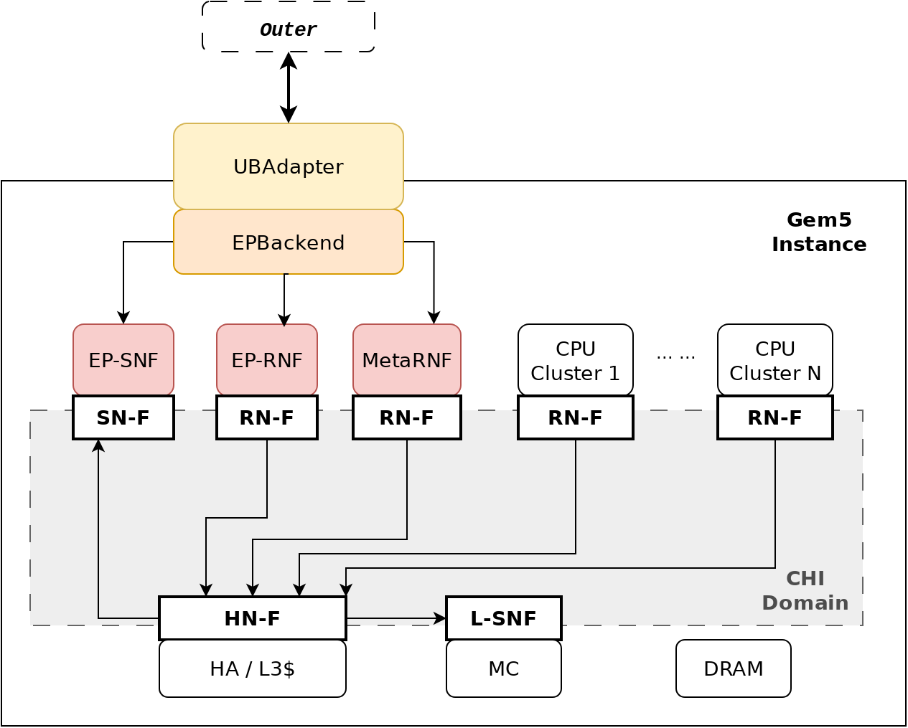

# 跨节点一致性协议理论分析与方案对比

<!-- PAGEBREAK -->

---

## 目录

1. 概述
2. 跨节点一致性协议理论分析
   - 2.1 比较范围与评价维度
   - 2.2 状态集合的性能影响
   - 2.3 全局目录方案对比
   - 2.4 典型事务的成本分析
   - 2.5 方案选择：采用 MESI 精确全局目录
3. UBCC 方案体系结构
   - 3.1 总体体系结构
   - 3.2 核心组件
   - 3.3 全局一致性语义与关键路径
   - 3.4 并发仲裁与活性
4. 结论
附录 A 消息与状态速查表
附录 B EP-RNF 仲裁规则
附录 C 术语表
附录 D 体系结构细节

<!-- PAGEBREAK -->

---

## 1. 概述

### 1.1 方案定位

UBCC 是面向多节点系统的跨节点缓存一致性体系结构：在节点内 gem5 CHI 一致性域之上，构建独立的跨节点目录与仲裁层，并通过 EP 接入现有处理器缓存层级。本文的中心不是性能实测，而是分析跨节点一致性协议的状态表达、目录组织和事务路径，并据此说明 UBCC 的方案选择。

### 1.2 设计目标与范围

- 协议解耦：全局目录与节点内 CHI 状态机职责分离；
- 容量扩展：在固定 SRAM 预算下提升等效追踪容量；
- 精确目标选择：依据全局目录状态选择 owner、sharer 和失效目标；
- 事务确认完成：通过 epoch、reqId、两阶段提交和幂等处理保证同址事务有序完成；
- 多拓扑适配：支持多节点、多 Socket 和跨节点路由组织；
- 工程集成：以模块化接口接入 ubsim 环境。

本文比较 VI、MSI、MESI、MOESI、MESIF，以及多节点系统级 CHI HN-F 与“全局 MESI 目录＋边界协议转换”；UBCC 与 HA 的方案对比不属于本文范围。消息段数、状态位宽和资源数量是结构分析，不作为额外性能测量。

### 1.3 交付结论

理论分析表明，MESI 的 E 状态可使常见私有读后写在本地完成 E→M，且与 MSI 同为 2 bit 稳定编码；精确全局目录可按真实 sharer 选择目标，并以 ResidentDir＋H64 Backstore 扩展冷目录容量。因此，当前方案采用 MESI 精确全局目录，节点内 CHI 通过 EP 与 Outer 域衔接。关键远程读、所有权迁移、共享转写者、写回、逐出和目录换入换出路径已形成完整控制与数据通路。

方案通过分层验证确认协议状态安全、消息幂等和事务确认完成；性能观测及各结果集的适用范围由性能分册统一报告。

| 项目 | 结论 | 适用范围 |
|---|---|---|
| 架构 | 独立 Outer 域、分层目录和 EP 接入路径已形成 | 当前交付实现及已验证拓扑 |
| 正确性 | 关键安全、活性与可恢复传输故障路径通过分层验证 | 形式化模型、定向验证与端到端执行所覆盖的机制 |
| 性能 | 完成 M3 五拓扑三压力配对；M1/M2 按独立结果集核验 | 既定 workload、统一完成边界与参考模型条件 |
| 验证模型 | 在 Home 持续存活条件下验证协议端点层级 | 端口级 Switch 微体系结构未建模 |

---

<!-- PAGEBREAK -->

## 2. 跨节点一致性协议理论分析

本章给出状态表达与消息组织的机制取舍。时延实测与计分只由性能分册报告，本章的消息段数、状态位宽和资源数量是结构分析，不作为额外性能测量。

### 2.1 比较范围与评价维度

Outer 协议的性能取决于两件事：稳定状态集合决定协议能够直接表达哪些副本和数据责任，目录与数据路径的组织方式决定消息承载、目录权威和数据如何分布。状态集合与组织方式并非彼此独立——E/O/F 的收益只在相应的目录组织与数据路径下才能兑现——因此本章比较的是具备配套条件的完整方案，而不是状态名称或消息承载名称。

本节使用以下评价量：`K` 表示 requester 可见完成路径上的串行跨节点消息段数，`M` 表示
跨节点单播消息总数，`D` 表示同一份 64 B 数据线被搬运的跨节点遍历次数，`S` 表示需要失效
的实际 sharer 数，`F` 表示同时接收 Recall 或 Invalidate 的目标数。

半定量时延可表示为：

$T_{\mathrm{visible}} ≈ K × τ_{\mathrm{link}} + T_{\mathrm{dir}} + T_{\mathrm{local}} + T_{\mathrm{queue}} + T_{\mathrm{fanout\_tail}}$。

其中 `K` 为串行跨节点消息段数；`τ_link` 为单段链路时延；`T_dir` 为目录查询与冷目录换入的访问时延；`T_local` 为节点内 CHI 完成与 EP 边界映射时延；`T_queue` 为 Home 事务槽、metadata DRAM 与链路队列等待；`T_fanout_tail` 为失效扇出中最后一个 Ack 的尾部时延。该式用于比较各方案的依赖关系与资源趋势，实际数值还取决于目录命中率、互连带宽、控制器并行度与实现时序。

评价时还需区分**单次事务的依赖长度**与**系统持续服务能力**。减少 `K` 主要缩短可见路径，减少 `D` 主要释放数据带宽，减少 `M` 或 `F` 主要减少控制处理与扇出压力；这些改善不必同步发生。目录容量则通过命中率影响 `T_dir`，通过换入等待影响 `T_queue`。因此，不能以状态位宽单独推导面积，也不能以数据直达单独推导完整事务的时延收益。

比较遵循共同边界：同一缓存行大小、相同 requester 可见完成口径、相同权限安全要求。涉及 Home 事务退役或 Clear 的成本时单独注明；已实现机制与候选增强分开讨论，避免把候选直接转发或 O/F 的收益计入当前 UBCC 实现。

### 2.2 状态集合的性能影响

稳定状态描述事务确认完成后的副本关系，瞬态状态则承接数据返回、权限变更和确认之间的依赖。
以下分别讨论五种状态集合；其性能收益以相应访问模式出现为前提。

#### 2.2.1 VI：简洁副本状态与外部权限管理

VI 用有效与无效表示本地副本是否可用，适合副本管理简单、权限责任由外部机制承担的组织。
唯一写者、多个读者和脏数据责任由外部目录、集中仲裁或探测机制管理，跨节点写入前需使
冲突副本的权限确认完成。是否广播及其目标范围由具体组织方式决定。

其局部状态判断路径短，稳定状态至少需要 1 bit；但远程 miss 的 latency 取决于附加机制
如何找到数据源。若采用探测，traffic 与接收端处理会随候选节点数增加，限制持续 throughput；
若配合精确目录，则仍需保存节点级 sharer 和事务状态。因而 VI 的适用性应按整个权限管理
组织的 storage 和消息成本评估，而非只比较一个有效位。

#### 2.2.2 MSI：显式写者与共享集合

MSI 以 M 表示持有修改责任的单一 owner，以 S 表示只读共享副本，以 I 表示无效。
目录式组织可以据此向 owner 回收最新数据，或向实际 sharer 发起失效，避免向无关节点查询。
对确实存在多个读者的缓存行，这种表达已经覆盖共享读取和单写者切换的主要稳定关系。

单一干净副本在 MSI 中仍表现为 S，首次写入需要完成 S→M 权限升级，即使实际上没有其他
sharer，也要由全局仲裁确认。私有读后写场景因此增加控制往返、Home 事务占用和排队机会；
持续共享场景则不一定因缺少 E 而增加相同成本。MSI 至少使用 2 bit 稳定状态，精确目录
仍需位图和身份字段，适合共享访问占主导、私有干净升级优化价值较低的场景。

#### 2.2.3 MESI：利用干净独占副本缩短私有写升级

MESI 增加 E，表示一个节点持有唯一的干净副本。全局独占关系成立时，该节点可按本地一致性
规则完成 E→M，无需重新执行共享副本失效路径。这对初始化后由单个节点使用的私有数据、
先读后写的数据结构尤其有利：写入 latency 降低，同时减少跨节点升级消息和 Home 事务槽占用。

E 的收益来自“已知唯一”，而不是绕过全局权限管理。其他节点请求该缓存行时，仍需由
Home UBCC 控制器协调降级或迁移；高共享度下 E 停留时间较短，其 throughput 收益也随之减少。
MESI 与 MSI 均可用 2 bit 编码，新增成本主要是 E 相关转换和本地写升级的状态衔接，
而非稳定状态位宽。当前 UBCC 的 MESI 类全局目录采用这一权限表达，并由第 3.3 节的授权与
提交机制维护全局关系。

#### 2.2.4 MOESI：保留脏共享数据责任

MOESI 增加 O，使一个节点在其他节点持有只读副本时继续承担脏数据责任。对于一个节点产生
数据、多个节点随后读取的模式，O 持有者可以作为后续读取的数据源，不必先使 Home memory
成为最新副本再服务每个读者。收益集中在可避免的写回和内存访问，而非所有远程读取。

O 不规定数据必须直接到 requester：Home 中转仍会占用两段数据带宽，直接转发才可能进一步
减少数据遍历。长期保留 O 可以降低 Home memory traffic，但也会使提供数据的节点承担热点带宽；
O 逐出、责任迁移和共享转写者都需要额外协调，可能增加事务占用和尾延迟。稳定状态至少
需要 3 bit，瞬态 storage 还要表达脏共享责任的释放与接续。该状态集合适合脏共享复用充分的
访问模式，在本章作为架构比较选项，当前 UBCC 全局目录采用 MESI 类状态。

#### 2.2.5 MESIF：为干净共享读取指定响应者

MESIF 增加 F，在多个干净共享副本中指定一个转发响应者。新读者到达时，目录和消息规则
可以选择该响应者提供数据，减少多个副本同时响应或重新选择数据源的工作。与 O 不同，F 表达
响应责任而非脏数据责任，适合读多写少、共享副本能够持续复用的数据。

若 cache-to-cache 路径优于 Home memory 路径，F 可降低读 latency 和内存 traffic；若响应者
较远或已饱和，指定 F 并不自动改善 throughput。F 逐出、迁移或被失效时，需要保持响应者
身份与目录一致，写密集模式会反复支付这些维护消息。至少 3 bit 的稳定状态只是 storage
增量的一部分，还需相应瞬态和完成跟踪。MESIF 是本章的架构比较选项；当前 Outer 采用
MESI 类目录，F 语义和任意干净副本转发属于候选能力，尚未实现。

状态位本身通常不是目录存储的主要部分。精确目录还需要 sharer 位图、tag、epoch 和控制位；
事务执行期间还需要 requester、目标位图、Ack 位图和可选的 64 B 数据缓冲。下表归纳各状态
集合的主要取舍，实际资源应结合附录 D.1–D.2 的目录容量评估。

| 状态集合 | 直接表达能力 | Latency 影响 | Throughput、Traffic 与 Storage 影响 |
|---|---|---|---|
| VI | 只区分有效与无效 | 需要额外机制定位写者、共享者和脏数据源 | 状态处理简单；精确失效和数据源选择依赖附加目录或探测；至少 1 bit 状态 |
| MSI | 表达单一 Modified owner 与 Shared 集合 | 单一干净副本写入仍经过 S→M 升级 | 可按 owner/sharer 定位目标；至少 2 bit 状态 |
| MESI | 增加 Exclusive | 单一干净持有者可本地 E→M，减少一次全局升级路径 | 降低私有干净数据的控制流量和 Home 事务占用；至少 2 bit 状态 |
| MOESI | 增加 Owned | dirty shared read 可由 O 持有者提供数据，减少回写后再读路径 | 降低部分 Home memory 数据流量，增加 O 回收、转发和逐出事务；至少 3 bit 状态 |
| MESIF | 增加 Forward | 多 sharer 读取时由 F 提供确定的 cache-to-cache 数据源 | 减少响应者选择和部分 Home/memory 数据流量，增加 forwarder 选举、迁移和失效流量；至少 3 bit 状态 |

#### 2.2.6 目录精度：精确目录与广播探测

状态集合之外，目录**精度**同样影响性能。精确目录只记录真实 sharer，失效目标随实际共享集合增长；广播或探测不保存完整精确 sharer（或只保存有限提示），向候选节点请求后再确定数据源与权限，稳定目录更小，但 traffic、接收端过滤与响应确认工作随节点数增长。节点数少、探测域受控或目录预算极紧时广播可接受；节点规模与稀疏共享增长时精确目录优势扩大。是否精确过滤取决于目录实现与配置，与“用不用 CHI”不是互斥分类。

精确性与驻留容量也不是同一概念。目录条目从 SRAM 迁入 metadata DRAM，只改变查询成本，不应把真实 sharer 关系丢弃或改为广播假设。Bloom 只用于过滤冷目录查找，不能替代最终的 sharer 权威；可信 negative、lookup Found 和 NotFound 的处理边界见附录 D.2。由此，目录方案应同时报告表达精度、驻留容量和冷访问代价，而不能仅报告片上条目数。

### 2.3 全局目录方案对比

#### 2.3.1 比较对象与共同边界

两个方案承担相同的全局功能：覆盖全互联的副本关系、确定合法数据源与失效目标、建立单写者关系并协调同址冲突与完成。区别只在全局权威用什么语义表达、由谁承载。

- **方案一 多节点系统级 CHI HN-F 全局目录**：在全局目录侧部署承担系统级 Home 职责的 HN-F，用 CHI 事务与目录规则组织全局请求、snoop、数据与完成。
- **方案二 全局 MESI 目录＋边界协议转换**：Home UBCC 控制器维护节点级 MESI 类目录与全局提交关系；EP 在边界把节点内 CHI 请求、snoop、数据与完成映射为全局权限事务；节点内 CHI 继续负责本地一致性。

#### 2.3.2 五个维度的对照

| 维度 | 系统级 HN-F 全局目录 | 全局 MESI 目录＋转换 | 结论 |
|---|---|---|---|
| 存储 | 系统范围保存 sharer/owner，沿用 CHI 状态编码（MOESI/MESIF 通常 ≥3 bit）与事务字段（TxnID/DBID、四通道缓冲） | 2-bit 状态＋节点级 sharer 位图＋tag/epoch；owner 由 one-hot sharer 推导；ResidentDir＋H64 用 metadata DRAM 扩展冷容量 | **MESI 目录一般更省、更可扩展**（HN-F 即使精简目录，CHI 通道/事务状态仍不可省） |
| 时延 | 原生 CHI、无跨域转换，可利用 DMT/DCT 直接提供数据；但目录 miss、snoop、credit、完成依赖仍在关键路径 | 边界多一次映射与完成关联，当前远程提供数据经 Home 中转；E 免全局升级 | **远程提供数据路径上 HN-F 一般更短**；现有实现 MESI 需配套授权直接转发才能拉平 |
| 流量 | 由目录过滤精度、snoop 范围、实际数据路由的具体实现决定 | 精确节点级 sharer 只向真实副本发失效，E 免去无谓共享升级；代价是 Home 中转增加数据遍历 | **MESI 目录一般控制流量更低**；数据遍历可加直接转发弥补 |
| 复杂度 | 复用标准 agent、协议规则与验证资产；但系统集成需处理通道依赖、credit、ID、完成次序与层级适配 | 全局稳定语义集中、资源可独立设计；边界必须正确映射 CHI 请求/snoop/数据/重试/完成 | **没有现成多节点级 CHI 基础设施时，MESI 目录＋转换更集中可控**；已有系统级 CHI fabric 或第三方互操作需求时，HN-F 的复用收益才明显 |
| 状态转换 | 由 CHI 版本、HN-F 目录实现与 agent 能力决定；目录稳定态与缓存状态非一一对应，往往不止比 MESI 多 1 bit | 全局稳定关系即 I/S/E/M；CHI 子事务映射为权限意图，Grant 与匹配完成事件到达后提交 | **MESI 目录更简单、提交点更明确**；HN-F 状态转换更复杂且受实现约束 |

这些结论应按维度使用，不宜汇总为脱离实现条件的统一优劣排序。原生 CHI 的路径优势与边界转换的组织优势可以同时成立；精确目录也并非 MESI 独占的能力。若两种实现采用相同过滤精度，应继续区分 E 的升级节省与数据中转开销，而不能把全部流量差异归因于协议名称。

#### 2.3.3 方案边界与适用条件

系统级 HN-F 方案在已有多节点 CHI fabric、标准 agent 和第三方互操作要求下具有复用价值：协议通道、credit、ID 与既有验证资产可以继续使用，数据提供路径也可能更短。但这种复用并不消除系统级目录的容量、snoop 范围、完成次序和故障恢复问题；若全局共享关系仍需额外的层级映射，原生 CHI 只减少了边界转换，不会自动减少目录状态或目标集合。

全局 MESI 目录＋边界转换方案适合将跨节点职责作为独立模块规划的系统。Home UBCC 控制器集中维护 committed directory 和提交点，EP 负责把节点内 CHI 的本地事实转换为全局权限意图。它的主要工程风险集中在边界：请求与 snoop 必须使用一致的 epoch/reqId，数据返回必须与授权关联，Recall/Invalidate 的完成必须通过明确的 Clear 或 Ack 退役。只要这些边界条件被显式建模，目录状态、容量资源、重试策略和后续数据路径增强即可独立演进。

两种方案都需要回答四个共同问题：目录是否精确、最新数据由谁提供、失效目标如何确认、Home 如何在授权与提交之间保持安全。因而“采用 HN-F”不能替代目录分析，“采用 MESI”也不能替代数据路径分析。本章后续以这四个问题作为事务成本和方案选择的共同基线。

### 2.4 典型事务的成本分析

跨节点事务的成本可以用四个问题拆开：**最新数据在哪、数据怎么走、谁必须参与、这次访问要不要进入全局路径**。前三个问题决定“进入全局路径之后有多贵”，第四个问题决定“要不要进入”。下面依次讨论，用 `K`（requester 可见完成路径上的串行跨节点消息段数，代表时延）、`D`（同一份 64 B 数据线被搬运的跨节点遍历次数，代表数据带宽）、`S`（需失效的实际 sharer 数）、`F`（同时接收 Recall 或 Invalidate 的目标数）来量化。

#### 2.4.1 最新数据在哪

- **Home memory 最新**：数据只遍历一次（`D=1`，`K≈2`）；
- **远程干净持有者最新**：Home 先从持有者回收数据再返回；若授权持有者直达 requester，则省去一次遍历；
- **远程脏 owner 最新**：必须先回收数据并释放旧写权限，才能授予新 requester。

区别只在数据源，不在状态名：同样是“读”，数据在 Home、干净副本或脏 owner，路径段数与数据遍历都不同。

#### 2.4.2 数据怎么走

- **Home 中转**：提供数据者先交给 Home，Home 再组织响应，`D=2`、`K≈4`；
- **直接转发**：Home 只做权限判定与提交，提供数据者直达 requester，`D=1`、`K≈3`。

| 最新数据位置 | Home 中转 | 直接转发 |
|---|---|---|
| Home memory | `D=1`，`K≈2` | 无额外收益 |
| 远程干净持有者 | `D=2`，`K≈4` | `D=1`，`K≈3` |
| 远程脏 owner | `D=2`，`K≈4` | `D=1`，`K≈3` |


图 2-1　Home 中转与直接数据转发

#### 2.4.3 谁必须参与

**所有权迁移（写）**：新写者必须同时取得最新数据和合法写权限，可见完成时间由两个分支中较慢者决定，`T_visible = max(T_data, T_authority)`。数据直达缩短 `T_data`，但当权限分支（旧 owner 释放、必要失效与完成关联）更慢时，整体时延不会同比下降。requester 可见完成与 Home 事务退役是两件事，应分别观察。

**共享转写者（多副本写）**：写者需要使除自己外的所有共享副本失效。精确目录只向真实 sharer 发失效（`F=S`），近似 `K≈4`、`M≈2S+2`（计入 requester Clear 约 `2S+3`）；广播或探测在不知道精确 sharer 时向 `N−1` 个节点请求，控制消息约随 `N−1` 增长。当 `S≪N−1` 时精确目录显著减少链路流量与接收端处理；接近全共享时两者最坏扇出趋近。

#### 2.4.4 是否进入全局路径：E 与静默升级

前三个问题都在“已经发起全局事务”的前提下讨论。对最常见的私有访问——初始化后单节点使用、先读后写、同一私有副本反复写——真正的差别在于**这次写升级要不要进入全局路径**。

节点持有 E 时，它由目录的 one-hot 不变量保证是唯一持有者，本地写只需 E→M，不涉及任何其他副本。协议因此允许这次升级在节点内**零跨节点消息**完成：不发 UpgradeReq、不占 Home、不增 epoch（静默升级启用时，写命中与 snoop 两条路径都在本地直接完成）。这正是 MESI 的 E 相对 MSI 的 S 的关键差别：S 意味着可能存在其他 sharer，写之前必须由全局确认或失效，无法本地完成。

这个收益有明确的边界。它是**结构性**的：MESI 的 E 提供了“可以本地升级”的前提，是否真正省掉全局往返取决于实现是否启用静默升级；若关闭，E→M 仍会发一次 UpgradeReq，只是不需要失效其他节点。它也有代价：静默升级后 Home 的全局状态仍停在 `G_E` 而数据已经变脏，因此对 E 持有行 Home 不能再从内存直接提供数据，必须回收到 owner。最后，这一收益面向的是**不进入全局路径**的访问，因此不会出现在 2.4.1–2.4.3 的远程事务成本表里。

#### 2.4.5 小结

典型远程事务的成本由**数据位置、数据路径、参与目标数**决定，与状态集合基本无关。状态集合真正影响的是**要不要进入全局路径**：E 让最常见的私有写升级可以在本地零消息完成，S 则必须进入全局路径。其余状态在特定情形提供额外收益：O 免去脏共享数据的一次回写，F 为多副本读指定一个确定的响应者。也就是说，目录组织与数据路径决定“进了全局路径有多贵”，而 MESI 的 E 决定“多数私有访问根本不用进”。

结构成本还需与瓶颈位置配合解释：同样的 `K` 不保证同样的时延，同样的 `D` 不保证相同的带宽压力。链路距离、源节点本地回收、Home 排队与最后一个 Ack 都可能成为主导项。上表提供的是共同完成边界下的路径基线，不包含故障重试、容量背压及特定拓扑的测量结论。

### 2.5 方案选择：采用 MESI 精确全局目录

选择 MESI 的首要理由，是它以最小的稳定表示覆盖了最常见的权限关系。在私有数据、初始化后单节点使用以及先读后写这类访问中，一个节点在确认自己持有唯一干净副本后，可以本地完成 E→M 升级，不必再发起一次全局共享升级。这类访问在多数 workload 中占主导，而且这份收益不依赖长期脏共享，也不依赖指定某个远程响应者。与 MSI 相比，MESI 增加 E 并不增加稳定状态位宽——两者都可以用 2 bit 编码——因此它几乎是纯增益。I/S/E/M 四个状态覆盖了无副本、共享只读、干净独占和修改独占这几种主要稳定权限关系，无需长期维护 O 的脏共享责任或 F 的指定响应责任。

在此基础上，精确全局目录与分层承载进一步放大了 MESI 方案的系统价值。精确的节点级 sharer 使 owner 定位和失效只作用于真实副本，在稀疏共享下显著减少无关消息与接收端工作；每地址唯一的 Home 提交点使同址权限关系清晰，数据位置的变化不改变全局权威归属；2-bit 状态与节点级位图紧凑地适配现有目录条目，ResidentDir 与 H64 分别承担热点与冷目录容量；节点内 CHI 保持一致性的本地职责，全局语义转换集中在 EP 边界，使全局目录资源可以按需独立规划。

其余能力作为条件性增强，而不是放弃 MESI 的理由。当远程 owner 的数据中转成为瓶颈时，优先在 MESI 权限语义下增加授权直接提供数据，而不必引入 O；当持续脏共享复用成为主导访问模式时，再评估 O 带来的写回节省是否超过其责任维护成本；当干净共享缓存的提供数据路径明显优于内存时，再评估 F 的固定响应者价值；当已有系统级 CHI fabric 或第三方互操作需求时，再评估多节点系统级 HN-F 的复用收益。当前实现采用 Home 中转，把数据回收、授权与完成关联集中在一处，路径关系清晰，其数据带宽代价已在前述事务分析中说明。

---

<!-- PAGEBREAK -->

## 3. UBCC 方案体系结构

本章只保留支撑第 2 章分析所需的最小事实；字段表、换入换出细节、EP-RNF 细粒度规则和资源预算集中见附录 D。

### 3.1 总体体系结构

UBCC 将系统划分为两个协同一致性域：Inner 域是节点内 gem5 CHI 一致性域，包括 CPU Cache、HN-F 及节点内 snoop 路径；Outer 域由 Home UBCC 控制器协同实现，负责全局目录、权限仲裁、Recall、Invalidate 和完成确认。节点内请求经 EP 转换为 Outer 请求，发送给目标地址的 Home UBCC 控制器；Home 根据全局目录状态完成权限判断，并经跨节点通信平面交换消息。


图 3-1　UBCC 总体架构

控制路径携带请求类型、权限状态、epoch、reqId、sharer/owner 信息和完成确认；数据路径承载远程读、脏数据回收、写回数据和授权返回；完成路径依次覆盖请求授权、失效确认、Clear 提交和最终权限可用。若最新数据位于远程 owner，Home 发起 Recall；若 Home 已有权威数据，则直接组织授权返回。

### 3.2 核心组件

| 组件 | 所属域 | 主要职责 |
|---|---|---|
| CPU Cache / HN-F | Inner | 节点内缓存一致性和本地内存访问 |
| EP-RNF | 边界层 | 代表 Outer 响应 HN-F snoop，并发起跨节点权限操作 |
| EP-SNF | 边界层 | 将节点内服务请求接入 Outer 数据路径 |
| UBAdapter | 边界层 | CHI 端点与 UBIO 消息适配和事务关联 |
| UBCC 控制器 | Outer | 维护全局目录、权限仲裁和事务确认完成 |
| ResidentDir | Outer | 保存活跃跨节点目录元数据 |
| H64 Backstore | Outer | 保存冷目录元数据并支持换入换出 |

UBCC 控制器以地址映射选择唯一 Home；全局目录采用 `G_I/G_S/G_E/G_M` MESI 类状态，记录 sharer 位图和 epoch，`G_E/G_M` 的 owner 由 one-hot sharer 推导。committed state 与 intended state 分离：Grant 只表示权限已保留，匹配 Clear 或本地升级完成后才提交 intended state。

ResidentDir 是全局目录的片上驻留层，当前基础配置的片上目录总预算为 512 KiB（含 Bloom、GroupIndex 等，分配见附录 D.1）。H64 Backstore 位于 metadata DRAM，是固定 64 B bucket 的开放寻址哈希表，不保存缓存行数据。当前 12 B slot 使用 16-bit 节点级 sharer mask，可覆盖最多 16 个节点；16N1S 位于该编码范围内。

EPBackend 协调 Recall、写回和本地升级的跨域完成、身份与持久化关系。EP-RNF、EP-SNF、EPBackend 和 UBAdapter 只承担边界映射与协调，不拥有全局目录或提交权；全局权限仍由 Home UBCC 控制器决定。


图 3-2　分层目录：查询与换入



图 3-3　gem5 EP 架构

### 3.3 全局一致性语义与关键路径

全局目录记录 owner、sharer 集合、MESI 状态和 committed epoch。一次跨节点操作依次经历：requester 发送读或写权限请求；Home 查询已提交目录；必要时 Recall owner 或 Invalidate sharer；Home 返回数据和临时授权；requester 完成本地操作后发送 Clear；Home 校验事务身份并提交新目录状态。

两阶段提交中，阶段 1 创建 outstanding、记录目标状态和事务身份并保持原 committed state；阶段 2 收到匹配 Clear 后提交目标状态并退役事务。Ack 位图、epoch、reqId、Clear tombstone、stable tuple 和 waiter 去重共同处理重复、延迟和重试消息。


图 3-4　UBCC 核心协议路径

- **远程读**：EP-SNF 将 miss 发送到 Home；Home 查询 owner/sharer；远程 owner 存在时发起 Recall；owner 经 EP-RNF 返回权威数据；Home 更新共享关系并返回数据和授权。
- **所有权迁移**：新写者请求独占权限；Home 定位旧 owner；旧 owner 降级或失效并返回数据；Home 重配置权限；新写者获得数据和单一写权限。
- **共享转写者**：Home 固定有效 sharer 目标集合，发送 Invalidate，收集每个目标 Ack，授权 requester；Clear 到达后提交 owner 状态。

### 3.4 并发仲裁与活性

Home 对同一缓存行保持单一主事务；并发请求立即服务、进入 waiter、返回 BUSY 并稳定重试，或合并到 Recall/Invalidate 流程。稳定身份为 `(PA, node, socket, epoch, reqId)`。

失效目标以发起时刻的 committed directory 为基准，收到每个目标确认即扣除；重试只面向尚未确认目标。EP-RNF 对同址 CHI 事务与 snoop 分类仲裁：active Recall 优先完成数据回收；可安全即时响应的 snoop 直接完成；与写权限冲突的 snoop 返回 stale，使发起者按全局顺序重试。Clear 成功提交后按 `(PA, node, socket, reqId)` 精确退役完成 waiter；Clear、Upgrade、Invalidate 和 Recall 路径重发相同 tuple，由接收方幂等处理。

---

## 4. 结论

1. 选择 MESI 的主要收益：E 改善常见私有读后写路径；与 MSI 同为 2-bit 稳定编码；覆盖主要权限关系，无需额外承担 O/F 的长期责任维护。
2. 选择精确全局目录及边界转换的系统收益：失效目标随实际共享集合增长；全局权威清晰，目录容量可独立分层扩展；复用节点内 CHI，保持全局目录与本地一致性职责分工。
3. 更复杂能力按明确瓶颈引入：O/F 依赖可兑现的提供数据收益与访问模式；多节点系统级 HN-F 的价值取决于标准互操作与已有基础设施；直接数据路径可在 MESI 基础上演进，无需预先增加共享责任状态。

UBCC 方案以独立全局目录为核心，在保持节点内 CHI 一致性边界的同时，提供跨节点数据定位、权限仲裁、目录容量扩展和可恢复消息处理。该架构兼顾协议清晰度、容量效率、目标选择精度和多拓扑扩展能力，并已形成可集成到 ubsim 的模块化实现。

---

## 附录 A 消息与状态速查表

### A.1 主要消息

| 消息类别 | 代表消息 | 作用 |
|---|---|---|
| 请求 | ReadReq、UpgradeReq、RecallReq、InvalidateReq | 发起数据或权限操作 |
| 响应 | ReadResp、UpgradeResp、RecallResp | 返回数据、目标集合或接受状态 |
| 确认 | Clear、ClearAck、InvalidateAck、UpgradeAckNotify | 确认本地完成或全局完成确认 |
| 生命周期 | Writeback、Evict | 归还数据或释放目录关系 |

### A.2 关键目录概念

| 概念 | 说明 |
|---|---|
| committed state | 已对后续请求可见的全局目录状态 |
| intended state | 当前授权完成后准备提交的目标状态 |
| outstanding | 正在执行的同址主事务 |
| waiter | 等待同址事务或目录换入完成的请求 |
| tombstone | 已完成事务的短期幂等记录 |

---

## 附录 B EP-RNF 仲裁规则

| 活跃事务 | invalidating snoop | SnpOnce | 处理原则 |
|---|---|---|---|
| CleanUnique | stale | stale | 保持全局写顺序，发起者重试 |
| ReadUnique | stale | stale | 优先完成 Recall 数据回收 |
| ReadShared | stale | immediate data | 允许只读数据即时返回 |
| 无冲突事务 | immediate | immediate | 按 CHI 正常响应 |

---

## 附录 C 术语表

| 术语 | 说明 |
|---|---|
| UBCC 方案 | 由 Outer 一致性层、Home UBCC 控制器、分层目录和 EP 边界组成的跨节点一致性体系结构 |
| UBCC 控制器 | 维护全局目录、串行化同址事务并执行权限仲裁的控制器组件 |
| Home UBCC 控制器 | 由地址映射选定、负责该地址全局目录和事务提交的实例 |
| CHI | AMBA coherent transaction protocol；当前实现用于节点内 gem5 CHI 域，Outer CHI 仅作候选分析 |
| HN-F | 节点内 Home Node，负责本地一致性与内存访问 |
| EP | 节点内 CHI 域与 Outer 一致性层之间的端点扩展层 |
| EP-RNF | 代表 Outer 域参与节点内 snoop 的端点 |
| EP-SNF | 将节点内服务请求接入 Outer 数据路径的端点 |
| UBAdapter | EP 与 UBIO 之间的消息适配组件 |
| UBIO | 承载 Home UBCC 控制器和分层目录的运行模块 |
| ResidentDir | SRAM 驻留目录 |
| H64 Backstore | 位于 metadata DRAM、保存冷目录元数据的 64 B bucket 哈希表 |
| HA-VI | VI 协议可执行参考模型 |
| ubsim | 组织仿真模块装载、运行与集成的框架 |
| Inner 域 | 节点内 gem5 CHI 一致性域 |
| Outer 域 | Home UBCC 控制器协同实现的跨节点一致性层 |
| Home | 负责指定地址全局目录和仲裁的节点 |
| owner | 持有写权限或最新脏数据的节点 |
| sharer | 持有共享副本的节点 |
| epoch | 区分同址新旧事务的单调序号 |
| reqId | 标识具体请求的事务编号 |
| Recall | 从当前 owner 回收数据或权限 |
| Invalidate | 使共享副本失效 |
| Clear | requester 本地完成后的提交确认 |

---

<!-- PAGEBREAK -->

## 附录 D 体系结构细节

本附录补充第 3 章的组件字段、容量资源、目录生命周期与边界仲裁细节，供核对理论分析的实现前提使用。

### D.1 控制器资源与目录容量

| 资源 | 当前上限 | 显式数据或位图存储 | 主要作用 |
|---|---:|---:|---|
| 活动 Outer 主事务 | 128 | 最多 128 × 64 B = 8 KiB Recall 数据 | 并发准入和同址串行化 |
| 单地址 pending requester | 32 | 包含在全局等待资源中 | 热点地址排队 |
| pending requester 总数 | 256 | 最多 256 × 64 B = 16 KiB 写回数据 | 主事务等待期间保留请求 |
| ResidentDir waiter 总数 | 256 | 最多 256 × 64 B = 16 KiB 写回数据 | fill、替换或持久化等待 |
| 活动事务目标与 Ack 位图 | 每事务 6 个 64-bit 位图字段 | 128 × 48 B = 6 KiB | 记录失效目标和完成集合 |
| H64 活动事务槽 | 128 | 最多 128 × 64 B = 8 KiB bucket RMW 快照 | lookup、upsert、erase 准入 |
| H64 持久化 waiter | 64 | 最多 64 × 64 B = 4 KiB 写回数据 | 等待 metadata 操作 |
| H64 并行 bucket RMW | 8 | 已包含在事务槽快照中 | 控制 metadata DRAM 并行修改 |
| 单一 H64 bucket waiter | 8 | 事务槽索引和到达次序 | 串行化同 bucket 冲突 |

上述 64 B 显式数据与位图的预留上限合计为 58 KiB。另计的控制字段包括地址、node/socket、状态、epoch、reqId、阶段和计时信息，随活动事务和等待请求数量线性增长；芯片面积评估还需要硬件布局信息。表中的数量是当前实现上限，可随实现配置调整。

ResidentDir 采用 bit-packed set-associative 组织，每个 set 内使用 pseudo-LRU 选择候选条目。目录条目依次为 valid（1 bit）、全局 MESI 状态（2 bit）、resident metadata dirty（1 bit）、fill/writeback/pinned 控制位（3 bit）、节点级 sharer 位图（节点数位，16N1S 为 16 bit）、24-bit epoch 和 tag（剩余位）。

当前基础配置的片上目录预算为 512 KiB：

| 配置 | ResidentDir 数据区 | Bloom | GroupIndex | ResidentDir 容量 |
|---|---:|---:|---:|---:|
| naive | 约 508 KiB | 0 | 4 KiB | 65,536 条 |
| spill-noopt / optimized | 约 448 KiB | 60 KiB | 4 KiB | 57,344 条 |

```text
B_onchip = B_resident + B_bloom + B_group-index + B_reserved
```

GroupIndex 是 ResidentDir 的分组索引元数据：每个 Bloom slice 对应一个 GroupIndex，记录该分组的页目录、live/dirty/stale 计数和 mini-Bloom 统计，用于在换入换出时快速定位候选分组、避免整目录扫描。

### D.2 H64 Backstore 字段与换入换出

H64 Backstore 位于 metadata DRAM，保存从 ResidentDir 迁出的冷目录元数据，不保存缓存行数据。它是一个**固定 64 B bucket 的开放寻址哈希表**：整个表划分为 256 个 **routing group**，每个 group 是一段独立的 bucket 数组；每个 bucket 占一个 64 B metadata line，由 4 B header 和 5 个 12 B slot 组成，因此一个 bucket 最多容纳 5 个地址条目。

routing group 是第一级哈希分区：物理地址先经 splitmix64 哈希取模 256 落到某个 group，再在 group 内经哈希定位 home bucket。每个 group 负责一个离散地址子集，限定单次查找的探测长度、允许按 group 独立重建与读—改—写，并与 ResidentDir 的 16 个 Bloom slice 对齐（slice = group % 16）。

| H64 结构 | 字段 | 含义 |
|---|---|---|
| 4 B bucket header | format version | bucket 布局版本，用于兼容性判断 |
| 4 B bucket header | generation | bucket 修改计数，检测并发更新 |
| 4 B bucket header | live count | 当前 LIVE slot 数 |
| 4 B bucket header | tombstone count | 墓碑数，用于判定是否整理 |
| 12 B slot | 44-bit PA | 缓存行物理地址标签，probe 时匹配 |
| 12 B slot | 2-bit MESI | 该行的全局缓存行状态 |
| 12 B slot | 2-bit slot state | EMPTY / LIVE / HASH_TOMBSTONE / RESERVED |
| 12 B slot | 16-bit sharer mask | 节点级 sharer 位图 |
| 12 B slot | 24-bit epoch | 该行事务世代 |
| 12 B slot | 8-bit integrity | 完整性校验，检测损坏与过期写入 |

lookup 从 home bucket 开始执行有界线性 probe：命中 LIVE 即返回，遇到 EMPTY 结束，遇到 HASH_TOMBSTONE 继续（墓碑只为保持探测链完整）。upsert 命中 LIVE 则原地更新，否则复用首个 TOMBSTONE/EMPTY slot；erase 不搬移其他条目，只把匹配项标记为 TOMBSTONE。bucket 修改使用读—改—写序列，并以 generation、epoch 和 integrity 分别检测并发更新、过期写入和损坏。

当前配置提供 128 MiB metadata DRAM，并按 Socket 均分。单 Socket 配置下，每个 group 包含 8,191 个 bucket，H64 共提供 `256 × 8,191 × 5 = 10,484,480` 个物理 slot。双 Socket 配置在每个 Socket 上独立组织 4,095 个 bucket/group，总物理 slot 数为 `2 × 256 × 4,095 × 5 = 10,483,200`。可用 live 容量还受目标装载率、哈希冲突和有界 probe 条件约束。

当前 12 B slot 使用 16-bit 节点级 sharer mask，可直接覆盖最多 16 个节点；Socket 只参与 requester 身份和节点内路由，不增加 sharer 位宽。16N1S 位于该编码范围内。若将 Socket 或 endpoint 作为独立全局 sharer，或扩展到 16 个以上节点，需要扩宽 slot 或采用间接、分层 sharer 编码。

等效追踪容量按缓存行地址计算 ResidentDir 有效条目与 H64 已持久化 LIVE 元数据的去重并集，使固定片上预算优先服务热点目录，同时由 metadata DRAM 承担冷目录容量。

ResidentDir 以 set 为单位管理容量。目标 set 无空闲位置时，Home UBCC 控制器从 pseudo-LRU 位置开始选择候选条目，并跳过当前访问地址和 pinned 条目。以下状态会使条目保持 pinned：

- 该地址存在活动 Outer 主事务；
- 请求正在等待目录换入或 metadata writeback；
- 条目正在执行 H64 upsert、erase 或数据持久化；
- waiter 的完成依赖该条目继续存在。

换出按照目录状态和持久化状态分类处理：

1. H64 已保存相同 epoch 的有效目录副本时，未修改的驻留条目可以直接释放 ResidentDir 位置；
2. 修改后的有效条目先执行 H64 upsert，写入 MESI、sharer 和 epoch，收到持久化确认后释放；
3. 已转为 `G_I` 且 H64 仍有旧记录的条目执行 erase，确认后释放；
4. set 内全部 way 均被 pin 时，新请求进入容量 waiter，不覆盖任何仍有全局目录意义的条目。

ResidentDir miss 的换入路径先检查对应分组 Bloom。可信的 negative 表示 H64 中不存在该地址，Home UBCC 控制器可直接建立新的 `G_I` 条目；positive 或正在重建的 Bloom slice 触发 H64 lookup。lookup Found 时恢复 MESI、sharer 和 epoch，NotFound 时建立 `G_I` 条目。H64 暂时无法准入时，placeholder、原请求类型、node/socket、epoch、reqId 和数据负载保持不变，待资源可用后重试。

换入完成后，Home UBCC 控制器解除 fill 状态，重新检查全局目录和活动事务，再按原事务身份重放 waiter。过期 epoch、损坏 bucket 和耗尽的 probe 路径分别进入对应错误处理，不转换为新的空目录状态。

### D.3 EPBackend 与边界交接

EPBackend 将 Recall 回收、脏写回、本地升级与全局 Outer 权限事务关联。交接协调表以缓存行同一次权限持有期为单位，分别记录 Recall 与写回完成，不把任一路径响应当作另一条路径已完成的证明。每节点固定 64 项、8 项控制预留，条目 72 B，表体 4.5 KiB；不复制 64 B 数据。普通写回使用前 56 项，Recall 控制路径优先使用 8 个预留项。

Recall 可与同址脏写回交错：写回已将数据交给 Home 时，先前发出的 Recall 仍可能在节点内执行；反之 Recall 先到时，写回也必须保留自己的持久化与完成条件。缓存行数据仍由原生 CHI 事务缓冲与 EP-SNF 待写回数据承载。协调表将两条原生路径关联到同一条目，而不是将一次内存访问视为完整的全局事务。

每条目保存地址、epoch、generation、首次捕获的 owner，以及 Recall、写回和已合并 Recall 的事务标识与各自 Socket。返回路径携带槽位与 generation 令牌，只有条目仍有效且 generation 相符才推进完成。写回区分数据发布与写回完成；仅当所有登记路径完成且不存在“已知合并但尚未到达”的 Recall 时释放条目。EPBackend 另维护 `(PA, node, socket, reqId)` 稳定状态映射、等待队列和持久化队列。

槽位复用时 generation 递增。收到与写回事务及 Socket 匹配的发布确认后才置持久化标志；Recall 侧只推进自己的完成位。当节点内原生清理由 Outer 失效派生时，消息携带父失效的请求标识与 epoch，返回处理先匹配原生子操作自身身份、再关联到父事务。控制预留避免普通写回占满描述符后阻塞释放它们所需的控制回收。该有界准入只针对 Recall 与写回交接，不等同于把 Read、Grant、Upgrade 和所有 EP 队列统一改为同一张表；控制器与目录资源预算见附录 D.1。

### D.4 EP-RNF、EP-SNF 与 UBAdapter 细粒度规则

EP-RNF 处理 `SnpCleanInvalid`、`SnpUnique`、`SnpOnce`，将本地写升级转为 Outer 权限请求，并为 Recall 发起 `ReadShared` 或 `ReadUnique`。active Recall 优先完成数据回收；可安全即时响应的 snoop 直接完成；与写权限冲突的 snoop 返回 stale；不符合路由约束的组合进入协议错误处理。EP-SNF 在 HN-F/L3 未命中且本地无副本时封装 Outer 请求，Home 返回数据与授权后生成节点内 CHI 响应。UBAdapter 负责消息序列化/反序列化、事务身份关联、请求发送、响应分发、回调完成和稳定 tuple 重试。

### D.5 幂等、写回与并发完成细节

Outer 协议使用以下机制处理消息重复、延迟和重试：

- Ack 位图保证每个目标只贡献一次确认：按失效目标集合维护一位，同一目标的重发或延迟 Ack 只置位一次，避免重复计数导致过早提交；
- epoch 和 reqId 拒绝过期事务：epoch 区分同址新旧代，reqId 标识代内具体请求，不匹配的迟到消息被丢弃，不会推进当前事务；
- Clear tombstone 支持已完成事务的幂等确认：事务提交后短期保留 tombstone，重发的 Clear 命中 tombstone 直接返回已完成结果，不重复提交目录状态；
- stable tuple 保证重试不改变事务身份：重试用与首次相同的 `(PA, node, socket, epoch, reqId)`，接收方可按同一身份幂等处理；
- waiter 去重避免相同请求重复进入等待队列：相同身份的请求只保留一个 waiter，防止重试堆积。

节点逐出脏数据时，Home UBCC 控制器根据 committed directory 和事务 epoch 校验写回来源。有效写回可作为 Recall 的权威数据返回；重复或过期写回不会重复提交目录状态。

例如：requester 请求写权限，Home 需要失效 node2、node3。node2 先返回 Ack 后，Home 收到 node3 的 snoop 与 requester 写权限冲突而返回 stale；requester 按全局顺序重试写请求，此时 Home 基于更新后的 committed directory（已扣除确认目标）重算目标，只对 node3 重发失效，不再打扰已失效的 node2。

Clear 成功提交后，Home UBCC 控制器按 `(PA, node, socket, reqId)` 精确退役已经完成的 Read waiter，保留其他 requester、其他事务身份和其他操作类型的 waiter，再安全重放剩余请求。
