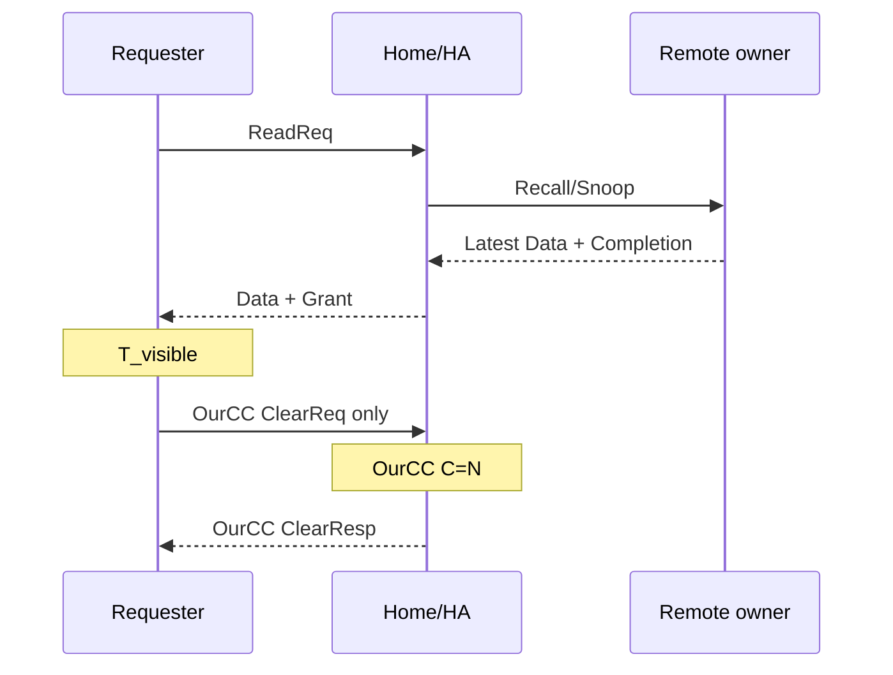
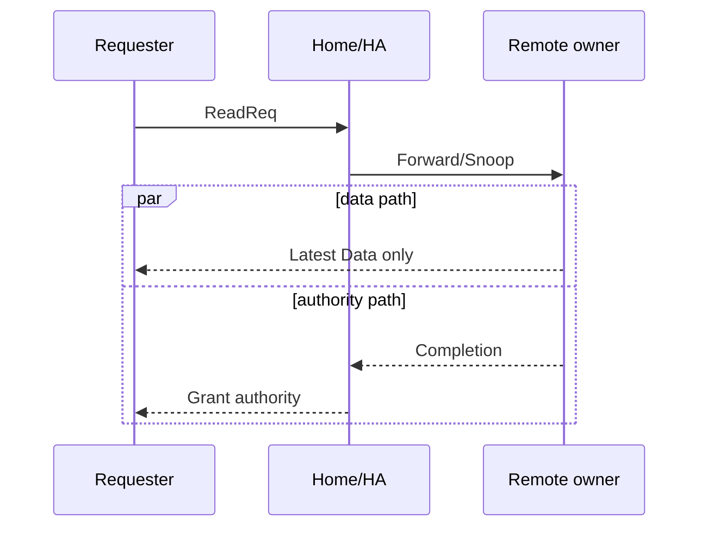
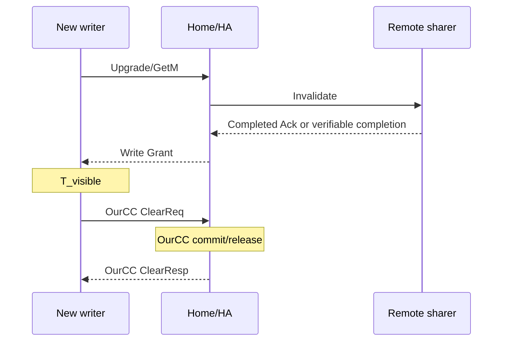
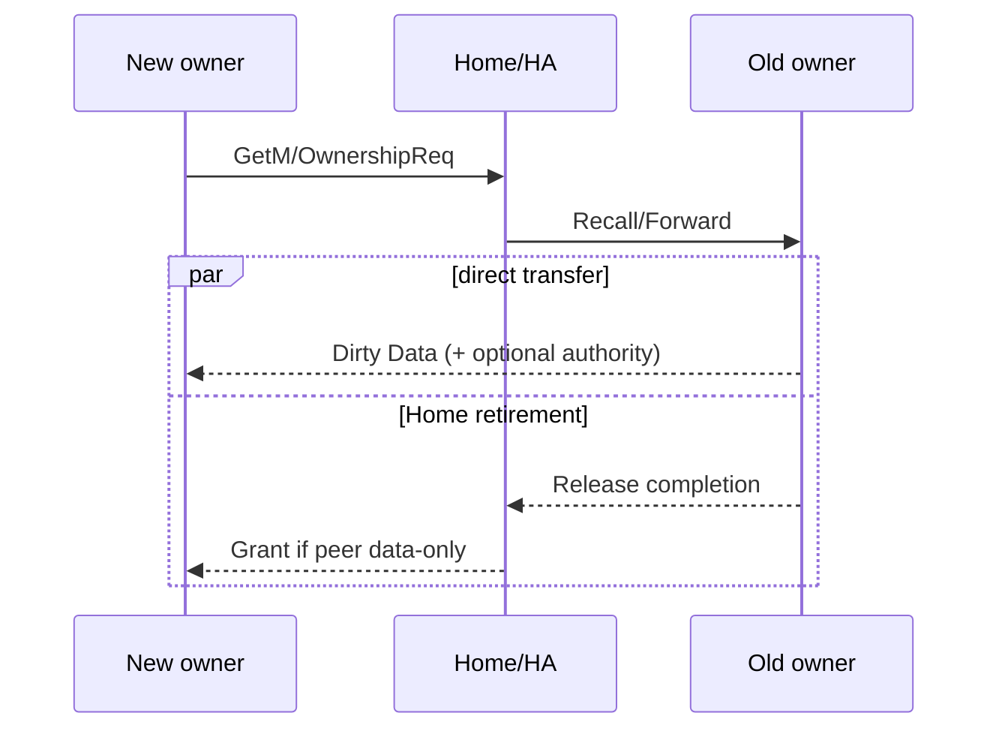

# OurCC 与甲方 HA 操作 DAG 账本

**日期：** 2026-08-06  
**状态：** 条件模型，不是甲方实现事实，也不是测得时延。

## 1. 统一记号

| 记号 | 含义 |
|---|---|
| `R` | requester/new owner |
| `H` | OurCC Home/UBCC 或甲方 HA |
| `O` | remote dirty/latest owner |
| `S` | remote clean sharer |
| `I` | requester install data/permission |
| `C` | Home metadata commit/retire |
| `N` | 下一同址冲突可安全释放 |
| `tau` | 归一化单向 fabric leg |
| `K_logical` | 最长串行依赖链逻辑段数 |
| `K_crossnode` | placement 冻结后真实跨节点 traversal 数 |
| `P` | `P_dir+P_peer+P_data+P_install+P_commit+P_queue` |

完成点：

- `T_visible`：R 同时拥有 latest data 和安全 authority。
- `T_commit`：H metadata 原子提交。
- `T_next`：下一同址冲突可安全继续。
- `T_root_current`：OurCC current 收到 ClearResp accepted 并完成 root path。

## 2. Profile 状态

| Profile | 状态 | 可用于当前合同 |
|---|---|---|
| `OurCC-current-clear-ack` | `CURRENT/IMPLEMENTED` | 是，但仍需冻结测量 |
| `OurCC-lossless-oneway` | `PROPOSED/UNIMPLEMENTED` | 否，只可建模 |
| `HA-central-return` | `HYPOTHESIS` | 甲方确认后 |
| `HA-direct-data-only` | `HYPOTHESIS` | 甲方确认后 |
| `HA-direct-data+authority` | `HYPOTHESIS` | 甲方确认 token/commit 后 |

当前 C4 是 direct data、非完整 authority，且要求 R/O/H 三个不同节点；两节点目标 3 中
为 `NOT APPLICABLE`。

## 3. Remote Read

### 3.1 Home memory latest：OurCC current

```mermaid
sequenceDiagram
    participant R as Requester
    participant H as OurCC Home
    R->>H: ReadReq
    H-->>R: Data + Grant
    Note over R: protocol accept; no explicit HN/L2 install Ack
    R->>H: ClearReq exact match
    Note over H: Commit/retire/release; T_commit=T_next
    H-->>R: ClearResp accepted; T_root_current
```

| 点 | K logical | K cross-node |
|---|---:|---:|
| visible candidate | 2 | `chi(R,H)+chi(H,R)`；仅当共同定义接受该 install/authority 边界 |
| commit/next | 3 | visible + `chi(R,H)` |
| current root | 4 | commit + `chi(H,R)` |

### 3.2 Remote owner central-return



| 方案 | K visible | commit/next/root |
|---|---:|---|
| HA central | 4 | 依 HU-05/06，可在 Grant 前或更晚 |
| OurCC current | 4 candidate | commit 5；current root 6 |
| OurCC proposed one-way | 4 candidate | commit/next 5；requester 不等 response |

### 3.3 Direct-data-only



```text
T_visible = prefix + max(O->R data, O->H completion + H->R Grant) + P_install
```

### 3.4 Direct-data+authority

```mermaid
sequenceDiagram
    participant R as Requester
    participant H as HA
    participant O as Remote owner
    R->>H: Read/GetS
    H->>O: Forward + transaction token
    par requester branch
        O-->>R: Data + verifiable authority
        Note over R: Install; T_visible
    and Home branch
        O-->>H: Release/completion
        Note over H: Commit if safe
    end
```

最优逻辑下界 K=3。只有 token 绑定 PA/transaction/version、旧 authority 已 release、H
阻止 next conflict、stale/duplicate 不 double commit、且 root 可不等更晚 commit 时才合法。

## 4. Shared-to-Writer



| 分支 | 依赖链到 visible | K logical | serialization |
|---|---|---:|---|
| central explicit Ack | `R->H->S->H->R` | 4 | H 收 Ack 后 Grant |
| direct completion only | `max(S->R, S->H->R)` | 通常 4 | H Grant |
| direct completion+authority | `R->H->S->R` | 3 | token + S invalidated |
| implicit completion+Home Grant | 逻辑仍含 `S=>H->R` | 通常 4 | fabric ordering + H |

## 5. Ownership Handoff



| 分支 | data | authority | K visible | 风险 |
|---|---|---|---:|---|
| central | `O->H->R` | H | 4 | H service/data path |
| direct-data-only | `O->R` | `H->R` after `O->H` | 4 max path | data 早到不可写 |
| direct-data+authority | `O->R` | O 基于 H token | 3 | old/new overlap、stale token |

dirty data、old release、new authority 和 Home commit 必须属于同一 transaction/version。

## 6. Physical placement

| Placement | logical chain | K logical | K cross-node |
|---|---|---:|---:|
| `R@N0,H@N0,P@N1` central | `R->H->P->H->R` | 4 | 2 |
| `R@N0,H@N1,P@N1` central | `R->H->P->H->R` | 4 | 2 |
| `R@N0,H@N0,P@N1` direct | `R->H->P->R` | 3 | 2 |
| `R@N0,H@N1,P@N1` direct | `R->H->P->R` | 3 | 2 |
| OurCC Clear, `H@R` | `R->H->R` | 2 | 0 |
| OurCC Clear, `H@P` | `R->H->R` | 2 | 2 |

## 7. 完成点策略

| 策略 | visible | commit | next | requester root |
|---|---|---|---|---|
| OurCC current | data+Grant+agreed install | ClearReq 在 H commit | H release | 等 ClearResp |
| OurCC proposed one-way | 同上 | Clear 到 H | H commit | 不等 response，未实现 |
| HA commit-before-Grant | Grant/data 后 | Grant 前/同时 | commit 后 | 可与 visible 同点 |
| HA commit-after-install | install 后 | requester completion 后 | commit 后 | 三点分离 |

## 8. 合同 case manifest

```text
case_id,operation,data_source,route_profile,authority_source,
invalidate_completion,commit_event,root_waits_commit,
R_placement,H_placement,peer_placement,
K_logical_visible,K_logical_commit,K_logical_next,
K_crossnode_visible,K_crossnode_commit,K_crossnode_next,
P_counter_set,weight,workload_seed
```

未冻结 `authority_source/commit_event/root_waits_commit/placement` 的 case 不进入 strict `<`
overall 判定，只能列为 `UNPROVEN` 区间。
