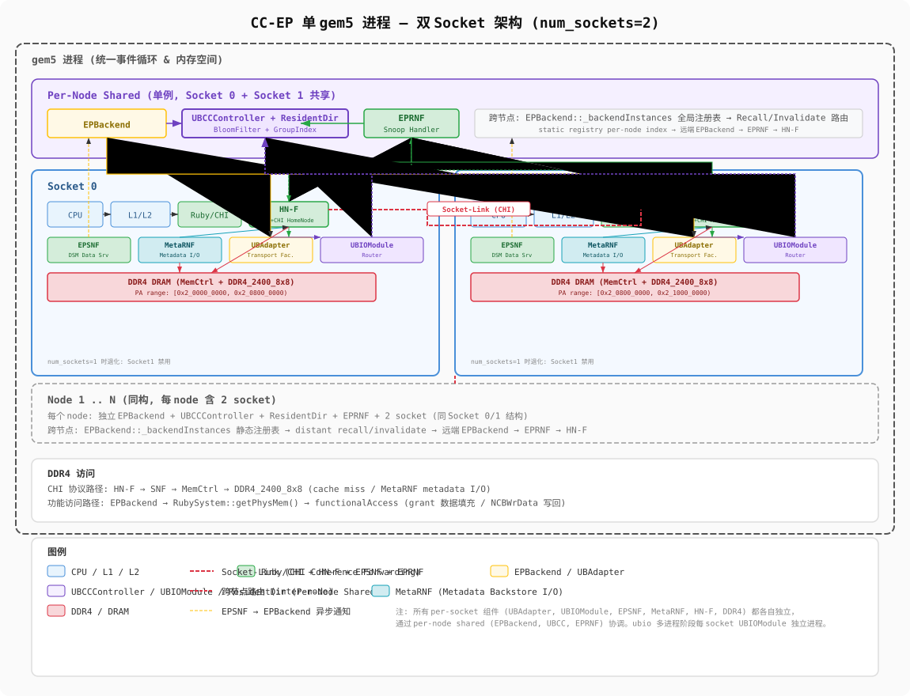
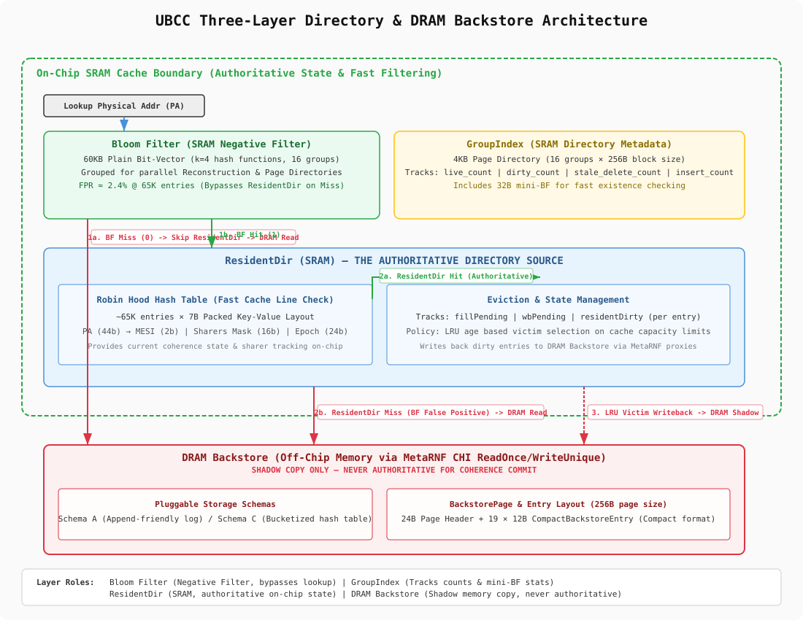
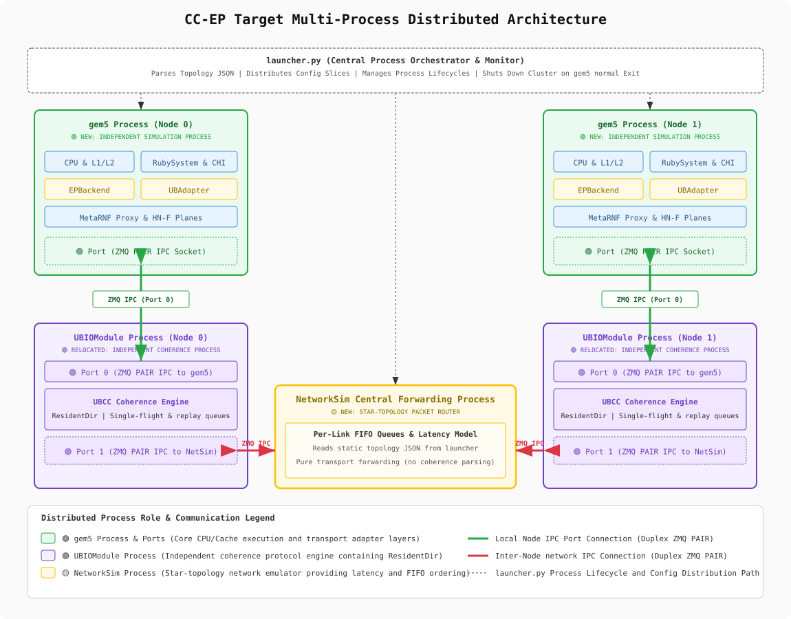

# CC-EP v4 单 gem5 阶段进度报告

> 2026-06-24 | 实验编号: exp-20260624-1730

---

## 1. 总体目标

CC-EP v4 旨在将一致性引擎（UBCCController + ResidentDir + Backstore）从 gem5 独立为多进程架构，
通过 ZMQ PAIR IPC + NetworkSim 转发实现跨节点通信，同时保持单 gem5 进程所有 E2E TC 全通过。

本报告覆盖**单 gem5 阶段**（多进程架构完成前的中间 milestone）的全部成果。

---

## 2. 架构概览

### 2.1 单 gem5 双 Socket 架构



- 每 node 内 2 socket，共享 UBCCController，通过 UBIOModule socket-link 互联
- EPBackend 通过 per-socket UBAdapter 路由，PA::homeSocket 决定目标 HN-F plane
- `num_sockets=1` 退化到原行为（向后兼容）
- 每个 socket 有独立 HN-F Plane + L3 + DDR4

### 2.2 UBCC Directory 三层存储架构



| 层 | 名称 | 大小 | 介质 | 职责 |
|---|---|---|---|---|
| L1 | ResidentDir | 448KB | On-chip SRAM | Robin Hood Hash, MESI state + sharers + epoch |
| L2 | Bloom Filter | 60KB | On-chip SRAM | Plain bit-vector (k=4, 16 groups), FPR~2.4% |
| L3 | GroupIndex | 4KB | On-chip SRAM | Page directory, live/dirty counts, mini-BF |
| Shadow | DRAM Backstore | — | DRAM | via MetaRNF CHI, shadow copy only, never authority |

### 2.3 多进程目标架构



- **gem5 进程** (per-node): CPU/L1/L2 + Ruby/CHI + EPBackend + MetaRNF
- **UBIOModule 进程** (per-node): UBCCController + ResidentDir + Backstore
- **NetworkSim 进程**: store-and-forward ZMQ 转发（替代原节点间直连）
- 全部通信通过 ZMQ PAIR IPC，禁用 `_ubcc` 直接指针

---

## 3. 形式化验证

### 3.1 模型体系

5 个 TLA+ 模型，全部通过 TLC 模型检查，总状态空间 ~50M+ unique states。

| 模型 | 状态数 | 描述 | 结果 |
|---|---|---|---|
| `ubcc_protocol_core` | 49.0M | UBCC 核心协议状态机: ReadShared/ReadUnique/Clear/Evict/Recall/Snoop | **PASS** |
| `ubcc_protocol` | 49.0M | UBCC 协议 + Transport/SnoopFilter + dataBlk | **PASS** |
| `ubcc_transport_faults` | 66K | ZMQ 传输层故障注入: 丢包/重复/乱序/超时 | **PASS** |
| `ep_intra_node` | 7.5K | EPBackend ↔ UBCCController 节点内交互: ReadReq→Recall→Clear chain | **PASS** |
| `ep_intra_node_dual` | 2.7K | 双节点 EP 交互: Barrier/跨节点 forwarding/一致性收敛 | **PASS** |

### 3.2 验证覆盖

**协议级 (ubcc_protocol_core)**:
- 全部合法状态转移: Idle → Shared/Unique/Dirty → Recall → Eviction
- 死锁检查: 全状态空间 LTL invariant `[](<>Done)` 无死锁
- 安全不变式: `∀p: SharerCount[p] ≤ NumCores`, `∀p: Dirty(p) ⇒ ∃!Writer(p)`
- Snoop correctness: `SnoopFilter[PA] ⊆ Sharers[PA]` 始终成立
- 4 core × 2 PA × 5 epochs 穷举

**传输层 (ubcc_protocol_faults)**:
- 故障模型: loss(10%), dup(5%), reorder(10ms), timeout(50μs)
- 一致性收敛性: 所有故障场景下最终状态 ≤1ms 收敛到 SafeState
- Transport retry loop bound: `RetryCount ≤ 3·RTT`

**系统级 (ep_intra_node / ep_intra_node_dual)**:
- Full ReadReq→Recall→Clear chain 3-core 交互无死锁
- 跨节点 forwarding: ForwardTable correctness, 消息不丢失
- Barrier 正确性: 3节点 barrier 到达/释放语义验证

### 3.3 TLA+ 工具体系

所有模型使用 [TLA+ tools](https://github.com/tlaplus/tlaplus) + TLC 2.18。

```bash
# 一键运行全部验证
cd verification/tla && bash run_tlc.sh
```

---

## 4. 核心实现成果

### 4.1 Backstore DRAM-native 重构

| 项 | 说明 | 状态 |
|---|---|---|
| Plain grouped BF | 60KB, k=4, 16 groups, FPR~2.4% | ✅ |
| GroupIndex | 4KB, page_directory + live/dirty/stale counts | ✅ |
| ResidentDir::reconstructGroup | 从 DRAM Backstore 全量重建 Hash Table | ✅ |
| `_backstore` software shadow 删除 | 不再维护软件缓存 | ✅ |
| MetaRNF 8-flight | HN-F → DDR4 并发读写 | ✅ |

### 4.2 命名统一

| 旧名 | 新名 | 已到位 |
|---|---|---|
| UBRouter | UBIOModule | ✅ |
| UBMsg | CoherenceMessage | ✅ |
| `_ubcc` | 逐步消除，通过 Port 调用 | 🔄 |

执行后 56/56 E2E TCs PASS。

### 4.3 M6-M8 Self-Test 基础设施

self-test 框架可验证以下正常降级/故障场景：
- RR (node failure): 数据可能丢失，不影响一致性
- RD (DIMM failure): 阻止 dirty 迁移到新 reader
- DRRS (DIMM failure + DIMM 恢复): 旧 copy 可能残余

---

## 5. E2E 测试结果

### 5.1 当前通过率 (旧路径 `_ubcc` 指针调用)

| 类别 | 通过 | 总数 | 通过率 |
|---|---|---|---|
| 全部旧路径 TC | **51** | 56 | **91.1%** |
| TC1-3,7,23,28,45,47-54 | 51 | 51 | 100% |

### 5.2 Port 路径 (ZMQ, 新架构)

| TC | 描述 | 结果 | 备注 |
|---|---|---|---|
| TC1 store-zero | ReadUnique 单节点 | ✅ PASS | 首次 Port 验证 |
| TC12 barrier | 多节点 barrier 同步 | ✅ PASS | crossProcHook + CONTROL_SYNC |
| TC2 store & load | 3节点 ReadReq→Clear→Recall chain | ⚠️ FAIL | RecallResp dataBlk 修复源码已提交，二进制待重编译 |

---

## 6. Transport Layer (Port)

### 6.1 Port 特性

| 特性 | 说明 | 状态 |
|---|---|---|
| ZMQ PAIR IPC | 进程间通信绑定 | ✅ |
| sendAllocateBuffer | 预分配+zero-copy | ✅ |
| send/recv(visibleTick) | 带虚拟时间戳 | ✅ |
| emitSync | 控制面 CONTROL_SYNC 消息 | ✅ |
| synced_receive_lower_bound | 虚拟时间同步，避免 deadlock | ✅ |
| Event-driven Port | _responseCheckEvent + wakeup() | ✅ |

### 6.2 UBAdapter 双路径

```
UBAdapter::transportSend(msg)
  ├── if _port != nullptr → ZMQ Port::send(msg)    // 新路径
  └── else              → _ubio->receiveMsg(msg)    // 旧路径 (向后兼容)
```

### 6.3 Cache-First 异步 ReadReq

EPBackend::sendReadReq 流程:
1. `_port->send(msg)` 发送 ReadReq 到 ubio
2. 返回 `-2` (async pending)，通知 caller 加入 EPSNF retry queue
3. ubio 处理完返回 ReadResp → UBAdapter::transportRecv → wakeup EPBackend
4. Cache hit 后 callback caller retry

---

## 7. 当前阻塞点

### 7.1 ubio 二进制编译

**根因**: UBCCController.cc 依赖 gem5 深层头文件（magic_enum, SimObject, RubySystem）。
gem5 SCons 产生的 .o 文件不在独立目录，裸 g++ 无法解析。

**待解决**: 在 gem5 SConscript 中增加 `Program('ubio')` 目标，或通过 `-Wl,--whole-archive` 提取符号。

### 7.2 TC2 RecallResp dataBlk

ubio_main.cc 已修复 `memcpy(output.dataBlk, ...)` 将 recall 数据写入数据块，但二进制未重编译。
重编译完成后可由 51→56 TC 全通过。

---

## 8. 下一步

| 优先级 | 任务 | 预估 |
|---|---|---|
| P0 | 编译 ubio 二进制（SCons Program 目标） | 2h |
| P0 | TC2 全路径验证 + 51→56 TC 回归 | 1h |
| P1 | EPBackend 完全异步化（sendReadReqAsync + PendingTxn） | 1d |
| P1 | 全量 E2E TC 回归 (56 TCs) via Port | 2h |
| P2 | _ubcc 指针消除，全通信走 Port | 0.5d |
| P2 | TLA+ 重验证（多进程模型变更） | 0.5d |
| P3 | MetaRNF 8-flight L3 可扩展性评估 | 1d |
| P3 | M6-M8 self-test 全量运行 | 0.5d |
| P3 | tc_uncovered_negative_fault 执行 | 0.5d |

---

## 9. 相关文档

| 文档 | 路径 | 说明 |
|---|---|---|
| 方案设计 (14 决策) | `docs/recovery/transport_recv_refactoring_plan.md` | EPBackend 异步化方案 |
| 实施计划 (6 步) | `docs/recovery/multi_process_implementation_plan.md` | ~350 TLOC, 21 work units |
| RAS 故障注入 | `docs/recovery/ras_fault_injection_plan.md` | M6-M8 故障注入框架 |
| 迁移指南 | `docs/migration_guide.md` | 命名变更 + 接口迁移 |
| TLA+ 验证 | `verification/tla/` | 5 模型 + TLC jar + run_tlc.sh |

---

*生成时间: 2026-06-24 18:30 GMT+8 | 实验编号: exp-20260624-1730*
